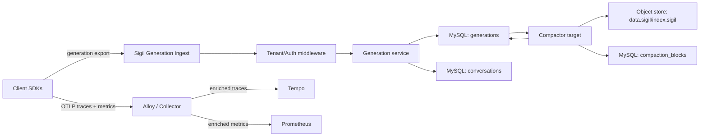
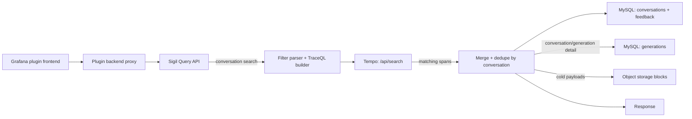
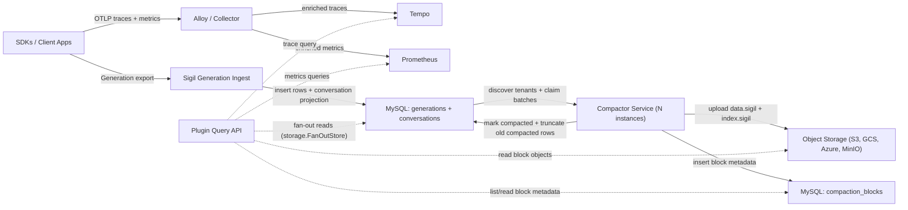
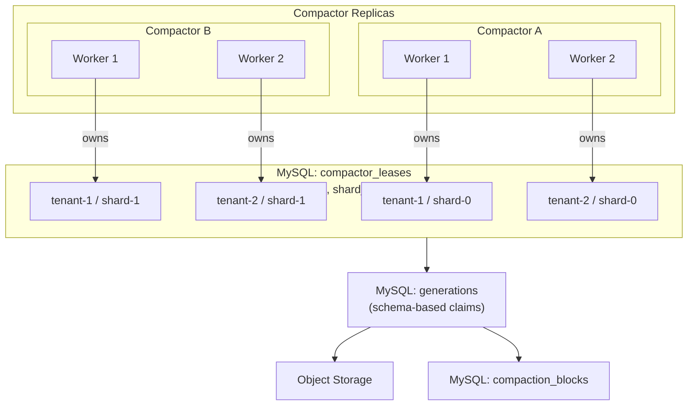
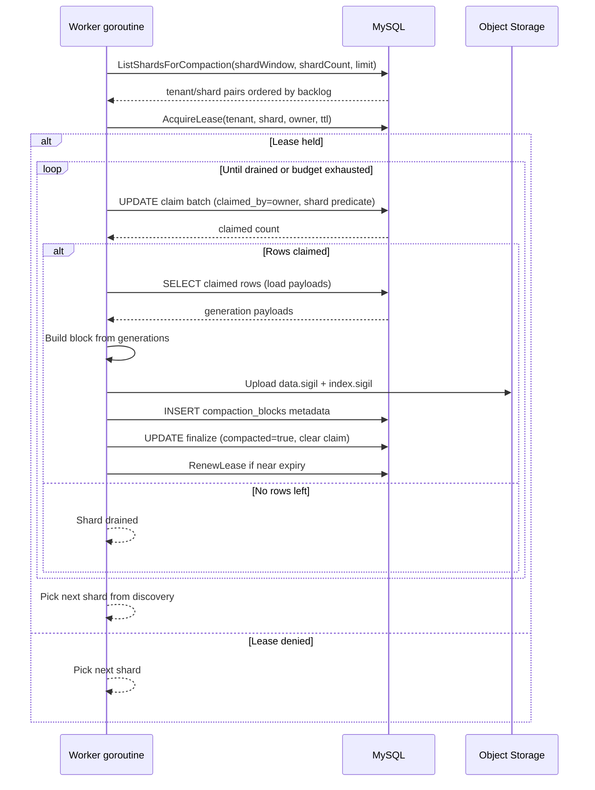

# Sigil Architecture

## System Boundaries

- `apps/plugin`: Grafana plugin UI and backend proxy for Sigil APIs.
- `sigil`: generation ingest and query APIs.
- `sdks/*`: post-LLM instrumentation SDKs (Go, Python, TypeScript/JavaScript, Java, .NET/C#). SDKs emit OTel traces, OTel metrics, structured generation records, and embedding spans.
- Alloy / OTel Collector: telemetry pipeline for traces and metrics. Receives OTLP from SDKs, enriches with infrastructure metadata (k8s namespace, cluster, service), and forwards to backends.
- Tempo: trace storage and TraceQL execution backend.
- Prometheus: metrics storage for SDK-emitted AI observability metrics.
- MySQL: hot metadata/index store plus hot generation payload store.
- Object storage: long-term compacted generation payload storage.
  - implementation standard: Thanos `objstore` Go package (`github.com/thanos-io/objstore`).

## Phase 2 Delivery Status

Phase 2 defines production contracts for SDK parity, query envelopes, tenant boundaries, and hybrid storage/query behavior. These contracts are implemented on `main`; remaining follow-up is benchmark baseline documentation and CI scope expansion tracked in execution plans and tech debt docs.

### Execution priority

Current sequencing focus is non-code follow-up:

1. benchmark baseline capture and documentation
2. cross-track consistency/docs maintenance
3. CI scope expansion (tracked tech debt)

SDK parity completion is tracked in:

- `docs/exec-plans/completed/2026-02-12-phase-2-sdk-parity-python.md`
- `docs/exec-plans/completed/2026-02-12-phase-2-sdk-parity-typescript-javascript.md`
- `docs/exec-plans/completed/2026-02-13-phase-2-sdk-parity-dotnet-csharp.md`
- `docs/exec-plans/completed/2026-02-13-sdk-parity-java.md`
- `docs/exec-plans/completed/2026-02-13-openai-chat-responses-strict-parity.md`
- `docs/exec-plans/completed/2026-02-13-all-providers-strict-helper-mapper-parity.md`
- `docs/exec-plans/completed/2026-02-13-sdk-metrics-and-telemetry-pipeline.md`

Tenant boundary completion is tracked in:

- `docs/exec-plans/completed/2026-02-12-phase-2-tenant-boundary.md`

SDK framework integration status:

- Completed (LangChain/LangGraph): `docs/exec-plans/completed/2026-02-20-sdk-langchain-langgraph-integrations.md`
- Completed (OpenAI Agents/LlamaIndex/Google ADK):
  - `docs/design-docs/2026-02-20-sdk-openai-agents-llamaindex-google-adk-integrations.md`
  - `docs/exec-plans/completed/2026-02-20-sdk-openai-agents-llamaindex-google-adk-integrations.md`
- Completed (Vercel AI SDK TypeScript):
  - `docs/design-docs/2026-02-22-sdk-vercel-ai-sdk-integration.md`
  - `docs/exec-plans/completed/2026-02-22-sdk-vercel-ai-sdk-integration.md`

Framework contract defaults:

- `conversation_id` is the primary grouping identity.
- Framework run/thread/parent/event IDs are optional supporting metadata/span attributes when available and useful.
- Core SDK runtimes remain framework-agnostic; framework integrations live in separate modules/packages.
- Generation ingest and query API contracts remain unchanged.

## Ingest Model (Generation-First)

### Telemetry pipeline (traces + metrics)

- SDKs export OTLP traces and OTLP metrics to Alloy / OTel Collector via `OTEL_EXPORTER_OTLP_ENDPOINT`.
- Alloy/Collector enriches telemetry with infrastructure metadata (k8s namespace, cluster, service, pod) and forwards:
  - Traces to Tempo.
  - Metrics to Prometheus.
- Sigil is NOT in the SDK trace/metrics path. SDK traces and SDK metrics flow through the standard OTel pipeline.

### Sigil backend operational metrics

- Sigil runtime components expose operational Prometheus metrics at `GET /metrics`.
- These metrics cover Sigil internals (HTTP/gRPC transport, ingest outcomes, compactor, storage read/write internals, query fan-out).
- They are scraped directly from Sigil component services by Prometheus and are separate from SDK-emitted OTel metrics.

### SDK metrics

SDKs emit four OTel histogram instruments alongside traces: `gen_ai.client.operation.duration`, `gen_ai.client.token.usage`, `gen_ai.client.time_to_first_token`, and `gen_ai.client.tool_calls_per_operation`. These metrics get collector-enriched infrastructure labels (namespace, cluster, service) automatically.

Full instrument definitions, units, and per-recording attributes: `docs/references/semantic-conventions.md`.

### Embedding call observability

- SDKs expose embedding lifecycle APIs (`StartEmbedding` / `start_embedding`) across Go, Python, JS/TS, Java, and .NET.
- Embedding calls are traces-and-metrics only:
  - OTel spans use `gen_ai.operation.name="embeddings"` plus provider/model/usage attributes.
  - Existing SDK metric instruments (`gen_ai.client.operation.duration`, `gen_ai.client.token.usage`) include embedding traffic.
  - TTFT and tool-call-per-operation metrics are not emitted for embeddings.
- There is no Sigil generation ingest/export for embeddings and no additional storage/query tables for embeddings.
- Optional embedding input text capture is disabled by default and configurable with truncation limits per SDK.

Design doc: `docs/design-docs/2026-02-13-sdk-metrics-and-telemetry-pipeline.md`

### Generation pipeline

- SDKs export normalized generations to Sigil custom ingest.
- Primary transport is gRPC with HTTP parity.
- HTTP and gRPC ingest paths call one shared export service path.
- Export in SDKs is buffered, batched, and asynchronous.
- `shutdown` is required to flush pending generations.

### Deployment topology guidance

- Generation path is direct to Sigil generation ingest (`/api/v1/generations:export` or `GenerationIngestService.ExportGenerations`) using tenant auth mode.
- Trace and metrics path goes through Alloy / OTel Collector. `OTEL_EXPORTER_OTLP_ENDPOINT` points at the collector.
- Sigil backend internal spans (HTTP server routes, gRPC server handling, ingest/query service spans) are exported only when Sigil runtime OTEL trace export is configured with standard `OTEL_*` env vars (for example `OTEL_TRACES_EXPORTER` and OTLP exporter endpoint vars).
- Enterprise proxy pattern:
  - client sends bearer token
  - proxy authenticates bearer and translates to upstream `X-Scope-OrgID`
  - Sigil API enforces tenant header and does not validate bearer tokens in this phase

## Query Model

- Tempo is the search index for conversation discovery via TraceQL.
- MySQL/object storage is the hydration layer for generation payloads.
- Conversation-level aggregates (models, agents, error counts) are computed at query time from Tempo span results.
- MySQL `conversations` table provides authoritative metadata (`generation_count`) used for conversation-level filters.
- Query access from the plugin frontend is plugin-proxy-only.

Design doc: `docs/design-docs/2026-02-15-conversation-query-path.md`

### Query endpoints

- `POST /api/v1/conversations:batch-metadata` -- batch conversation metadata hydration for plugin-owned search results.
- `GET /api/v1/conversations/{id}` -- full conversation with all hydrated generations (MySQL/object storage).
- `GET /api/v1/generations/{id}` -- single generation detail (MySQL/object storage).
- `GET /api/v1/agents` -- paginated agent catalog summaries grouped by agent name.
- `GET /api/v1/agents:lookup` -- full agent definition for a name bucket and effective version (or latest).
- `GET /api/v1/agents:versions` -- paginated effective-version history for one name bucket (named or anonymous).
- `GET /api/v1/model-cards` -- model-card list and provider+model resolve mode for dashboard pricing joins.
- `GET /api/v1/model-cards:lookup` -- model-card lookup by identity.
- `GET /api/v1/model-cards:sources` -- model-card source freshness/status metadata.
- `GET /api/v1/settings` and `PUT /api/v1/settings/datasources` -- tenant-scoped datasource settings for query proxy behavior.
- Optional Grafana datasource-proxy path for server-side Tempo reads (`SIGIL_GRAFANA_URL`, `SIGIL_GRAFANA_SA_TOKEN`, `SIGIL_GRAFANA_TEMPO_DATASOURCE_UID`).

### Query access path

1. Frontend sends query request to plugin backend resource endpoint.
2. Plugin backend applies tenant/header behavior, executes conversation search + search tag discovery directly against Tempo via Grafana datasource proxy, and calls Sigil only for metadata hydration.
3. Sigil API query path:
   - conversation batch metadata: hydrate conversation summaries (`generation_count`, timestamps, feedback summary, eval summary) for plugin-provided IDs.
   - conversation detail: direct MySQL/object storage fan-out read by conversation ID, return all hydrated generations.
   - generation detail: direct MySQL/object storage read by generation ID.
  - agent catalog list/lookup/version-history: direct MySQL projection reads from `agent_heads`, `agent_versions`, and `agent_version_models`.
   - model cards: read model-card catalog from DB/snapshot fallback and optionally resolve `(provider, model)` pairs for deterministic pricing joins.
4. Sigil API returns JSON responses (hydration payloads and full detail payloads).

For Grafana app plugin deployments:

- plugin admin config selects Prometheus and Tempo datasource UIDs
- plugin backend can proxy `query/proxy/prometheus/*` and `query/proxy/tempo/*` via Grafana datasource proxy APIs using the plugin managed service-account token

## Runtime Read/Write Paths

### Write path (implemented)

Write path components:

1. Client SDKs export generations directly to Sigil generation ingest (`/api/v1/generations:export` or gRPC).
2. Sigil tenant/auth middleware resolves tenant context.
3. Generation ingest service validates payloads and writes:
   - `generations` rows (hot payload + compaction cursor state)
   - `conversations` projection rows.
   - agent catalog projection rows (`agent_heads`, `agent_versions`, `agent_version_models`) keyed by effective agent version.
4. Client SDKs export OTLP traces and metrics to Alloy / OTel Collector.
5. Alloy enriches telemetry with infrastructure metadata and forwards traces to Tempo and metrics to Prometheus.
6. Optional: Sigil runtime exports its own internal spans through the configured OTEL trace exporter path.
7. Compactor target reads MySQL generations, writes object blocks + metadata, then marks/truncates compacted rows.
8. Prometheus scrapes Sigil `GET /metrics` endpoints for backend operational metrics.

### Read path

Read path components:

1. Grafana plugin frontend calls plugin backend resource routes.
2. Plugin backend adds tenant context and forwards to Sigil query API.
3. Conversation search:
   - Sigil translates user filter expression to TraceQL with `gen_ai.operation.name != ""` base predicate.
   - Tempo returns matching spans with `sigil.generation.id`, `gen_ai.conversation.id`, and optional `sigil.conversation.title` and `user.id` attributes.
   - Sigil groups spans by conversation, enriches from MySQL metadata and feedback tables.
   - Paginated conversation summaries returned to frontend.
4. Conversation/generation detail:
   - MySQL hot rows (`generations`, `conversations`) + object storage blocks.
   - Fan-out uses hot-first gating for conversation detail; cold reads are skipped when hot rows already satisfy expected conversation generation count.
   - Cold block scans are bounded by conversation metadata time range (`created_at`..`last_generation_at` with skew window), not full-history block scans.
   - Cold index reads use bounded worker concurrency, process-wide in-flight caps, per-read timeout/retry, and a request-level cold-read budget.
   - Object-store block indexes (`index.sigil`) are cached in-process with TTL/LRU and in-flight dedupe to avoid repeated S3 GETs under concurrent conversation-detail traffic.
   - Union + dedupe by `generation_id` with hot-row preference.
   - Conversation detail `user_id` is derived from latest generation metadata key `sigil.user.id` when present.
5. Proxy routes pass through to Tempo and Prometheus for raw access.

## Tenant/Auth Model

- Tenant header: `X-Scope-OrgID`.
- Operator guide: `docs/references/multi-tenancy.md`.
- Auth model is lightweight tenant header extraction/enforcement.
- OSS mode supports `auth enabled/disabled` behavior:
  - enabled: protected endpoints require tenant context
  - disabled: fake tenant context is injected for local/dev
- Runtime flags:
  - `SIGIL_AUTH_ENABLED` (default `true`)
  - `SIGIL_FAKE_TENANT_ID` (default `fake`)
- Tenant handling uses dskit utilities (`user`, `tenant`, `middleware`).
- Enforcement scope is uniform for query + generation ingest (HTTP and gRPC).
- Missing tenant behavior in auth-enabled mode:
  - HTTP protected endpoints: `401 Unauthorized`
  - gRPC protected methods: `Unauthenticated`
- Health endpoints are exempt.
- Bearer token authentication/validation is not performed by Sigil API in this phase.

## Storage Model

### Hot store (MySQL)

MySQL is not only an ingest log. It stores:

- generation metadata and indexes used by application queries
- conversation metadata
- agent catalog metadata (name-grouped heads, versioned prompt/tool definitions, and per-version provider/model usage)
- hot payload rows used for recent reads and overlap resolution
- compaction state and bookkeeping

### Cold store (object storage)

- compacted, compressed generation payload segments
- long-term retained payload history
- implemented via Thanos `objstore` interfaces and clients

### Read policy (fixed)

Query reads fan out to hot and cold stores, union results, and dedupe by `generation_id`.

- overlap conflict policy: prefer hot MySQL row
- implementation: `storage.FanOutStore` runs hot and cold reads in parallel and applies deterministic merge order.

### Hybrid storage data flow (implemented hot+cold fan-out)

### Distributed compactor topology

Status (2026-02-19):

- Implemented on `main`: shard-level leases (`compactor_leases` keyed by `(tenant_id, shard_id)`), schema-based claims (`claimed_by`/`claimed_at`), backlog-aware shard discovery, and worker-pool drain loops.
- Compactor claim lifecycle is now `ClaimBatch -> LoadClaimed -> Build/Upload -> InsertBlock -> FinalizeClaimed`.

### Compaction flow

Status (2026-02-19):

- Implemented on `main`: schema-based claim/load/finalize with short claim/finalize updates and out-of-transaction object I/O.
- Workers renew shard leases while draining and run shard-aware truncation after compaction passes.

### Compactor scaling characteristics

Current behavior on `main`:

- Compaction scales across tenants and within a single tenant via time-range sharding.
- Each tenant is split into N shards (`SIGIL_COMPACTOR_SHARD_COUNT`) that can be processed in parallel.
- Claims use schema-based durable state (`claimed_by`/`claimed_at`) with short claim/finalize updates.
- Workers run multi-batch shard drain loops with backlog-aware scheduling and lease renewal.
- Stale claim recovery sweeps release orphaned claims after `SIGIL_COMPACTOR_CLAIM_TTL`.
- Truncation is shard-aware.

References:

- Design doc: `docs/design-docs/2026-02-13-compaction-scaling.md`
- Execution plan: `docs/exec-plans/completed/2026-02-13-compaction-scaling.md`

## Online Evaluation

Online evaluation adds configurable, asynchronous scoring to production generations. Evaluators run inside Sigil workers and attach typed scores back to the generation + conversation debugging workflow.

Key characteristics:

- **Immediate per-generation trigger**: each eligible generation is evaluated at ingest time. No idle windows or session-completion detection.
- **API-managed configuration**: evaluators and rules stored in MySQL, managed via CRUD APIs. Predefined evaluator templates are exposed through dedicated template APIs and forked into tenant evaluators.
- **Conversation-level sampling**: deterministic hash on `(conversation_id, rule_id)` ensures all eligible turns in a sampled conversation get evaluated.
- **Built-in evaluator kinds**: `llm_judge`, `json_schema`, `regex`, `heuristic`.
- **External scores via API**: `POST /api/v1/scores:export` for bring-your-own evaluator workflows.

Design doc: `docs/design-docs/2026-02-17-online-evaluation.md`
Execution plan: `docs/exec-plans/completed/2026-02-17-online-evaluation.md`
User guide: `docs/references/online-evaluation-user-guide.md`

## API Contracts

### Ingest

- Generation ingest gRPC: `sigil.v1.GenerationIngestService.ExportGenerations`
- Generation ingest HTTP parity: `POST /api/v1/generations:export`

Note: OTLP trace and metric ingest is handled by Alloy / OTel Collector, not by Sigil. SDKs send OTLP to the collector via `OTEL_EXPORTER_OTLP_ENDPOINT`.

### Query

Conversation query path (design doc: `docs/design-docs/2026-02-15-conversation-query-path.md`):

- Sigil API query endpoints:
  - `POST /api/v1/conversations:batch-metadata` -- batch conversation metadata hydration for plugin search
  - `GET /api/v1/conversations/{conversation_id}` -- full conversation with hydrated generations
  - `GET /api/v1/generations/{generation_id}` -- single generation detail
  - `GET /api/v1/agents` -- tenant agent heads grouped by name
  - `GET /api/v1/agents:lookup` -- one agent bucket detail for selected/latest effective version
  - `GET /api/v1/agents:versions` -- paginated version history for one agent bucket
- Feedback endpoints (unchanged):
  - `GET /api/v1/conversations/{conversation_id}/ratings`
  - `POST /api/v1/conversations/{conversation_id}/ratings`
  - `GET /api/v1/conversations/{conversation_id}/annotations`
  - `POST /api/v1/conversations/{conversation_id}/annotations`
- Plugin resource proxy endpoints:
  - `POST /api/plugins/grafana-sigil-app/resources/query/conversations/search`
  - `GET /api/plugins/grafana-sigil-app/resources/query/conversations/{conversation_id}`
  - `GET /api/plugins/grafana-sigil-app/resources/query/generations/{generation_id}`
  - `GET /api/plugins/grafana-sigil-app/resources/query/search/tags`
  - `GET /api/plugins/grafana-sigil-app/resources/query/search/tag/{tag}/values`
  - `GET /api/plugins/grafana-sigil-app/resources/query/agents`
  - `GET /api/plugins/grafana-sigil-app/resources/query/agents/lookup`
  - `GET /api/plugins/grafana-sigil-app/resources/query/agents/versions`
  - `GET /api/plugins/grafana-sigil-app/resources/query/conversations/{conversation_id}/ratings`
  - `POST /api/plugins/grafana-sigil-app/resources/query/conversations/{conversation_id}/ratings`
  - `GET /api/plugins/grafana-sigil-app/resources/query/conversations/{conversation_id}/annotations`
  - `POST /api/plugins/grafana-sigil-app/resources/query/conversations/{conversation_id}/annotations`
  - `/api/plugins/grafana-sigil-app/resources/query/proxy/prometheus/...`
  - `/api/plugins/grafana-sigil-app/resources/query/proxy/tempo/...`
  - Plugin backend enforces RBAC actions on query routes:
    - `grafana-sigil-app.data:read` for query/read endpoints and Prometheus/Tempo proxy reads
    - `grafana-sigil-app.feedback:write` for ratings/annotations writes
    - `grafana-sigil-app.settings:write` for datasource settings updates
- Evaluation endpoints (design doc: `docs/design-docs/2026-02-17-online-evaluation.md`):
  - `POST /api/v1/scores:export` -- external score ingest
  - `GET /api/v1/generations/{generation_id}/scores` -- scores for a generation
  - `POST /api/v1/eval/evaluators` -- create/update evaluator
  - `GET /api/v1/eval/evaluators` -- list evaluators
  - `GET /api/v1/eval/evaluators/{id}` -- get evaluator detail
  - `DELETE /api/v1/eval/evaluators/{id}` -- soft-delete evaluator
  - `GET /api/v1/eval/predefined/evaluators` -- list predefined evaluator templates
  - `POST /api/v1/eval/predefined/evaluators/{id}:fork` -- fork a template into a tenant evaluator
  - `POST /api/v1/eval/rules` -- create/update online rule
  - `GET /api/v1/eval/rules` -- list rules
  - `GET /api/v1/eval/rules/{id}` -- get rule detail
  - `PATCH /api/v1/eval/rules/{id}` -- enable/disable rule
  - `DELETE /api/v1/eval/rules/{id}` -- soft-delete rule
  - `GET /api/v1/eval/judge/providers` -- list configured judge providers
  - `GET /api/v1/eval/judge/models?provider={id}` -- list models for a provider
- Dropped placeholder endpoints:
  - `GET /api/v1/completions` (replaced by conversation search)
  - `GET /api/v1/traces/{trace_id}` (replaced by Tempo proxy)

## Query Response Contract

- Envelope: Grafana datasource `QueryDataResponse` shape (`results.<refId>.frames`).
- Metrics frames: Grafana-compatible metric data frames for graph/table usage.
- Trace detail frames: Grafana/Tempo-compatible trace frame shape (`preferredVisualisationType: trace`).
- Trace search frames: Tempo/Grafana-compatible table frame shape (trace id, start time, service, name, duration, nested spans when present).

See `docs/references/grafana-query-response-shapes.md`.

## Generation Contract

- Generation mode is explicit:
  - `SYNC`: non-stream provider flows
  - `STREAM`: streaming provider flows
- Normalized fields are always sent:
  - model/system prompt/input/output/tools/usage/metadata/timestamps/tags
- SDK-owned identity metadata keys are always present on normalized generations:
  - `sigil.sdk.name`
  - callers may set this key, but SDK normalization overwrites it with SDK-owned values
- Request controls are first-class optional generation fields:
  - `max_tokens`
  - `temperature`
  - `top_p`
  - `tool_choice`
  - `thinking_enabled`
- Provider-specific thinking budget is preserved when available via metadata key:
  - `sigil.gen_ai.request.thinking.budget_tokens`
- Tool definitions support optional input schema JSON for transport parity (`input_schema_json` over gRPC) and a `deferred` flag for provider/tool-loading semantics.
- Optional identity fields are supported end-to-end:
  - `conversation_id`
  - `agent_name`
  - `agent_version`
- Raw artifacts are optional debug payloads and default OFF.
- Artifact identity fields (`name`, `record_id`, `uri`) are supported when present.

## SDK Runtime Contracts

- OTel-first mental model: Sigil extends familiar instrumentation flow with AI-specific normalized generation semantics.
- Core APIs are explicit client/recorder lifecycle APIs.
- Provider wrappers are convenience sugar, documented wrapper-first in provider modules.
- Provider parity target for Go/Python/TS/Java/.NET: OpenAI, Anthropic, Gemini.
- OpenAI provider parity now includes strict official SDK-shaped support for both Chat Completions and Responses across Go/Python/TS/Java/.NET.
- Python SDK runtime lives in `sdks/python` with provider wrapper packages in `sdks/python-providers/*`.
- Python framework modules live in:
  - `sdks/python-frameworks/langchain`
  - `sdks/python-frameworks/langgraph`
  - `sdks/python-frameworks/openai-agents`
  - `sdks/python-frameworks/llamaindex`
  - `sdks/python-frameworks/google-adk`
- .NET SDK runtime lives in `sdks/dotnet` with split provider packages under `sdks/dotnet/src/Grafana.Sigil.*`.
- Framework integrations are module-based (core runtime stays framework-agnostic).
- Active first-class framework scope:
  - LangChain + LangGraph in Python and TypeScript/JavaScript.
  - OpenAI Agents + LlamaIndex in Python and TypeScript/JavaScript.
  - Google ADK in Python, TypeScript/JavaScript, Go, and Java.
  - Vercel AI SDK hooks in TypeScript/JavaScript.
- JS framework modules are exposed as subpath exports:
  - `@grafana/sigil-sdk-js/langchain`
  - `@grafana/sigil-sdk-js/langgraph`
  - `@grafana/sigil-sdk-js/openai-agents`
  - `@grafana/sigil-sdk-js/llamaindex`
  - `@grafana/sigil-sdk-js/google-adk`
  - `@grafana/sigil-sdk-js/vercel-ai-sdk`
- Raw provider artifacts are default OFF, explicit opt-in only.
- SDK validation enforces message role/part compatibility and artifact payload-or-record-id constraints.
- Empty tool names return a no-op tool recorder (instrumentation safety behavior).
- Generation and execute_tool spans always include SDK identity attributes:
  - `sigil.sdk.name`
- Generation and execute_tool spans may include a human-readable conversation label:
  - `sigil.conversation.title`
- Generation spans may include a human-readable end-user label:
  - `user.id`
- `rec.Err()` surfaces local validation/enqueue failures only.
- Background export failures are retried and logged.
- Generation export auth supports strict modes:
  - `none`, `tenant`, `bearer`
  - `tenant` mode injects `X-Scope-OrgID`
- `bearer` mode injects `Authorization: Bearer <token>`
- Trace/metric exporter auth and transport are configured in the application's OTEL SDK setup.
- SDK conversation feedback helpers (ratings/annotations) use a dedicated Sigil API base endpoint config (default `http://localhost:8080`) and reuse generation auth headers.
- Auth config validation is strict and fail-fast during config resolution/client init.
- Explicit transport headers have precedence over injected auth headers for `Authorization` and `X-Scope-OrgID`.

## Service Responsibilities

- `apps/plugin`: UI routes and backend proxy handlers for Sigil query contracts.
- `sigil/internal/ingest/generation`: generation ingest validation and persistence coordination.
- `sigil/internal/query`: Tempo-first query orchestration plus storage hydration and fan-out reads.
- `sigil/internal/modelcards`: model-card catalog bootstrap, DB-backed refresh coordination, supplemental overlay merge (`snapshot + supplemental`), and API read semantics.
- `sigil/internal/eval`: online evaluation control plane, score ingest, rule engine, evaluator implementations, and async worker.
- `sigil/internal/storage/mysql`: hot metadata/index/payload access.
- `sigil/internal/storage/object`: compacted payload access.
  - implementation should wrap Thanos `objstore` primitives.
- `sdks/*`: OTel traces, OTel metrics (see `docs/references/semantic-conventions.md`), and structured generation export.
- Alloy / OTel Collector: OTLP receiver, infrastructure enrichment, trace forwarding to Tempo, metric forwarding to Prometheus.

### Runtime targets

Runtime module targets include:

- `all`
- `server` (transport-only HTTP/gRPC listeners)
- `ingester` (generation ingest HTTP/gRPC + eval enqueue dispatcher)
- `querier`
- `compactor`
- `catalog-sync` (singleton model-card refresh loop)
- `eval-worker` (async evaluation worker; claims work items, runs evaluators, writes scores)

`all` runs `ingester`, `querier`, `compactor`, and `eval-worker` in-process through shared transport listeners.

## Local Runtime (Compose Core)

The default local stack started by `mise run up` (`docker compose --profile core up --build`) now includes a synthetic SDK traffic service:

- `sdk-traffic`: one always-on compose service that runs Go/JS/Python/Java/.NET emitters in one container.
- The emitter continuously sends fake threaded agent conversations through all provider wrapper paths (`openai`, `anthropic`, `gemini`) plus a core custom provider path (`mistral`) for ingest/devex validation.
- Traffic uses mixed `SYNC`/`STREAM` modes, provider/language tags, and per-turn metadata to keep shapes distinguishable in local debugging.
- One-shot mode (`SIGIL_TRAFFIC_ONESHOT=1`) runs bounded emitter cycles and fails fast if API assertions do not observe all five SDK emitters plus Python/JS framework-tagged records for LangChain, LangGraph, OpenAI Agents, LlamaIndex, and Google ADK.
- Raw provider artifacts stay default OFF; this path is intended for synthetic ingest load and contract-shape visibility only.

## Evolution Path

Sigil defines an ingestion-log abstraction with pluggable backends.

- Phase 2 backend: MySQL
- Future candidates: Kafka, WarpStream

This prevents tight coupling of ingest semantics to one concrete log implementation.
