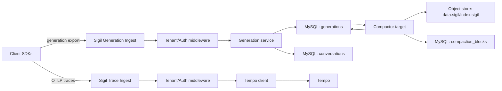
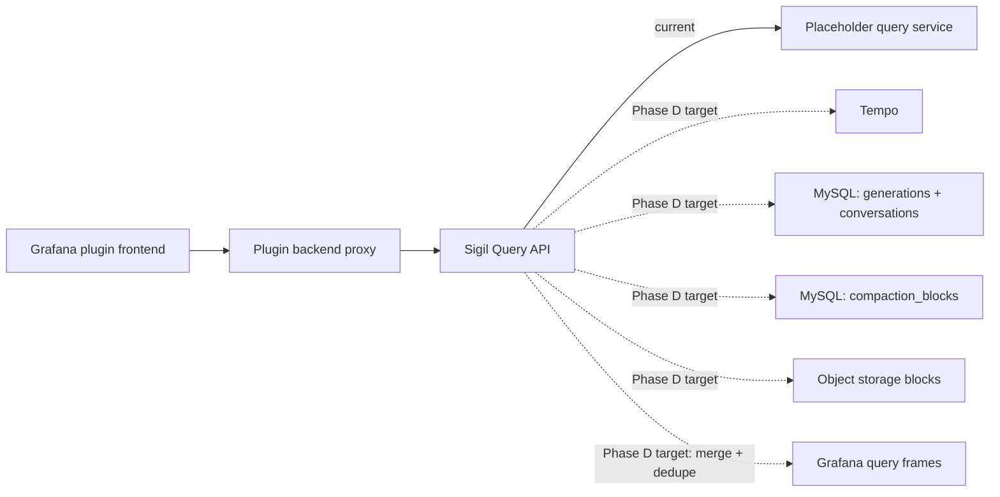
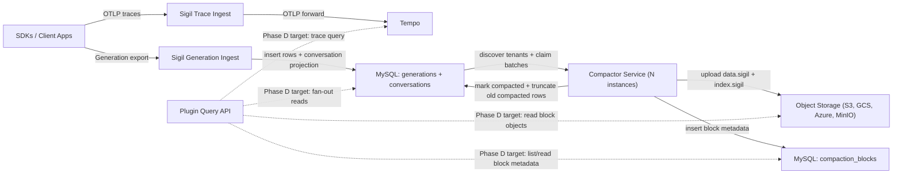
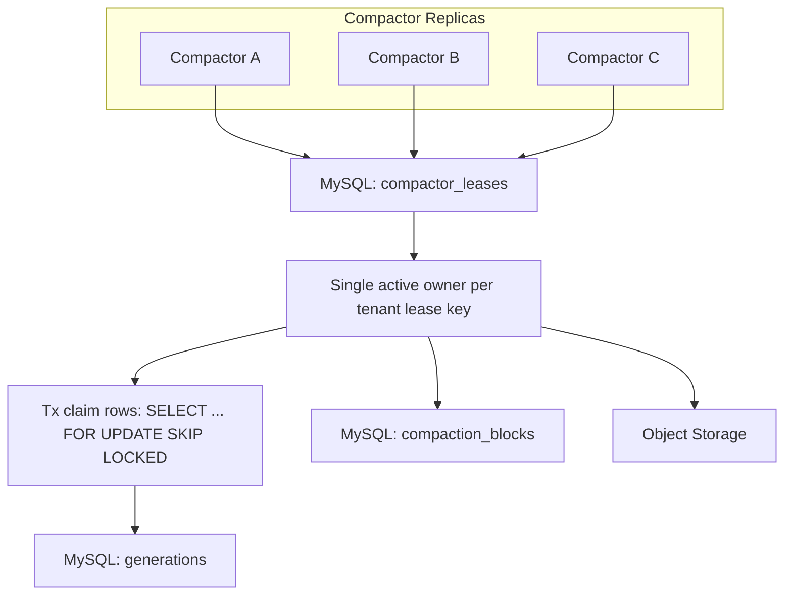
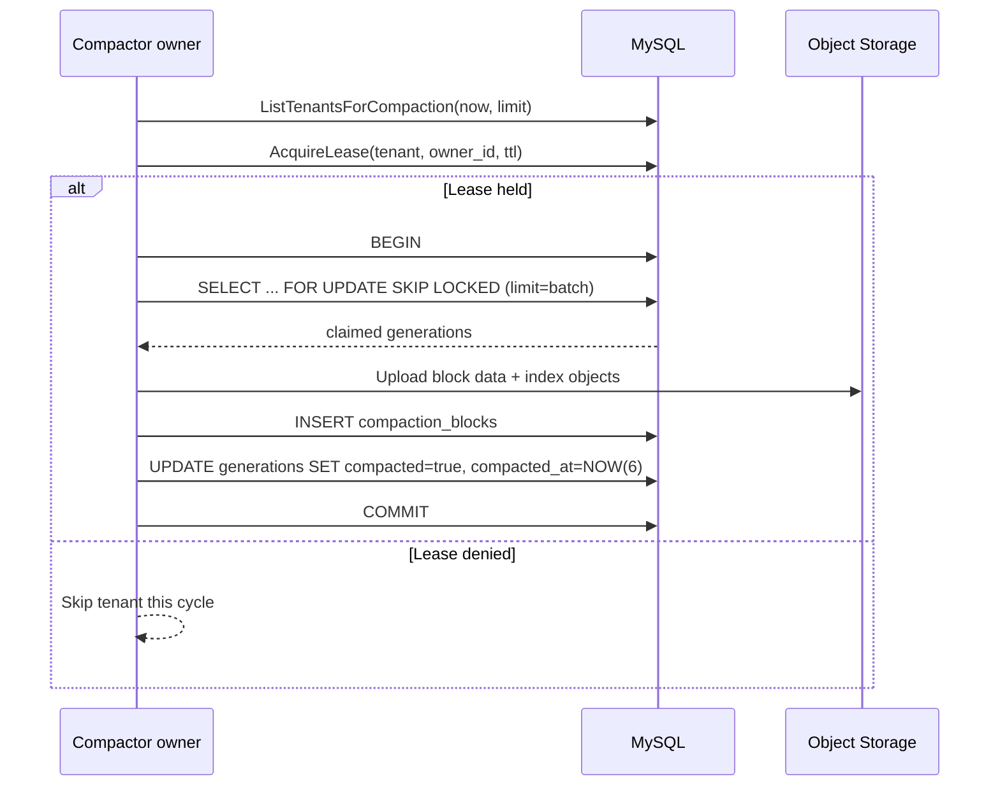

# Sigil Architecture

## System Boundaries

- `apps/plugin`: Grafana plugin UI and backend proxy for Sigil APIs.
- `sigil`: OTLP trace ingest, generation ingest, and query APIs.
- `sdks/*`: post-LLM instrumentation SDKs (Go, Python, TypeScript/JavaScript).
- Tempo: trace storage and TraceQL execution backend.
- MySQL: hot metadata/index store plus hot generation payload store.
- Object storage: long-term compacted generation payload storage.
  - implementation standard: Thanos `objstore` Go package (`github.com/thanos-io/objstore`).

## Phase 2 Target State

Phase 2 defines production contracts for SDK parity, query envelopes, tenant boundaries, and hybrid storage/query behavior. Some runtime paths remain placeholders today; this file defines the implementation target.

### Execution priority

SDK parity and tenant-boundary tracks are completed. Active implementation sequencing is:

1. query proxy
2. hybrid storage/query behavior
3. cross-track consistency and tech debt capture

SDK parity completion is tracked in:

- `docs/exec-plans/completed/2026-02-12-phase-2-sdk-parity-python.md`
- `docs/exec-plans/completed/2026-02-12-phase-2-sdk-parity-typescript-javascript.md`

Tenant boundary completion is tracked in:

- `docs/exec-plans/completed/2026-02-12-phase-2-tenant-boundary.md`

## Ingest Model (Generation-First)

### Trace pipeline

- SDKs export traces via OTLP (`grpc` or `http`) using SDK trace configuration.
- API exposes OTLP gRPC (`:4317`) and OTLP HTTP traces (`/v1/traces`) and forwards to Tempo.
- Forwarding is transport-matched:
  - incoming HTTP traces are forwarded to Tempo OTLP HTTP
  - incoming gRPC traces are forwarded to Tempo OTLP gRPC
- Forwarding propagates inbound auth context as-is:
  - HTTP request headers are copied upstream unchanged
  - gRPC metadata is copied upstream unchanged
- Tempo upstream endpoints are configured independently:
  - `SIGIL_TEMPO_OTLP_GRPC_ENDPOINT` (default `tempo:4317`)
  - `SIGIL_TEMPO_OTLP_HTTP_ENDPOINT` (default `tempo:4318`)

### Generation pipeline

- SDKs export normalized generations to Sigil custom ingest.
- Primary transport is gRPC with HTTP parity.
- HTTP and gRPC ingest paths call one shared export service path.
- Export in SDKs is buffered, batched, and asynchronous.
- `shutdown` is required to flush pending generations and trace provider state.

### Deployment topology guidance

- Generation path can be direct to Sigil generation ingest (`/api/v1/generations:export` or `GenerationIngestService.ExportGenerations`) using tenant auth mode.
- Trace path can target OTEL Collector/Alloy (`/v1/traces` or `:4317`) with separate auth configuration.
- Enterprise proxy pattern:
  - client sends bearer token
  - proxy authenticates bearer and translates to upstream `X-Scope-OrgID`
  - Sigil API enforces tenant header and does not validate bearer tokens in this phase

## Query Model

- Tempo is the primary backend for trace search and TraceQL-based metrics workflows.
- Query fan-out hydration from MySQL/object storage is the Phase D target.
- Current `sigil/internal/query` implementation is still placeholder/bootstrap.
- Query access from the plugin frontend is plugin-proxy-only.

### Query access path

1. Frontend sends query request to plugin backend resource endpoint.
2. Plugin backend applies tenant header behavior and forwards to Sigil API query endpoint.
3. Sigil API query path:
   - current: placeholder response path
   - target: Tempo query + storage hydration/fan-out reads
4. Sigil API returns Grafana-compatible query envelope and frames.

## Runtime Read/Write Paths

### Write path (implemented)

Write path components:

1. Client SDKs export generations directly to Sigil generation ingest (`/api/v1/generations:export` or gRPC).
2. Sigil tenant/auth middleware resolves tenant context.
3. Generation ingest service validates payloads and writes:
   - `generations` rows (hot payload + compaction cursor state)
   - `conversations` projection rows.
4. Client SDKs also export OTLP traces to Sigil OTLP ingest.
5. Sigil trace ingest forwards OTLP to Tempo.
6. Compactor target reads MySQL generations, writes object blocks + metadata, then marks/truncates compacted rows.

### Read path (current vs target)

Read path components:

1. Grafana plugin frontend calls plugin backend resource routes.
2. Plugin backend adds tenant context and forwards to Sigil query API.
3. Current query backend is placeholder/bootstrap.
4. Phase D target query backend fan-out:
   - Tempo for trace search/detail
   - MySQL hot rows (`generations`, `conversations`)
   - MySQL block catalog (`compaction_blocks`)
   - object storage blocks (`data.sigil`, `index.sigil`)
   - union + dedupe by `generation_id` with hot-row preference.

## Tenant/Auth Model

- Tenant header: `X-Scope-OrgID`.
- Auth model is lightweight tenant header extraction/enforcement.
- OSS mode supports `auth enabled/disabled` behavior:
  - enabled: protected endpoints require tenant context
  - disabled: fake tenant context is injected for local/dev
- Runtime flags:
  - `SIGIL_AUTH_ENABLED` (default `true`)
  - `SIGIL_FAKE_TENANT_ID` (default `fake`)
- Tenant handling uses dskit utilities (`user`, `tenant`, `middleware`).
- Enforcement scope is uniform for query + generation ingest + OTLP ingest (HTTP and gRPC).
- Missing tenant behavior in auth-enabled mode:
  - HTTP protected endpoints: `401 Unauthorized`
  - gRPC protected methods: `Unauthenticated`
- Health endpoints are exempt.
- Bearer token authentication/validation is not performed by Sigil API in this phase.

## Storage Model

### Hot store (MySQL)

MySQL is not only an ingest log. It stores:

- generation metadata and indexes used by application queries
- conversation metadata
- hot payload rows used for recent reads and overlap resolution
- compaction state and bookkeeping

### Cold store (object storage)

- compacted, compressed generation payload segments
- long-term retained payload history
- implemented via Thanos `objstore` interfaces and clients

### Read policy (fixed)

Query reads fan out to hot and cold stores, union results, and dedupe by `generation_id`.

- overlap conflict policy: prefer hot MySQL row

### Hybrid storage data flow (current compaction + target query fan-out)

### Distributed compactor topology

### Compaction transaction flow

### Compactor scaling characteristics (current implementation)

- Compaction scales horizontally across tenants by running multiple compactor instances.
- Per tenant, work is serialized:
  - lease ownership is single-writer (`compactor_leases` row per tenant)
  - claim path uses one transaction with `FOR UPDATE SKIP LOCKED`
- Current compact loop processes at most one claim batch per tenant per cycle.
- Truncate loop is batched but drains repeatedly in one cycle (`while deleted == batchSize`).
- Net effect:
  - many-tenant workloads scale well with more compactor replicas
  - one very hot tenant is limited by single-owner, single-batch-per-cycle behavior
- Recorded debt for later improvement:
  - move from long transaction claim pattern to durable schema-based claim state.

## API Contracts

### Ingest

- OTLP gRPC traces: `:4317` (`opentelemetry.proto.collector.trace.v1.TraceService/Export`)
- OTLP HTTP traces: `POST /v1/traces`
- Generation ingest gRPC: `sigil.v1.GenerationIngestService.ExportGenerations`
- Generation ingest HTTP parity: `POST /api/v1/generations:export`

### Query

- Sigil API query endpoint: `POST /api/v1/query`
- Plugin resource proxy endpoint: `POST /api/plugins/grafana-sigil-app/resources/query`

## Query Response Contract

- Envelope: Grafana datasource `QueryDataResponse` shape (`results.<refId>.frames`).
- Metrics frames: Grafana-compatible metric data frames for graph/table usage.
- Trace detail frames: Grafana/Tempo-compatible trace frame shape (`preferredVisualisationType: trace`).
- Trace search frames: Tempo/Grafana-compatible table frame shape (trace id, start time, service, name, duration, nested spans when present).

See `docs/references/grafana-query-response-shapes.md`.

## Generation Contract

- Generation mode is explicit:
  - `SYNC`: non-stream provider flows
  - `STREAM`: streaming provider flows
- Normalized fields are always sent:
  - model/system prompt/input/output/tools/usage/metadata/timestamps/tags
- Tool definitions support optional input schema JSON for transport parity (`input_schema_json` over gRPC).
- Optional identity fields are supported end-to-end:
  - `conversation_id`
  - `agent_name`
  - `agent_version`
- Raw artifacts are optional debug payloads and default OFF.
- Artifact identity fields (`name`, `record_id`, `uri`) are supported when present.

## SDK Runtime Contracts

- OTel-first mental model: Sigil extends familiar instrumentation flow with AI-specific normalized generation semantics.
- Core APIs are explicit client/recorder lifecycle APIs.
- Provider wrappers are convenience sugar, documented wrapper-first in provider modules.
- Provider parity target for Go/Python/TS: OpenAI, Anthropic, Gemini.
- Python SDK runtime lives in `sdks/python` with provider wrapper packages in `sdks/python-providers/*`.
- Raw provider artifacts are default OFF, explicit opt-in only.
- SDK validation enforces message role/part compatibility and artifact payload-or-record-id constraints.
- Empty tool names return a no-op tool recorder (instrumentation safety behavior).
- `rec.Err()` surfaces local validation/enqueue failures only.
- Background export failures are retried and logged.
- Trace and generation auth are configured independently per export:
  - modes: `none`, `tenant`, `bearer`
  - `tenant` mode injects `X-Scope-OrgID`
  - `bearer` mode injects `Authorization: Bearer <token>`
- Auth config validation is strict and fail-fast during config resolution/client init.
- Explicit transport headers have precedence over injected auth headers for `Authorization` and `X-Scope-OrgID`.

## Service Responsibilities

- `apps/plugin`: UI routes and backend proxy handlers for Sigil query contracts.
- `sigil/internal/ingest/trace`: OTLP trace ingest handling and Tempo forwarding.
- `sigil/internal/ingest/generation`: generation ingest validation and persistence coordination.
- `sigil/internal/query`: Tempo-first query orchestration plus storage hydration and fan-out reads.
- `sigil/internal/modelcards`: model-card catalog bootstrap, refresh, lease coordination, and API read semantics.
- `sigil/internal/storage/mysql`: hot metadata/index/payload access.
- `sigil/internal/storage/object`: compacted payload access.
  - implementation should wrap Thanos `objstore` primitives.

### Runtime targets

Runtime module targets include:

- `all`
- `server`
- `querier`
- `compactor`
- `catalog-sync` (singleton model-card refresh loop; can run independently or as part of `all`)

## Evolution Path

Sigil defines an ingestion-log abstraction with pluggable backends.

- Phase 2 backend: MySQL
- Future candidates: Kafka, WarpStream

This prevents tight coupling of ingest semantics to one concrete log implementation.
