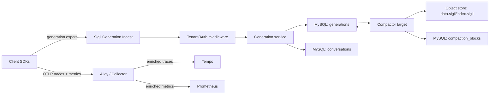
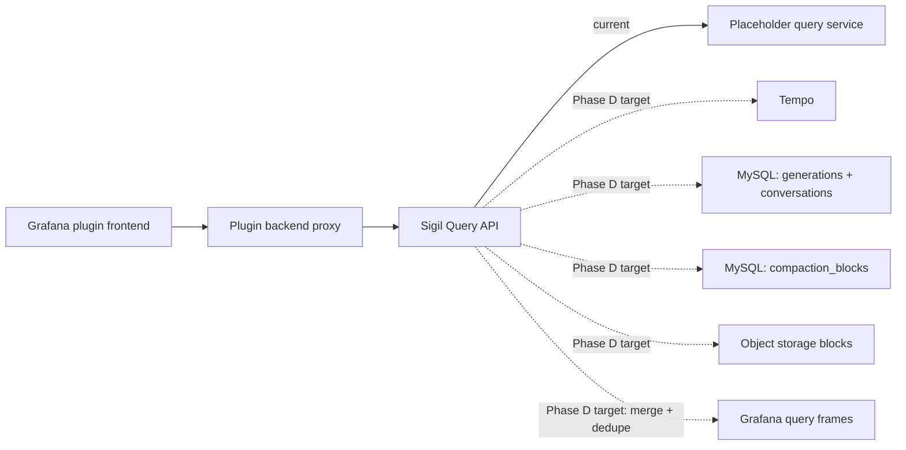
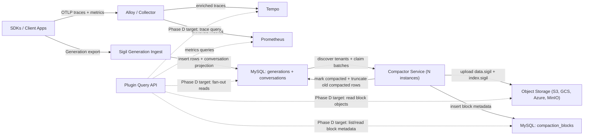
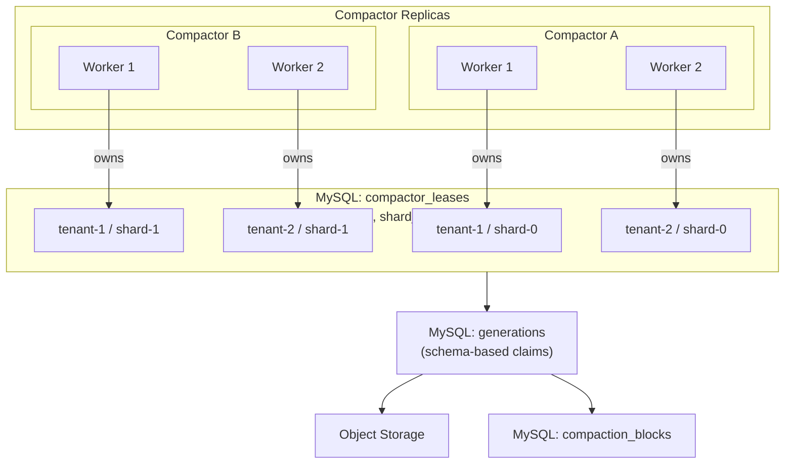
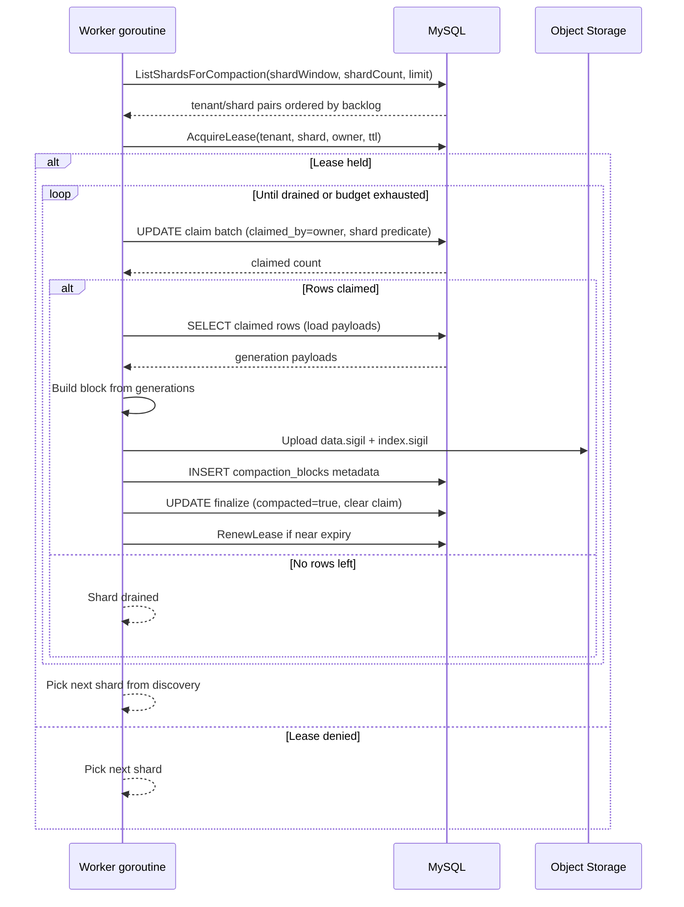

# Sigil Architecture

## System Boundaries

- `apps/plugin`: Grafana plugin UI and backend proxy for Sigil APIs.
- `sigil`: generation ingest and query APIs.
- `sdks/*`: post-LLM instrumentation SDKs (Go, Python, TypeScript/JavaScript, Java, .NET/C#). SDKs emit OTel traces, OTel metrics, and structured generation records.
- Alloy / OTel Collector: telemetry pipeline for traces and metrics. Receives OTLP from SDKs, enriches with infrastructure metadata (k8s namespace, cluster, service), and forwards to backends.
- Tempo: trace storage and TraceQL execution backend.
- Prometheus: metrics storage for SDK-emitted AI observability metrics.
- MySQL: hot metadata/index store plus hot generation payload store.
- Object storage: long-term compacted generation payload storage.
  - implementation standard: Thanos `objstore` Go package (`github.com/thanos-io/objstore`).

## Phase 2 Target State

Phase 2 defines production contracts for SDK parity, query envelopes, tenant boundaries, and hybrid storage/query behavior. Some runtime paths remain placeholders today; this file defines the implementation target.

### Execution priority

Tenant-boundary track is completed. Active implementation sequencing is:

1. query proxy
2. hybrid storage/query behavior
3. compaction scaling and cross-track consistency / tech debt capture

SDK parity completion is tracked in:

- `docs/exec-plans/completed/2026-02-12-phase-2-sdk-parity-python.md`
- `docs/exec-plans/completed/2026-02-12-phase-2-sdk-parity-typescript-javascript.md`
- `docs/exec-plans/completed/2026-02-13-phase-2-sdk-parity-dotnet-csharp.md`
- `docs/exec-plans/completed/2026-02-13-sdk-parity-java.md`
- `docs/exec-plans/completed/2026-02-13-openai-chat-responses-strict-parity.md`
- `docs/exec-plans/completed/2026-02-13-all-providers-strict-helper-mapper-parity.md`
- `docs/exec-plans/completed/2026-02-13-sdk-metrics-and-telemetry-pipeline.md`

Tenant boundary completion is tracked in:

- `docs/exec-plans/completed/2026-02-12-phase-2-tenant-boundary.md`

## Ingest Model (Generation-First)

### Telemetry pipeline (traces + metrics)

- SDKs export OTLP traces and OTLP metrics to Alloy / OTel Collector via `OTEL_EXPORTER_OTLP_ENDPOINT`.
- Alloy/Collector enriches telemetry with infrastructure metadata (k8s namespace, cluster, service, pod) and forwards:
  - Traces to Tempo.
  - Metrics to Prometheus.
- Sigil is NOT in the trace or metrics path. Traces and metrics flow through the standard OTel pipeline.

### SDK metrics

SDKs emit four OTel histogram instruments alongside traces:

- `gen_ai.client.operation.duration` (seconds): latency histogram for generations and tool calls.
  - Attributes: `gen_ai.operation.name` (`generateText` | `streamText` | `execute_tool`), `gen_ai.provider.name`, `gen_ai.request.model`, `gen_ai.agent.name`, `error.type`, `error.category`.
- `gen_ai.client.token.usage` (tokens): token count histogram per generation, split by token type.
  - Attributes: `gen_ai.provider.name`, `gen_ai.request.model`, `gen_ai.agent.name`, `gen_ai.token.type` (`input` | `output` | `cache_read` | `cache_write` | `cache_creation` | `reasoning`).
- `gen_ai.client.time_to_first_token` (seconds): TTFT histogram for streaming operations.
  - Attributes: `gen_ai.provider.name`, `gen_ai.request.model`, `gen_ai.agent.name`.
- `gen_ai.client.tool_calls_per_operation` (count): tool call count distribution per generation.
  - Attributes: `gen_ai.provider.name`, `gen_ai.request.model`, `gen_ai.agent.name`.

These metrics get collector-enriched infrastructure labels (namespace, cluster, service) automatically.

Design doc: `docs/design-docs/2026-02-13-sdk-metrics-and-telemetry-pipeline.md`

### Generation pipeline

- SDKs export normalized generations to Sigil custom ingest.
- Primary transport is gRPC with HTTP parity.
- HTTP and gRPC ingest paths call one shared export service path.
- Export in SDKs is buffered, batched, and asynchronous.
- `shutdown` is required to flush pending generations.

### Deployment topology guidance

- Generation path is direct to Sigil generation ingest (`/api/v1/generations:export` or `GenerationIngestService.ExportGenerations`) using tenant auth mode.
- Trace and metrics path goes through Alloy / OTel Collector. `OTEL_EXPORTER_OTLP_ENDPOINT` points at the collector.
- Enterprise proxy pattern:
  - client sends bearer token
  - proxy authenticates bearer and translates to upstream `X-Scope-OrgID`
  - Sigil API enforces tenant header and does not validate bearer tokens in this phase

## Query Model

- Tempo is the primary backend for trace search and TraceQL-based metrics workflows.
- Query fan-out hydration from MySQL/object storage is the Phase D target.
- Current `sigil/internal/query` implementation is still placeholder/bootstrap.
- Query access from the plugin frontend is plugin-proxy-only.

### Query access path

1. Frontend sends query request to plugin backend resource endpoint.
2. Plugin backend applies tenant header behavior and forwards to Sigil API query endpoint.
3. Sigil API query path:
   - current: placeholder conversation/completion/trace endpoints plus pass-through query proxy routes for Prometheus/Mimir and Tempo
   - target: Tempo query + storage hydration/fan-out reads
4. Sigil API returns Grafana-compatible query envelope and frames.

## Runtime Read/Write Paths

### Write path (implemented)

Write path components:

1. Client SDKs export generations directly to Sigil generation ingest (`/api/v1/generations:export` or gRPC).
2. Sigil tenant/auth middleware resolves tenant context.
3. Generation ingest service validates payloads and writes:
   - `generations` rows (hot payload + compaction cursor state)
   - `conversations` projection rows.
4. Client SDKs export OTLP traces and metrics to Alloy / OTel Collector.
5. Alloy enriches telemetry with infrastructure metadata and forwards traces to Tempo and metrics to Prometheus.
6. Compactor target reads MySQL generations, writes object blocks + metadata, then marks/truncates compacted rows.

### Read path (current vs target)

Read path components:

1. Grafana plugin frontend calls plugin backend resource routes.
2. Plugin backend adds tenant context and forwards to Sigil query API.
3. Current query backend is placeholder/bootstrap.
4. Phase D target query backend fan-out:
   - Tempo for trace search/detail
   - MySQL hot rows (`generations`, `conversations`)
   - MySQL block catalog (`compaction_blocks`)
   - object storage blocks (`data.sigil`, `index.sigil`)
   - union + dedupe by `generation_id` with hot-row preference.

## Tenant/Auth Model

- Tenant header: `X-Scope-OrgID`.
- Operator guide: `docs/references/multi-tenancy.md`.
- Auth model is lightweight tenant header extraction/enforcement.
- OSS mode supports `auth enabled/disabled` behavior:
  - enabled: protected endpoints require tenant context
  - disabled: fake tenant context is injected for local/dev
- Runtime flags:
  - `SIGIL_AUTH_ENABLED` (default `true`)
  - `SIGIL_FAKE_TENANT_ID` (default `fake`)
- Tenant handling uses dskit utilities (`user`, `tenant`, `middleware`).
- Enforcement scope is uniform for query + generation ingest (HTTP and gRPC).
- Missing tenant behavior in auth-enabled mode:
  - HTTP protected endpoints: `401 Unauthorized`
  - gRPC protected methods: `Unauthenticated`
- Health endpoints are exempt.
- Bearer token authentication/validation is not performed by Sigil API in this phase.

## Storage Model

### Hot store (MySQL)

MySQL is not only an ingest log. It stores:

- generation metadata and indexes used by application queries
- conversation metadata
- hot payload rows used for recent reads and overlap resolution
- compaction state and bookkeeping

### Cold store (object storage)

- compacted, compressed generation payload segments
- long-term retained payload history
- implemented via Thanos `objstore` interfaces and clients

### Read policy (fixed)

Query reads fan out to hot and cold stores, union results, and dedupe by `generation_id`.

- overlap conflict policy: prefer hot MySQL row

### Hybrid storage data flow (current compaction + target query fan-out)

### Distributed compactor topology

Status (2026-02-13):

- Implemented on `main`: shard-level leases (`compactor_leases` keyed by `(tenant_id, shard_id)`), schema-based claims (`claimed_by`/`claimed_at`), backlog-aware shard discovery, and worker-pool drain loops.
- Compactor claim lifecycle is now `ClaimBatch -> LoadClaimed -> Build/Upload -> InsertBlock -> FinalizeClaimed`.

### Compaction flow

Status (2026-02-13):

- Implemented on `main`: schema-based claim/load/finalize with short claim/finalize updates and out-of-transaction object I/O.
- Workers renew shard leases while draining and run shard-aware truncation after compaction passes.

### Compactor scaling characteristics

Current behavior on `main`:

- Compaction scales across tenants and within a single tenant via time-range sharding.
- Each tenant is split into N shards (`SIGIL_COMPACTOR_SHARD_COUNT`) that can be processed in parallel.
- Claims use schema-based durable state (`claimed_by`/`claimed_at`) with short claim/finalize updates.
- Workers run multi-batch shard drain loops with backlog-aware scheduling and lease renewal.
- Stale claim recovery sweeps release orphaned claims after `SIGIL_COMPACTOR_CLAIM_TTL`.
- Truncation is shard-aware.

References:

- Design doc: `docs/design-docs/2026-02-13-compaction-scaling.md`
- Execution plan: `docs/exec-plans/active/2026-02-13-compaction-scaling.md`

## API Contracts

### Ingest

- Generation ingest gRPC: `sigil.v1.GenerationIngestService.ExportGenerations`
- Generation ingest HTTP parity: `POST /api/v1/generations:export`

Note: OTLP trace and metric ingest is handled by Alloy / OTel Collector, not by Sigil. SDKs send OTLP to the collector via `OTEL_EXPORTER_OTLP_ENDPOINT`.

### Query

Current bootstrap endpoints on `main`:

- Sigil API query endpoints:
  - `GET /api/v1/conversations`
  - `GET /api/v1/conversations/{conversation_id}`
  - `GET /api/v1/conversations/{conversation_id}/ratings`
  - `POST /api/v1/conversations/{conversation_id}/ratings`
  - `GET /api/v1/conversations/{conversation_id}/annotations`
  - `POST /api/v1/conversations/{conversation_id}/annotations`
  - `GET /api/v1/completions`
  - `GET /api/v1/traces/{trace_id}`
  - `GET|POST /api/v1/proxy/prometheus/api/v1/query`
  - `GET|POST /api/v1/proxy/prometheus/api/v1/query_range`
  - `GET|POST /api/v1/proxy/prometheus/api/v1/query_exemplars`
  - `GET|POST /api/v1/proxy/prometheus/api/v1/series`
  - `GET|POST /api/v1/proxy/prometheus/api/v1/labels`
  - `GET /api/v1/proxy/prometheus/api/v1/label/{name}/values`
  - `GET /api/v1/proxy/prometheus/api/v1/metadata`
  - `GET /api/v1/proxy/tempo/api/search`
  - `GET /api/v1/proxy/tempo/api/search/tags`
  - `GET /api/v1/proxy/tempo/api/v2/search/tags`
  - `GET /api/v1/proxy/tempo/api/search/tag/{tag}/values`
  - `GET /api/v1/proxy/tempo/api/v2/search/tag/{tag}/values`
  - `GET /api/v1/proxy/tempo/api/traces/{trace_id}`
  - `GET /api/v1/proxy/tempo/api/v2/traces/{trace_id}`
  - `GET /api/v1/proxy/tempo/api/metrics/query`
  - `GET /api/v1/proxy/tempo/api/metrics/query_range`
- Plugin resource proxy endpoints:
  - `GET /api/plugins/grafana-sigil-app/resources/query/conversations`
  - `GET /api/plugins/grafana-sigil-app/resources/query/conversations/{conversation_id}`
  - `GET /api/plugins/grafana-sigil-app/resources/query/conversations/{conversation_id}/ratings`
  - `POST /api/plugins/grafana-sigil-app/resources/query/conversations/{conversation_id}/ratings`
  - `GET /api/plugins/grafana-sigil-app/resources/query/conversations/{conversation_id}/annotations`
  - `POST /api/plugins/grafana-sigil-app/resources/query/conversations/{conversation_id}/annotations`
  - `GET /api/plugins/grafana-sigil-app/resources/query/completions`
  - `/api/plugins/grafana-sigil-app/resources/query/proxy/prometheus/...`
  - `/api/plugins/grafana-sigil-app/resources/query/proxy/tempo/...`

Phase 2 target contract (tracked in `docs/exec-plans/active/2026-02-12-phase-2-query-proxy.md`):

- Sigil API query endpoint: `POST /api/v1/query`
- Plugin resource proxy endpoint: `POST /api/plugins/grafana-sigil-app/resources/query`

## Query Response Contract

- Envelope: Grafana datasource `QueryDataResponse` shape (`results.<refId>.frames`).
- Metrics frames: Grafana-compatible metric data frames for graph/table usage.
- Trace detail frames: Grafana/Tempo-compatible trace frame shape (`preferredVisualisationType: trace`).
- Trace search frames: Tempo/Grafana-compatible table frame shape (trace id, start time, service, name, duration, nested spans when present).

See `docs/references/grafana-query-response-shapes.md`.

## Generation Contract

- Generation mode is explicit:
  - `SYNC`: non-stream provider flows
  - `STREAM`: streaming provider flows
- Normalized fields are always sent:
  - model/system prompt/input/output/tools/usage/metadata/timestamps/tags
- Request controls are first-class optional generation fields:
  - `max_tokens`
  - `temperature`
  - `top_p`
  - `tool_choice`
  - `thinking_enabled`
- Provider-specific thinking budget is preserved when available via metadata key:
  - `sigil.gen_ai.request.thinking.budget_tokens`
- Tool definitions support optional input schema JSON for transport parity (`input_schema_json` over gRPC).
- Optional identity fields are supported end-to-end:
  - `conversation_id`
  - `agent_name`
  - `agent_version`
- Raw artifacts are optional debug payloads and default OFF.
- Artifact identity fields (`name`, `record_id`, `uri`) are supported when present.

## SDK Runtime Contracts

- OTel-first mental model: Sigil extends familiar instrumentation flow with AI-specific normalized generation semantics.
- Core APIs are explicit client/recorder lifecycle APIs.
- Provider wrappers are convenience sugar, documented wrapper-first in provider modules.
- Provider parity target for Go/Python/TS/Java/.NET: OpenAI, Anthropic, Gemini.
- OpenAI provider parity now includes strict official SDK-shaped support for both Chat Completions and Responses across Go/Python/TS/Java/.NET.
- Python SDK runtime lives in `sdks/python` with provider wrapper packages in `sdks/python-providers/*`.
- .NET SDK runtime lives in `sdks/dotnet` with split provider packages under `sdks/dotnet/src/Grafana.Sigil.*`.
- Raw provider artifacts are default OFF, explicit opt-in only.
- SDK validation enforces message role/part compatibility and artifact payload-or-record-id constraints.
- Empty tool names return a no-op tool recorder (instrumentation safety behavior).
- `rec.Err()` surfaces local validation/enqueue failures only.
- Background export failures are retried and logged.
- Generation export auth supports strict modes:
  - `none`, `tenant`, `bearer`
  - `tenant` mode injects `X-Scope-OrgID`
- `bearer` mode injects `Authorization: Bearer <token>`
- Trace/metric exporter auth and transport are configured in the application's OTEL SDK setup.
- SDK conversation feedback helpers (ratings/annotations) use a dedicated Sigil API base endpoint config (default `http://localhost:8080`) and reuse generation auth headers.
- Auth config validation is strict and fail-fast during config resolution/client init.
- Explicit transport headers have precedence over injected auth headers for `Authorization` and `X-Scope-OrgID`.

## Service Responsibilities

- `apps/plugin`: UI routes and backend proxy handlers for Sigil query contracts.
- `sigil/internal/ingest/generation`: generation ingest validation and persistence coordination.
- `sigil/internal/query`: Tempo-first query orchestration plus storage hydration and fan-out reads.
- `sigil/internal/modelcards`: model-card catalog bootstrap, in-memory refresh loop/cache coordination, and API read semantics.
- `sigil/internal/storage/mysql`: hot metadata/index/payload access.
- `sigil/internal/storage/object`: compacted payload access.
  - implementation should wrap Thanos `objstore` primitives.
- `sdks/*`: OTel traces, OTel metrics (`gen_ai.client.operation.duration`, `gen_ai.client.token.usage`, `gen_ai.client.time_to_first_token`, `gen_ai.client.tool_calls_per_operation`), and structured generation export.
- Alloy / OTel Collector: OTLP receiver, infrastructure enrichment, trace forwarding to Tempo, metric forwarding to Prometheus.

### Runtime targets

Runtime module targets include:

- `all`
- `server`
- `querier`
- `compactor`
- `catalog-sync` (singleton model-card refresh loop; can run independently or as part of `all`)

## Local Runtime (Compose Core)

The default local stack started by `mise run up` (`docker compose --profile core up --build`) now includes a synthetic SDK traffic service:

- `sdk-traffic`: one always-on compose service that runs Go/JS/Python/Java/.NET emitters in one container.
- The emitter continuously sends fake threaded agent conversations through all provider wrapper paths (`openai`, `anthropic`, `gemini`) plus a core custom provider path (`mistral`) for ingest/devex validation.
- Traffic uses mixed `SYNC`/`STREAM` modes, provider/language tags, and per-turn metadata to keep shapes distinguishable in local debugging.
- Raw provider artifacts stay default OFF; this path is intended for synthetic ingest load and contract-shape visibility only.

## Evolution Path

Sigil defines an ingestion-log abstraction with pluggable backends.

- Phase 2 backend: MySQL
- Future candidates: Kafka, WarpStream

This prevents tight coupling of ingest semantics to one concrete log implementation.
