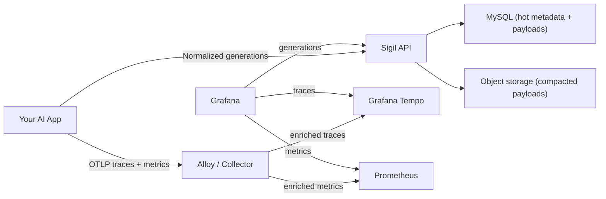

# Grafana Sigil

<p align="center">
  
</p>

Sigil is an open-source AI observability project from Grafana.

> It's actually useful AI o11y.

It combines OpenTelemetry traces with normalized LLM generation data, so you can inspect conversations, completions, and traces in one place.

## What You Get

- Grafana app plugin (`/apps/plugin`) for conversations, completions, traces, and settings.
- Go service (`/sigil`) for generation ingest and query APIs on `:8080`.
- SDKs (`/sdks`) for Go, Python, TypeScript/JavaScript, Java, and .NET/C#:
  - OTel traces with AI-specific attributes (`gen_ai.*`).
  - OTel metrics: latency histograms and token usage distributions.
  - Structured generation export to Sigil.
- Alloy / OTel Collector as the telemetry pipeline (traces + metrics).
- Tempo (docker compose) as trace storage.
- Prometheus as metrics storage for SDK-emitted AI metrics.
- MySQL as default metadata and record-reference storage.
- Object storage for compacted payloads:
  - MinIO (default local/core profile)
  - AWS S3
  - Google Cloud Storage
  - Azure Blob Storage

## Why Sigil

- **Trace + generation correlation**: connect model calls, tool executions, and request traces.
- **OpenTelemetry-native**: SDKs emit OTel traces and metrics via standard OTLP. Works with any OTel-compatible collector.
- **Built-in AI metrics**: latency histograms (streaming, sync, tool calls), token usage distributions, error rates -- per provider, model, agent, and namespace.
- **Generation-first ingest**: export normalized generation payloads across providers.
- **Grafana-native experience**: query and explore from the Sigil app plugin.
- **SDK support**: Go, Python, TypeScript/JavaScript, Java, and .NET/C# SDKs with provider helpers.

## Architecture At A Glance



## Get Started (Local)

### Prerequisites

- [Docker](https://docs.docker.com/get-docker/) with Compose
- [mise](https://mise.jdx.dev/)

### 1. Clone the repository

```bash
git clone https://github.com/grafana/sigil.git
cd sigil
```

### 2. Install toolchain and dependencies

```bash
mise trust
mise install
mise run doctor:go
mise run deps
```

### 3. Start the local stack

```bash
mise run up
```

This starts Grafana, the Sigil app plugin, the Sigil API service, Alloy, Tempo, Prometheus, MySQL, and MinIO.

### 4. Open the Sigil app

- Grafana: [http://localhost:3000](http://localhost:3000)
- Sigil app: [http://localhost:3000/a/grafana-sigil-app/conversations](http://localhost:3000/a/grafana-sigil-app/conversations)

Local default runs with anonymous Grafana auth enabled.

### 5. Verify the API is running

```bash
curl -s http://localhost:8080/healthz
curl -s http://localhost:8080/api/v1/conversations
curl -s http://localhost:8080/api/v1/completions
```

## Deploy On Kubernetes (Helm)

The Sigil Helm chart lives in `charts/sigil`.

Basic install:

```bash
helm upgrade --install sigil ./charts/sigil \
  --namespace sigil \
  --create-namespace \
  --set image.repository=<your-image-repository> \
  --set image.tag=<your-image-tag>
```

Chart docs and reference:

- Chart usage: [`charts/sigil/README.md`](charts/sigil/README.md)
- Helm reference: [`docs/references/helm-chart.md`](docs/references/helm-chart.md)

## SDK Quick Examples

### TypeScript

```ts
import { SigilClient } from "@grafana/sigil-sdk-js";

const client = new SigilClient({
  generationExport: {
    protocol: "http",
    endpoint: "http://localhost:8080/api/v1/generations:export",
    auth: { mode: "tenant", tenantId: "dev-tenant" },
  },
});

// Configure OTEL exporters (traces/metrics) in your app OTEL setup.

await client.startGeneration(
  {
    conversationId: "conv-1",
    model: { provider: "openai", name: "gpt-5" },
  },
  async (recorder) => {
    recorder.setResult({
      output: [{ role: "assistant", content: "Hello from Sigil" }],
    });
  }
);

await client.shutdown();
```

### JavaScript

```js
import { SigilClient } from "@grafana/sigil-sdk-js";

const client = new SigilClient({
  generationExport: {
    protocol: "http",
    endpoint: "http://localhost:8080/api/v1/generations:export",
    auth: { mode: "tenant", tenantId: "dev-tenant" },
  },
});

await client.startGeneration(
  {
    conversationId: "conv-1",
    model: { provider: "openai", name: "gpt-5" },
  },
  async (recorder) => {
    recorder.setResult({
      output: [{ role: "assistant", content: "Hello from Sigil" }],
    });
  }
);

await client.shutdown();
```

### Go

```go
cfg := sigil.DefaultConfig()
cfg.GenerationExport.Protocol = sigil.GenerationExportProtocolHTTP
cfg.GenerationExport.Endpoint = "http://localhost:8080/api/v1/generations:export"
cfg.GenerationExport.Auth = sigil.AuthConfig{
	Mode:     sigil.ExportAuthModeTenant,
	TenantID: "dev-tenant",
}

client := sigil.NewClient(cfg)
defer func() { _ = client.Shutdown(context.Background()) }()

ctx, rec := client.StartGeneration(context.Background(), sigil.GenerationStart{
	ConversationID: "conv-1",
	Model:          sigil.ModelRef{Provider: "openai", Name: "gpt-5"},
})
defer rec.End()

rec.SetResult(sigil.Generation{
	Output: []sigil.Message{sigil.AssistantTextMessage("Hello from Sigil")},
}, nil)
```

### Python

```python
from sigil_sdk import Client, ClientConfig, GenerationStart, ModelRef, assistant_text_message

client = Client(
    ClientConfig(
        generation_export_endpoint="http://localhost:8080/api/v1/generations:export",
    )
)

with client.start_generation(
    GenerationStart(
        conversation_id="conv-1",
        model=ModelRef(provider="openai", name="gpt-5"),
    )
) as rec:
    rec.set_result(output=[assistant_text_message("Hello from Sigil")])

client.shutdown()
```

## SDKs We Support

- Go core SDK: [`sdks/go/README.md`](sdks/go/README.md)
- Python core SDK: [`sdks/python/README.md`](sdks/python/README.md)
- TypeScript/JavaScript SDK: [`sdks/js/README.md`](sdks/js/README.md)
- Java SDK: [`sdks/java/README.md`](sdks/java/README.md)
- .NET SDK: [`sdks/dotnet/README.md`](sdks/dotnet/README.md)

Provider helper docs:

- Go providers: OpenAI ([`sdks/go-providers/openai/README.md`](sdks/go-providers/openai/README.md)), Anthropic ([`sdks/go-providers/anthropic/README.md`](sdks/go-providers/anthropic/README.md)), Gemini ([`sdks/go-providers/gemini/README.md`](sdks/go-providers/gemini/README.md))
- Python providers: OpenAI ([`sdks/python-providers/openai/README.md`](sdks/python-providers/openai/README.md)), Anthropic ([`sdks/python-providers/anthropic/README.md`](sdks/python-providers/anthropic/README.md)), Gemini ([`sdks/python-providers/gemini/README.md`](sdks/python-providers/gemini/README.md))
- TypeScript/JavaScript providers: OpenAI ([`sdks/js/docs/providers/openai.md`](sdks/js/docs/providers/openai.md)), Anthropic ([`sdks/js/docs/providers/anthropic.md`](sdks/js/docs/providers/anthropic.md)), Gemini ([`sdks/js/docs/providers/gemini.md`](sdks/js/docs/providers/gemini.md))
- Java providers: OpenAI ([`sdks/java/providers/openai/README.md`](sdks/java/providers/openai/README.md)), Anthropic ([`sdks/java/providers/anthropic/README.md`](sdks/java/providers/anthropic/README.md)), Gemini ([`sdks/java/providers/gemini/README.md`](sdks/java/providers/gemini/README.md))
- .NET providers: OpenAI ([`sdks/dotnet/src/Grafana.Sigil.OpenAI/README.md`](sdks/dotnet/src/Grafana.Sigil.OpenAI/README.md)), Anthropic ([`sdks/dotnet/src/Grafana.Sigil.Anthropic/README.md`](sdks/dotnet/src/Grafana.Sigil.Anthropic/README.md)), Gemini ([`sdks/dotnet/src/Grafana.Sigil.Gemini/README.md`](sdks/dotnet/src/Grafana.Sigil.Gemini/README.md))

## Documentation

- Docs index: [`docs/index.md`](docs/index.md)
- Architecture and contracts: [`ARCHITECTURE.md`](ARCHITECTURE.md)
- Generation ingest reference: [`docs/references/generation-ingest-contract.md`](docs/references/generation-ingest-contract.md)
- Helm deployment reference: [`docs/references/helm-chart.md`](docs/references/helm-chart.md)

## Contributing

Forking and contribution workflow lives in [`CONTRIBUTING.md`](CONTRIBUTING.md).

## License

- Repository code is licensed under GNU AGPL v3.0. See [`LICENSE`](LICENSE).
- SDK subfolders under `sdks/` are licensed under Apache License 2.0. See [`sdks/LICENSE`](sdks/LICENSE).
