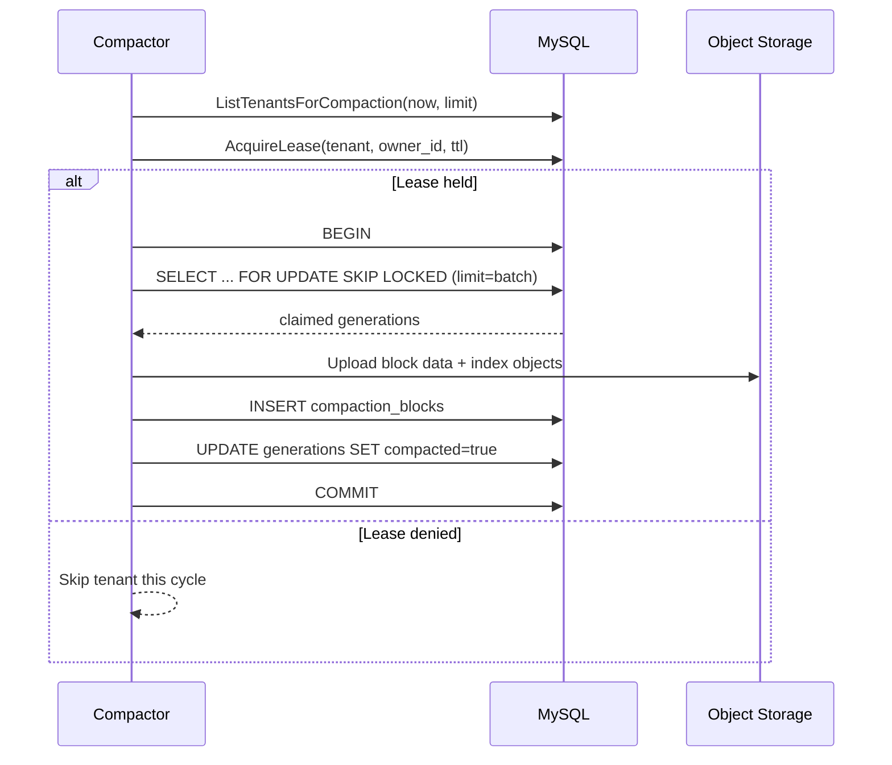
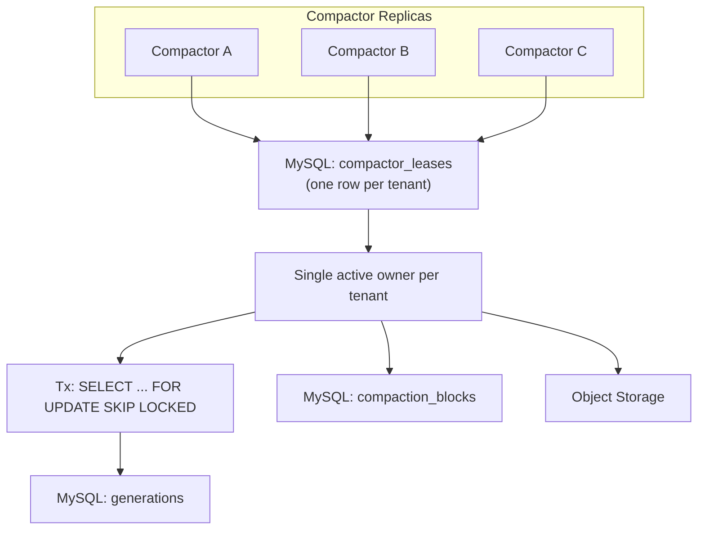
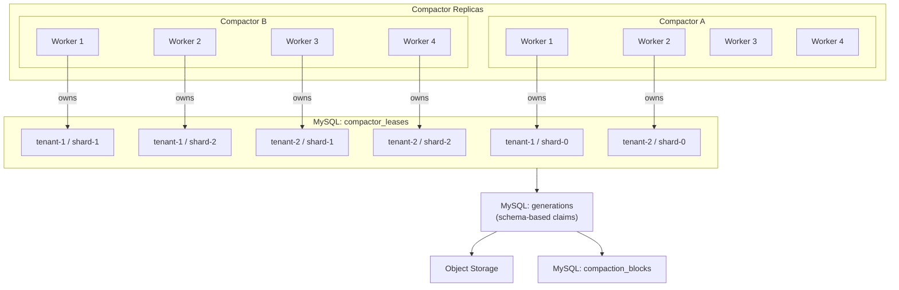
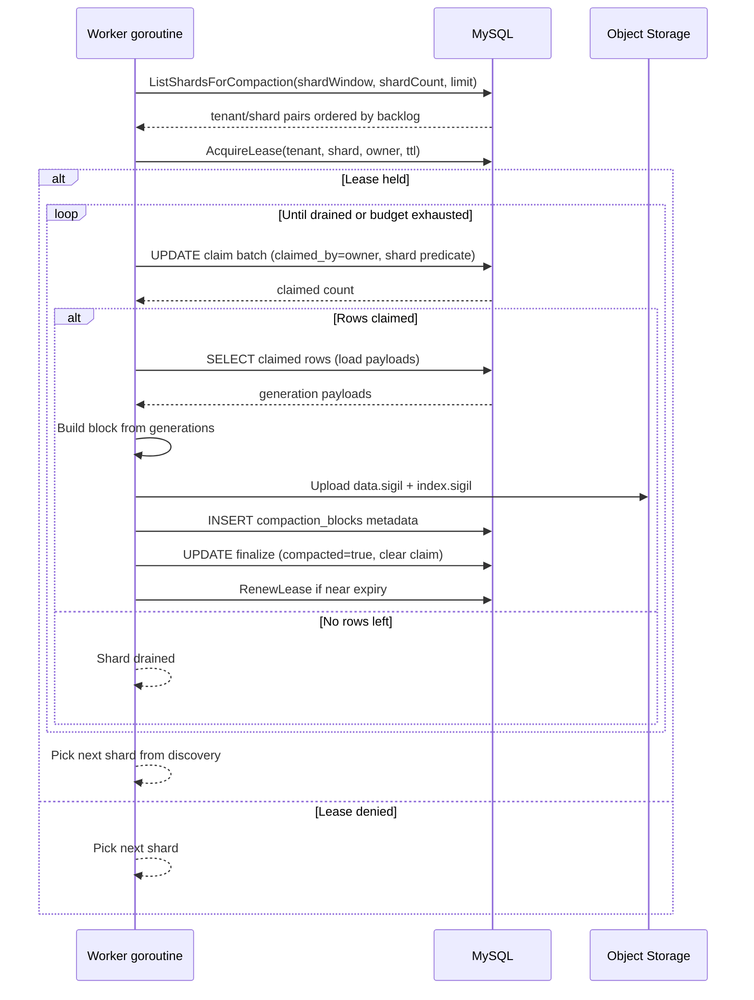

# Compaction Scaling: Sub-Tenant Sharding and Schema-Based Claims

## Implementation status (2026-02-13)

- This document defines a target design; the full shard-based scaling model is not merged to `main` yet.
- Current `main` behavior remains tenant-level leasing plus transactional `FOR UPDATE SKIP LOCKED` claims.
- Partial safety improvement merged: compaction retry idempotency guard for `upload succeeded + metadata inserted + finalize failed` retries (duplicate metadata is treated as idempotent on retry).
- Close related tech-debt items only after full implementation code and tests merge to `main`.

## Problem statement

The current compaction design (defined in `2026-02-12-phase-2-hybrid-storage.md`) distributes work across tenants but serializes all work within a single tenant to one compactor instance. This creates a throughput ceiling for hot tenants:

- One lease per tenant means one compactor owner regardless of backlog size.
- One batch per compact cycle means the compactor idles between ticks even with pending work.
- The `SELECT ... FOR UPDATE SKIP LOCKED` pattern holds row locks for the entire duration of block building, object store upload, metadata insert, and row marking. Object store latency directly extends lock hold time.
- Tenant discovery is alphabetical with a flat `LIMIT`, ignoring backlog size. A tenant producing 100x the data gets the same scheduling priority as a quiet tenant.
- Truncation has the same single-owner bottleneck.

Net effect: many-tenant workloads scale horizontally with more compactor replicas, but a single hot tenant cannot benefit from additional compactor capacity.

## Current state

Compaction phases 0 through C are implemented and tested:

- `sigil/internal/storage/compactor/service.go`: compact loop + truncate loop
- `sigil/internal/storage/compactor/leaser.go`: `TenantDiscoverer`, `TenantLeaser`, `TransactionalClaimer`, `Truncator` interfaces
- `sigil/internal/storage/mysql/lease.go`: `AcquireLease`, `ListTenantsForCompaction`, `ListTenantsForTruncation`
- `sigil/internal/storage/mysql/compaction_tx.go`: `WithClaimedUncompacted` (long-transaction claim)
- `sigil/internal/storage/mysql/compaction.go`: `TruncateCompacted`

The current compaction transaction flow:



Current distributed topology:



## Proposed design

Five changes work together to remove the single-tenant bottleneck.

### Change 1: Schema-based durable claim state

Replace the transactional `FOR UPDATE SKIP LOCKED` pattern with explicit claim columns on the `generations` table and a two-phase claim/finalize flow. This decouples lock duration from object store I/O latency.

#### Schema change: `generations` table additions

- `claimed_by VARCHAR(255) NULL` -- compactor owner ID that claimed the row
- `claimed_at TIMESTAMP(6) NULL` -- when the claim was made

New compaction index replacing `(tenant_id, compacted, created_at)`:

- `(tenant_id, compacted, claimed_by, created_at)`

#### Claim flow

The `TransactionalClaimer` interface is replaced by a `Claimer` with three operations:

```go
type Claimer interface {
    // ClaimBatch atomically marks unclaimed rows as owned by this compactor.
    // Returns the number of rows claimed.
    ClaimBatch(ctx context.Context, tenantID, ownerID string, shardPredicate ShardPredicate, olderThan time.Time, limit int) (int, error)

    // LoadClaimed returns generations previously claimed by this owner.
    LoadClaimed(ctx context.Context, tenantID, ownerID string, shardPredicate ShardPredicate, limit int) ([]*sigilv1.Generation, []uint64, error)

    // FinalizeClaimed marks claimed rows as compacted and clears claim state.
    FinalizeClaimed(ctx context.Context, tenantID, ownerID string, ids []uint64) error
}
```

SQL operations:

**Claim** (short UPDATE, no long-held locks):

```sql
UPDATE generations
SET claimed_by = ?, claimed_at = NOW(6)
WHERE tenant_id = ?
  AND compacted = FALSE
  AND claimed_by IS NULL
  AND created_at <= ?
  AND <shard_predicate>
ORDER BY created_at ASC
LIMIT ?
```

**Load** (read claimed rows outside any transaction):

```sql
SELECT id, payload FROM generations
WHERE tenant_id = ?
  AND claimed_by = ?
  AND compacted = FALSE
  AND <shard_predicate>
ORDER BY created_at ASC
LIMIT ?
```

**Finalize** (short UPDATE):

```sql
UPDATE generations
SET compacted = TRUE, compacted_at = NOW(6), claimed_by = NULL, claimed_at = NULL
WHERE tenant_id = ? AND claimed_by = ? AND id IN (?)
```

**Stale claim recovery** (periodic sweep):

```sql
UPDATE generations
SET claimed_by = NULL, claimed_at = NULL
WHERE claimed_by IS NOT NULL
  AND claimed_at < NOW() - INTERVAL ? SECOND
  AND compacted = FALSE
```

The stale claim timeout should be configurable (`SIGIL_COMPACTOR_CLAIM_TTL`, default 5 minutes) and must be longer than the maximum expected block build + upload duration.

### Change 2: Sub-tenant sharding via time-range partitioning

Replace the single `compactor_leases` row per tenant with a shard-based lease model. Multiple compactors can work on different time-range shards of the same tenant in parallel.

#### Schema change: `compactor_leases` table

Replace:

```sql
-- old
CREATE TABLE compactor_leases (
  tenant_id  VARCHAR(128) PRIMARY KEY,
  owner_id   VARCHAR(255) NOT NULL,
  leased_at  TIMESTAMP(6) NOT NULL,
  expires_at TIMESTAMP(6) NOT NULL
);
```

With:

```sql
-- new
CREATE TABLE compactor_leases (
  tenant_id  VARCHAR(128) NOT NULL,
  shard_id   INT NOT NULL,
  owner_id   VARCHAR(255) NOT NULL,
  leased_at  TIMESTAMP(6) NOT NULL,
  expires_at TIMESTAMP(6) NOT NULL,
  PRIMARY KEY (tenant_id, shard_id)
);
```

#### Shard assignment function

Each generation row maps to a shard deterministically using its `created_at` timestamp:

```
shard_id = FLOOR(UNIX_TIMESTAMP(created_at) / shard_window_seconds) % shard_count
```

Configuration:

- `SIGIL_COMPACTOR_SHARD_COUNT` (default `1`): number of shards per tenant. `1` reproduces current single-writer behavior exactly.
- `SIGIL_COMPACTOR_SHARD_WINDOW_SECONDS` (default `60`): time window width in seconds for shard rotation.

The shard predicate injected into claim and truncation queries:

```sql
AND (FLOOR(UNIX_TIMESTAMP(created_at) / ?) % ?) = ?
```

#### Why time-range sharding over hash sharding

- Time-based shards produce blocks with contiguous time ranges, aligning with the existing `compaction_blocks.min_time / max_time` overlap query pattern for fan-out reads.
- Hash sharding would scatter timestamps across blocks, increasing the number of blocks a fan-out read must touch for any given time window.
- Time-based shards naturally partition hot (recent) vs warm (older) data, allowing compactors to prioritize recent shards.

### Change 3: Backlog-aware tenant/shard scheduling

Replace the flat `SELECT DISTINCT tenant_id` discovery with a backlog-weighted query that returns tenant/shard pairs ordered by the size of their unprocessed backlog:

```sql
SELECT tenant_id,
       (FLOOR(UNIX_TIMESTAMP(created_at) / ?) % ?) AS shard_id,
       COUNT(*) AS backlog
FROM generations
WHERE compacted = FALSE
  AND claimed_by IS NULL
GROUP BY tenant_id, shard_id
ORDER BY backlog DESC
LIMIT ?
```

Updated interface:

```go
type TenantDiscoverer interface {
    // ListShardsForCompaction returns tenant/shard pairs ordered by backlog size.
    ListShardsForCompaction(ctx context.Context, shardWindowSeconds int, shardCount int, limit int) ([]TenantShard, error)

    // ListShardsForTruncation returns tenant/shard pairs with compacted rows ready for deletion.
    ListShardsForTruncation(ctx context.Context, shardWindowSeconds int, shardCount int, olderThan time.Time, limit int) ([]TenantShard, error)
}

type TenantShard struct {
    TenantID string
    ShardID  int
    Backlog  int
}
```

This ensures hot tenants get proportional compaction attention across all compactor instances.

### Change 4: Multi-batch drain within a cycle

After processing one batch for a tenant/shard, the compactor loops and processes the next batch until:

- No more unclaimed rows remain for that shard
- A configurable time budget is exhausted (`SIGIL_COMPACTOR_CYCLE_BUDGET`, default `30s`)
- The lease is approaching expiry (remaining TTL < renew threshold)

Between batches, the compactor renews the shard lease. This removes the one-batch-per-tick throughput ceiling.

```go
for {
    if timeBudgetExhausted() || leaseNearExpiry() {
        break
    }
    claimed, err := claimer.ClaimBatch(ctx, tenantID, ownerID, shardPred, olderThan, batchSize)
    if claimed == 0 || err != nil {
        break
    }
    // load -> build block -> upload -> finalize
    leaser.RenewLease(ctx, tenantID, shardID, ownerID, leaseTTL)
}
```

### Change 5: Parallel workers within a compactor instance

Each compactor instance runs a configurable pool of worker goroutines (`SIGIL_COMPACTOR_WORKERS`, default `4`). Workers coordinate through the lease table with no in-process locking required:

1. Each worker picks the highest-backlog tenant/shard from the shared discovery result.
2. Acquires or renews the shard lease.
3. Runs the claim-load-build-upload-finalize drain loop.
4. When drained, moves to the next available shard.

Workers within the same instance naturally avoid contention because the lease table ensures only one owner per shard. If two workers race for the same shard, the loser simply moves to the next one.

## Target topology



## Target compaction sequence



## Truncation improvements

The same shard-based model applies to truncation:

- Workers that finish compacting a shard can also truncate stale compacted rows for that shard.
- The shard predicate ensures no contention between truncators working on different shards.
- Truncation query becomes:

```sql
DELETE FROM generations
WHERE tenant_id = ?
  AND compacted = TRUE
  AND compacted_at < ?
  AND (FLOOR(UNIX_TIMESTAMP(created_at) / ?) % ?) = ?
ORDER BY id ASC
LIMIT ?
```

## Lease heartbeat and renewal

With multi-batch drain loops and parallel workers, leases need proactive renewal:

- Each worker renews its shard lease at `LeaseTTL / 2` intervals during processing.
- Renewal is a conditional update: `UPDATE compactor_leases SET expires_at=? WHERE tenant_id=? AND shard_id=? AND owner_id=?`. If the update affects zero rows (lease stolen), the worker abandons the shard immediately and moves to the next one.
- The stale claim sweeper (Change 1) handles crash recovery: if a compactor dies mid-claim, the claimed rows are released after `claim_ttl` expires.

## Block size strategy

With more parallelism, compactors may create more smaller blocks. To mitigate index bloat and read amplification:

- Add a target block size configuration (`SIGIL_COMPACTOR_TARGET_BLOCK_BYTES`, default `67108864` / 64 MiB).
- The compactor accumulates claimed rows until the accumulated payload size reaches the target (or the batch runs out), producing fewer, larger blocks.
- Level-2 block compaction (merging small blocks into larger ones) is deferred to a future phase and recorded in tech debt.

## Impact on fan-out reads

The fan-out read algorithm (Phase D) is unaffected by these changes:

- `BlockMetadataStore.ListBlocks(tenantID, from, to)` returns blocks based on `min_time/max_time` overlap, regardless of which shard or compactor produced them.
- Time-range sharding produces blocks with naturally contiguous time ranges, which is optimal for time-bounded fan-out queries.
- WAL hot rows remain the source of truth for in-progress data. Claimed-but-not-yet-compacted rows are still visible through `WALReader` since `compacted` remains `FALSE` during the claim phase.
- During compaction lag (hot tenant with large backlog), the WAL serves all recent reads. The fan-out read path is designed for this: hot-row preference means correctness is maintained regardless of compaction throughput.

## Configuration summary

| Variable | Default | Description |
|---|---|---|
| `SIGIL_COMPACTOR_SHARD_COUNT` | `1` | Number of time-range shards per tenant |
| `SIGIL_COMPACTOR_SHARD_WINDOW_SECONDS` | `60` | Time window width for shard rotation |
| `SIGIL_COMPACTOR_WORKERS` | `4` | Parallel worker goroutines per compactor instance |
| `SIGIL_COMPACTOR_CYCLE_BUDGET` | `30s` | Max wall-clock time a worker spends draining one shard |
| `SIGIL_COMPACTOR_CLAIM_TTL` | `5m` | Stale claim expiry for crash recovery |
| `SIGIL_COMPACTOR_TARGET_BLOCK_BYTES` | `67108864` | Target block size in bytes (64 MiB) |
| `SIGIL_COMPACTOR_COMPACT_INTERVAL` | `1m` | Discovery/scheduling tick interval |
| `SIGIL_COMPACTOR_TRUNCATE_INTERVAL` | `5m` | Truncation scheduling tick interval |
| `SIGIL_COMPACTOR_BATCH_SIZE` | `1000` | Rows per claim batch |
| `SIGIL_COMPACTOR_LEASE_TTL` | `30s` | Shard lease TTL |
| `SIGIL_COMPACTOR_RETENTION` | `1h` | Compacted row retention before truncation |

## Backward compatibility

All new configuration defaults reproduce the current behavior exactly:

- `shard_count=1` means one shard per tenant, equivalent to current single-lease model.
- `workers=1` means one worker goroutine, equivalent to current sequential processing.
- The schema migration adds nullable `claimed_by`/`claimed_at` columns and adds `shard_id` to `compactor_leases`. Existing data is compatible: `claimed_by IS NULL` rows are unclaimed, and existing leases map to `shard_id=0`.

## Instrumentation changes

Updated and new metrics:

- `sigil_compactor_lease_held{tenant_id, shard_id}` (label addition)
- `sigil_compactor_runs_total{status, phase}` (unchanged)
- `sigil_compactor_claim_batch_total{status}` (new: claim operation counts)
- `sigil_compactor_claim_stale_recovered_total` (new: stale claims swept)
- `sigil_compactor_worker_active` (new: gauge of active workers)
- `sigil_compactor_shard_backlog{tenant_id, shard_id}` (new: discovered backlog per shard)
- `sigil_compactor_drain_duration_seconds{tenant_id, shard_id}` (new: time spent draining a shard)

## Testing strategy

### Unit tests

- Schema-based claim/load/finalize round-trip correctness.
- Stale claim recovery sweep behavior.
- Shard predicate correctness: rows map to expected shards.
- Multi-shard concurrent claim isolation (no cross-shard interference).
- Lease renewal and expiry edge cases with shard dimension.
- Worker pool shutdown and graceful drain.
- Backlog-aware discovery ordering correctness.

### Integration tests

- Multiple compactor instances with `shard_count > 1` compacting the same tenant concurrently.
- Crash recovery: kill a compactor mid-claim, verify stale sweep releases rows.
- Multi-batch drain: verify a worker processes multiple batches without waiting for next tick.
- Block size target: verify accumulation behavior produces blocks near target size.
- Full lifecycle: write -> compact (sharded) -> truncate (sharded) -> fan-out read correctness.

### Benchmarks

- `BenchmarkClaimBatch` vs current `BenchmarkWithClaimedUncompacted` (lock duration comparison).
- `BenchmarkParallelCompaction` with N workers on one hot tenant.
- `BenchmarkBacklogDiscovery` with many tenants and skewed backlogs.

## Consequences

- A single hot tenant can now scale compaction across N compactor workers (across any number of instances) by increasing `shard_count`.
- Lock hold duration is reduced from "claim + build + upload + metadata + mark" to just the duration of a single `UPDATE ... LIMIT ?` statement.
- Backlog-aware scheduling ensures compaction resources flow to where they are most needed.
- Backward compatible: default configuration reproduces current behavior.
- Block time-range contiguity is preserved by using time-based (not hash-based) sharding.
- Fan-out read correctness is maintained: claimed rows are still visible through WALReader.
