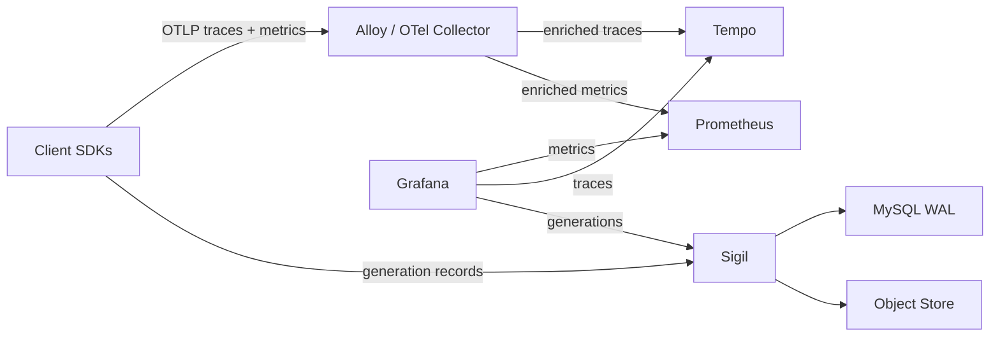

# SDK Metrics and Telemetry Pipeline

## Implementation status (2026-02-13)

- This document defines a target design; no implementation has merged to `main` yet.
- Current `main` behavior: Sigil proxies OTLP traces to Tempo; no SDK-emitted metrics; no Alloy bundled.

## Problem statement

Sigil needs high-level AI observability metrics (Level 1 in the roadmap) -- latency histograms per operation type, token usage distributions, error rates -- all sliceable by provider, model, agent name, AND infrastructure dimensions (namespace, cluster, service).

Three constraints make this hard:

1. **Enrichment gap**: Generation records arrive directly from SDKs without collector-enriched resource attributes (`k8s.namespace.name`, `service.name`, etc.). If Sigil derives metrics from the generation ingest path, those metrics lack infrastructure dimensions that operators need.

2. **Tempo metrics-generator limitations**: Tempo's span-metrics processor can only histogram span duration. It cannot create histograms of arbitrary attribute values like token counts. Token counts as labels would cause cardinality explosion.

3. **Trace proxy waste**: Sigil's OTLP trace ingest (`sigil/internal/ingest/trace/`, `sigil/internal/tempo/client.go`) is a dumb proxy that copies headers and forwards to Tempo. It adds latency without providing batching, retry, enrichment, sampling, or load balancing -- all of which Alloy/Collector handles natively.

## Current state

- SDKs export OTLP traces (with `gen_ai.*` attributes) and generation records (with structured token counts, model, provider, agent, mode).
- Sigil receives OTLP traces on `:4317` (gRPC) and `:4318` (HTTP), forwards them unchanged to Tempo.
- Sigil receives generation records on `:8080` (HTTP) and `:4317` (gRPC, shared with OTLP), writes to MySQL WAL.
- No Prometheus-style metrics are derived from AI operations. Existing metrics are operational only (compactor, WAL, Tempo forwarding).
- Tempo config has empty `overrides: defaults: {}`, no metrics-generator enabled.

## Proposed design

Three changes that reinforce each other:

1. **SDKs emit OTel metrics** alongside traces using 4 histogram instruments.
2. **Remove OTLP trace ingest from Sigil** -- Sigil becomes generation ingest + query API only.
3. **Bundle Alloy** in Helm chart and docker-compose as the standard telemetry pipeline.

### Target architecture



### Why SDK-emitted metrics

- **Collector enrichment works naturally**: OTel metrics flow through the same collector pipeline as traces. The k8s metadata processor enriches both identically. Namespace, cluster, service, pod -- all present on metrics automatically.
- **Full data access at the source**: The SDK has everything at generation completion -- duration, token counts, model, provider, agent, errors, mode -- plus the OTel Resource (service.name, etc.).
- **No Sigil metrics processing**: No per-tenant registries, no remote-write client, no metrics query proxy. Sigil stays focused on generation ingest, storage, and query.
- **Standard OTel pipeline**: `OTEL_EXPORTER_OTLP_ENDPOINT` is a standard env var. Customers with an existing collector get metrics with zero additional setup.
- **No Tempo dependency for metrics**: No overrides API, no reconciler, no metrics-generator resource cost.

### Why remove trace ingest from Sigil

- Sigil's trace proxy adds latency but no value. It copies headers and forwards -- that's it.
- Alloy/Collector provides batching, retry with backoff, load balancing, k8s enrichment, sampling, multi-backend routing.
- Clear separation of concerns: Sigil = generation ingest + query; Alloy = telemetry pipeline.
- Reduces Sigil's resource footprint and operational surface (no trace traffic flowing through Sigil).
- Removes `sigil/internal/tempo/`, `sigil/internal/ingest/trace/`, the `:4318` server, and Tempo forwarding metrics.

### SDK metric instruments

Four OTel histogram instruments cover all use cases:

#### `gen_ai.client.operation.duration` -- Histogram (unit: seconds)

Captures latency for every generation and tool call. The `gen_ai.operation.name` attribute naturally splits streaming, sync, and tool call histograms.

Attributes:

- `gen_ai.operation.name`: `generateText` | `streamText` | `execute_tool`
- `gen_ai.provider.name`: `openai` | `anthropic` | `gemini` | ...
- `gen_ai.request.model`: `gpt-5` | `claude-sonnet-4-5` | ...
- `gen_ai.agent.name`: user-defined agent name (empty if not set)
- `error.type`: `provider_call_error` | `mapping_error` | `validation_error` | `enqueue_error` | `tool_execution_error` (empty on success)

Bucket strategy: `[0.05, 0.1, 0.25, 0.5, 1, 2.5, 5, 10, 30, 60, 120]` seconds. Streaming calls can run 30-120s; sync calls typically under 10s; tool calls vary.

Example queries:

- Streaming latency p99: `histogram_quantile(0.99, rate(gen_ai_client_operation_duration_bucket{gen_ai_operation_name="streamText"}[5m]))`
- Error rate per model: `rate(gen_ai_client_operation_duration_count{error_type!=""}[5m]) / rate(gen_ai_client_operation_duration_count[5m])`
- Tool call latency by namespace: `histogram_quantile(0.95, rate(gen_ai_client_operation_duration_bucket{gen_ai_operation_name="execute_tool"}[5m]))` (sliced by `k8s_namespace_name` after collector enrichment)

#### `gen_ai.client.token.usage` -- Histogram (unit: tokens)

Captures token count distribution per generation, split by token type. Enables "p95 input tokens per model" and "cache hit ratio by namespace."

Attributes:

- `gen_ai.provider.name`
- `gen_ai.request.model`
- `gen_ai.agent.name`
- `gen_ai.token.type`: `input` | `output` | `cache_read` | `cache_write` | `cache_creation` | `reasoning`

Bucket strategy: `[1, 10, 50, 100, 250, 500, 1000, 2500, 5000, 10000, 50000, 100000]` tokens.

Note: `total_tokens` is deliberately not included as a separate token type. Total is always derivable from `sum(input + output)` or the full sum of all types. Adding it as a histogram observation would double-count tokens and skew aggregations. Use `sum by () (rate(gen_ai_client_token_usage_sum[5m]))` to get totals.

Example queries:

- Input token distribution per model: `histogram_quantile(0.95, rate(gen_ai_client_token_usage_bucket{gen_ai_token_type="input"}[5m]))`
- Total token rate per model: `sum by (gen_ai_request_model) (rate(gen_ai_client_token_usage_sum[5m]))`
- Cache efficiency: `rate(gen_ai_client_token_usage_sum{gen_ai_token_type="cache_read"}[5m]) / rate(gen_ai_client_token_usage_sum{gen_ai_token_type="input"}[5m])`
- Cache investment: `rate(gen_ai_client_token_usage_sum{gen_ai_token_type="cache_creation"}[5m])`
- Reasoning tokens per agent per namespace: `rate(gen_ai_client_token_usage_sum{gen_ai_token_type="reasoning", gen_ai_agent_name="planner"}[5m])`

#### `gen_ai.client.time_to_first_token` -- Histogram (unit: seconds)

Captures time-to-first-token (TTFT) for streaming operations. This is the most important UX metric for streaming -- it measures what the user perceives as responsiveness. Only recorded for `streamText` operations when the first stream chunk arrives.

Attributes:

- `gen_ai.provider.name`
- `gen_ai.request.model`
- `gen_ai.agent.name`

Bucket strategy: `[0.01, 0.025, 0.05, 0.1, 0.25, 0.5, 1, 2.5, 5, 10]` seconds. TTFT is typically sub-second for fast providers and under 5s for complex prompts.

Implementation: The SDK captures `time.Now()` when the first stream chunk arrives (first call to `stream.Next()` that returns data). TTFT = first_chunk_time - span_start_time.

Example queries:

- TTFT p50 per provider: `histogram_quantile(0.5, rate(gen_ai_client_time_to_first_token_bucket[5m]))`
- TTFT p99 per model: `histogram_quantile(0.99, rate(gen_ai_client_time_to_first_token_bucket{gen_ai_request_model="gpt-5"}[5m]))`
- TTFT comparison across providers by namespace: `histogram_quantile(0.95, rate(gen_ai_client_time_to_first_token_bucket[5m])) by (gen_ai_provider_name, k8s_namespace_name)`

#### `gen_ai.client.tool_calls_per_operation` -- Histogram (unit: count)

Captures the number of tool calls per generation. Essential for understanding agent complexity and cost -- "my planner agent averages 4.2 tool calls per generation." Only recorded for generations that have tool call output parts, or recorded as 0 for generations with tools defined but no tool calls made.

Attributes:

- `gen_ai.provider.name`
- `gen_ai.request.model`
- `gen_ai.agent.name`

Bucket strategy: `[0, 1, 2, 3, 5, 10, 20, 50]` counts.

Implementation: At generation completion, count output message parts with `Kind == PartKindToolCall`. Record the count as a histogram observation.

Example queries:

- Average tool calls per agent: `rate(gen_ai_client_tool_calls_per_operation_sum[5m]) / rate(gen_ai_client_tool_calls_per_operation_count[5m])`
- Percentage of generations with tool calls: `1 - rate(gen_ai_client_tool_calls_per_operation_bucket{le="0"}[5m]) / rate(gen_ai_client_tool_calls_per_operation_count[5m])`
- Agent complexity comparison: `histogram_quantile(0.95, rate(gen_ai_client_tool_calls_per_operation_bucket[5m])) by (gen_ai_agent_name)`

### Cardinality analysis

| Attribute | Estimated Values | Notes |
|---|---|---|
| `gen_ai.operation.name` | 3 | generateText, streamText, execute_tool |
| `gen_ai.provider.name` | 3-5 | openai, anthropic, gemini, azure |
| `gen_ai.request.model` | 10-20 | Correlated with provider (sparse cross-product) |
| `gen_ai.agent.name` | 5-50 | User-defined; bounded by real agent count |
| `gen_ai.token.type` | 6 | input, output, cache_read, cache_write, cache_creation, reasoning |
| `error.type` | 6 | 5 categories + empty string |

Duration histogram cardinality per service/namespace: 3 operations x 20 model-provider combos x 50 agents x 6 error types = ~18,000 series. Realistic (sparse): ~2,000-5,000.

Token histogram cardinality per service/namespace: 20 model-provider combos x 50 agents x 6 token types = ~6,000 series. Realistic: ~1,000-3,000.

TTFT histogram cardinality per service/namespace: 5 providers x 20 models x 50 agents = ~5,000 series. Realistic (sparse): ~500-1,500. Low cardinality since it has fewer attributes than duration.

Tool calls per operation cardinality per service/namespace: 5 providers x 20 models x 50 agents = ~5,000 series. Realistic: ~500-1,500. Same as TTFT.

Total across all 4 instruments: well within Prometheus limits. Primary cardinality risk is `gen_ai.agent.name`, mitigated by being bounded by real agent count. Collector-level attribute filtering is available as an escape hatch.

### Missing span attributes to add

The following attributes exist in the SDK's `TokenUsage` struct but are not currently set as span attributes. They must be added to enable the corresponding metric observations:

- `gen_ai.usage.reasoning_tokens` (int64): available in `TokenUsage.ReasoningTokens`, not set on spans. Required for `gen_ai.token.type=reasoning` metric observations.
- `gen_ai.usage.cache_creation_input_tokens` (int64): available in `TokenUsage.CacheCreationInputTokens`, not set on spans. Required for `gen_ai.token.type=cache_creation` metric observations.

These span attributes should be added alongside the metric instrumentation work.

### Error categorization

The current `error.type` attribute on spans classifies errors by location (provider call, mapping, validation, enqueue, tool execution). For operational use, a finer-grained `error.category` would help distinguish rate limits from server errors:

- `rate_limit`: provider returned HTTP 429 or equivalent rate-limit signal.
- `server_error`: provider returned HTTP 5xx.
- `auth_error`: provider returned HTTP 401/403.
- `timeout`: request timed out before provider responded.
- `client_error`: provider returned HTTP 4xx (not 429, 401, 403).
- `sdk_error`: local SDK error (validation, mapping, enqueue).

This requires provider helpers to extract the HTTP status code from provider error responses and map it to a category. The `error.category` attribute is set on spans and used as an additional attribute on the duration histogram alongside `error.type`.

Implementation note: `error.category` is only set when `error.type` is non-empty (i.e., only on errors). This adds no cardinality on the success path.

### Attributes deliberately excluded from metrics

- `gen_ai.tool.name`: Unbounded cardinality (users define arbitrary tool names). Tool-level analysis available via TraceQL on trace data.
- `gen_ai.response.finish_reasons`: Array attribute, awkward as metric label. Available in generation records for drill-down.
- `gen_ai.conversation.id`: Extremely high cardinality. Available via WAL queries.
- `gen_ai.response.model`: Redundant with `gen_ai.request.model` in most cases.
- `http.response.status_code`: Too many possible values as a metric label. Captured in `error.category` instead.

### SDK implementation pattern

Each SDK adds:

1. **MeterProvider** setup alongside existing TracerProvider, sharing the same OTLP exporter and OTel Resource.
2. **Four histogram instruments** created at client init.
3. **Metric recording** at generation completion:
   - Duration observation on `gen_ai.client.operation.duration`.
   - Token observations on `gen_ai.client.token.usage` (one per non-zero token type: input, output, cache_read, cache_write, cache_creation, reasoning).
   - Tool call count observation on `gen_ai.client.tool_calls_per_operation` (count of tool call parts in output).
4. **Metric recording** at tool call completion: duration observation on `gen_ai.client.operation.duration` with `gen_ai.operation.name=execute_tool`.
5. **TTFT recording** for streaming: capture timestamp when first stream chunk arrives; record `first_chunk_time - span_start_time` on `gen_ai.client.time_to_first_token`. Only for streaming operations.
6. **Missing span attributes**: set `gen_ai.usage.reasoning_tokens` and `gen_ai.usage.cache_creation_input_tokens` on generation spans (currently missing from `generationSpanAttributes()`).
7. **Error categorization**: provider helpers extract HTTP status codes from provider error responses and set `error.category` span attribute (rate_limit, server_error, auth_error, timeout, client_error, sdk_error).
8. **Shutdown** flushes the MeterProvider alongside the TracerProvider and generation exporter.

No new configuration required. `OTEL_EXPORTER_OTLP_ENDPOINT` (already used for traces) sends both traces and metrics to the same collector endpoint. The OTel SDK handles OTLP multiplexing natively.

### Auth delegation to Alloy

With traces and metrics flowing through Alloy, auth for upstream backends is handled by Alloy rather than the SDK. Alloy injects tenant headers (`X-Scope-OrgID`) and bearer tokens on the upstream exporters. This simplifies the SDK configuration surface:

- SDK trace auth configuration is no longer needed -- remove from SDK examples and docs.
- SDK only needs to configure generation ingest auth (for Sigil endpoint).
- Alloy handles per-tenant routing for multi-tenant deployments.

This is the same pattern used in Grafana Cloud: the client sends unauthenticated OTLP to a local Alloy, and Alloy handles auth injection for the remote backend.

### Traffic generator for local dev

A `Dockerfile.sdk-traffic` container (`.config/Dockerfile.sdk-traffic`) uses the latest Go SDK to send realistic generation, trace, and metric data to Alloy and Sigil. This validates the full pipeline end-to-end in docker-compose:

- Points `OTEL_EXPORTER_OTLP_ENDPOINT` at Alloy for traces + metrics.
- Points `SIGIL_ENDPOINT` at Sigil for generation ingest.
- Generates a mix of sync/streaming generations, tool calls, and errors across multiple models and agents.
- Runs as a `docker-compose` service with the `core` profile.

### Deployment topologies

#### Production with Alloy (recommended)

```
SDK traces + metrics -> Alloy (k8s metadata enrichment) -> Tempo + Prometheus
SDK generations -> Sigil -> MySQL + Object Store
Grafana -> Prometheus datasource (metrics) + Tempo datasource (traces) + Sigil plugin (generations)
```

Full infrastructure enrichment. Standard Grafana Cloud topology.

#### Local dev (docker-compose bundles Alloy)

```
sdk-traffic container -> Alloy (Docker metadata enrichment) -> Tempo + Prometheus
sdk-traffic container -> Sigil -> MySQL
Grafana -> all three
```

Alloy is bundled in docker-compose, pre-configured to route OTLP to Tempo and Prometheus. Docker metadata enrichment adds container name and compose service labels. A `sdk-traffic` container generates realistic test data to validate the full pipeline.

#### Without collector (direct to backends)

```
SDK traces -> Tempo OTLP directly
SDK metrics -> Prometheus OTLP directly
SDK generations -> Sigil
```

Works but loses infrastructure enrichment. Acceptable for simple setups. The SDK's OTLP exporter is backend-agnostic -- it doesn't care whether the receiver is Alloy, Tempo, or Prometheus.

### Query architecture

Grafana uses three datasources:

- **Prometheus**: aggregated metrics (latency histograms, token distributions, error rates) with full infrastructure labels.
- **Tempo**: trace search, TraceQL, trace detail.
- **Sigil**: generation detail, conversation drilldown, completions list.

Dashboards use variables and links to correlate across datasources. Dashboard variables (`provider`, `model`, `agent_name`, `namespace`) apply across all panels.

Future: Sigil query API could proxy PromQL for a single-datasource experience. Not required for v1.

### What gets removed from Sigil

#### Code

- `sigil/internal/tempo/client.go` -- Tempo forwarding client (HTTP + gRPC), connection management, metrics.
- `sigil/internal/ingest/trace/` -- trace ingest service, HTTP handler, gRPC handler, tests.
- OTLP HTTP server (`:4318`) from `sigil/internal/server_module.go`.
- OTLP gRPC trace service registration from `server_module.go`.
- Tempo client lifecycle (init, close) from `server_module.go`.

#### Configuration

- `SIGIL_TEMPO_OTLP_GRPC_ENDPOINT` and `SIGIL_TEMPO_OTLP_HTTP_ENDPOINT` -- no longer needed.
- `:4317` port -- repurposed for generation gRPC only.
- `:4318` port -- removed entirely.

#### Metrics

- `sigil_tempo_forward_requests_total`, `sigil_tempo_forward_duration_seconds`, `sigil_tempo_forward_payload_bytes_total` -- removed.

### What gets added

#### Alloy in Helm chart + docker-compose

Bundled Alloy deployment with OTLP receiver, pre-configured to forward traces to Tempo and metrics to Prometheus. Docker metadata enrichment in docker-compose; k8s metadata enrichment in Helm deployment. Auth/tenant header injection handled by Alloy for upstream backends.

#### Prometheus in docker-compose

Prometheus service with OTLP receiver enabled for local dev metrics storage.

#### Traffic generator

`.config/Dockerfile.sdk-traffic` -- Go SDK traffic generator for end-to-end pipeline validation in docker-compose.

#### SDK changes (all 5 SDKs)

MeterProvider, 4 histogram instruments (duration, token usage, TTFT, tool calls per operation), metric recording at generation/tool completion, TTFT capture for streaming, missing span attributes (`reasoning_tokens`, `cache_creation_input_tokens`), error categorization in provider helpers, simplified auth (trace auth delegated to Alloy), shutdown flush.

## Configuration summary

| Variable | Default | Description |
|---|---|---|
| `OTEL_EXPORTER_OTLP_ENDPOINT` | SDK-specific | Standard OTel env var; points at Alloy/Collector for traces + metrics |
| `SIGIL_ENDPOINT` | `http://localhost:8080` | Sigil generation ingest endpoint |

SDK trace auth configuration is no longer needed -- Alloy handles auth injection for upstream backends. SDK only configures generation ingest auth (for Sigil endpoint).

Removed:

| Variable | Reason |
|---|---|
| `SIGIL_TEMPO_OTLP_GRPC_ENDPOINT` | Trace ingest removed; traces go through Alloy |
| `SIGIL_TEMPO_OTLP_HTTP_ENDPOINT` | Trace ingest removed; traces go through Alloy |
| SDK trace auth config | Auth delegated to Alloy for upstream backends |

## Consequences

- Sigil becomes a leaner service focused on generation ingest, storage, and query.
- SDK changes span 5 languages (Go, Python, TypeScript/JavaScript, Java, .NET) -- significant but patterned work.
- Alloy becomes a deployment dependency. Mitigated by bundling in Helm/docker-compose (same as Tempo, MySQL, MinIO today).
- Customers without a collector lose enrichment but retain functionality (SDK exports directly to backends).
- OTel GenAI metric semantic conventions are not yet stable. If they change, metric names may need renaming.
- Metric naming follows `gen_ai.client.*` convention. OTel-to-Prometheus conversion replaces dots with underscores (`gen_ai_client_operation_duration`).
- Generation gRPC port (`:4317` currently shared with OTLP traces) needs migration guidance.
