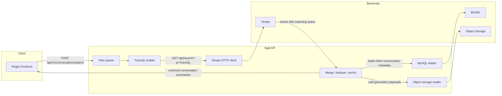
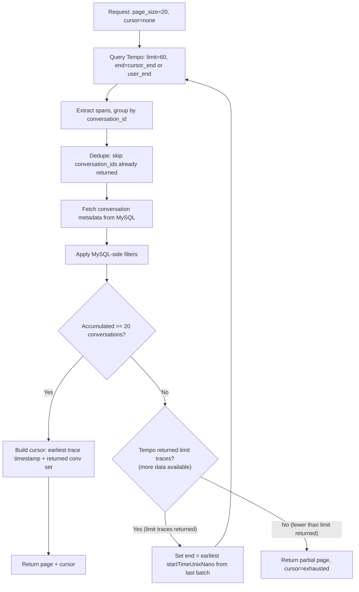
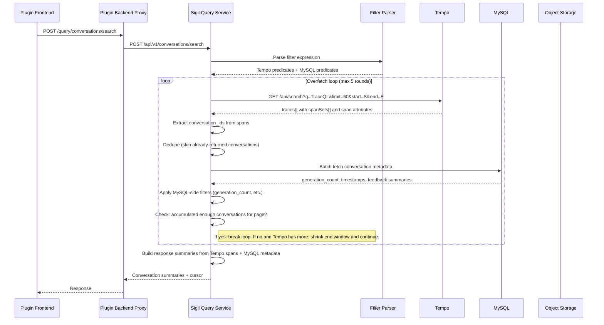

# Conversation and Generation Query Path

## Problem Statement

The current query path (`sigil/internal/query`) is placeholder/bootstrap code. It reads conversation metadata from MySQL and returns hardcoded stubs for completions and traces. There is no search, no generation hydration, and no Tempo integration beyond the pass-through proxy.

Users need to debug LLM conversations in Sigil. This requires:

- Searching conversations by model, agent, provider, error state, latency, tool usage, infrastructure attributes (namespace, cluster), and arbitrary span/resource attributes.
- Viewing a conversation with all its generations, messages, tools, usage, and trace links.
- Inspecting a single generation with its full payload and trace/span references.

## Design Principles

- **Conversation is the search result unit.** Users think in conversations (sessions/interactions), not individual LLM API calls.
- **Tempo is the search index.** TraceQL provides flexible, attribute-based filtering across all span and resource attributes. Sigil translates a user-friendly filter language to TraceQL; users never see TraceQL syntax.
- **MySQL/object storage is the hydration layer.** Once conversation IDs are identified via Tempo, generation payloads are read from MySQL hot store and object storage cold store.
- **Conversation-level aggregates are computed at query time.** Models, agents, error counts, and token totals are aggregated from Tempo span results per conversation. No ingest-time materialization is required for v1.
- **Default summary + selectable columns.** Search results return a fixed set of default summary fields. Users can select additional attributes (namespace, cluster, custom attributes) to include as extra columns.

## Architecture Overview



## Data Model Context

### What lives where

| Store | Contains | Role in query |
|---|---|---|
| Tempo | Trace spans with GenAI attributes (`sigil.generation.id`, `gen_ai.conversation.id`, `gen_ai.request.model`, `gen_ai.agent.name`, `error.type`, etc.) and resource attributes (`k8s.namespace.name`, `k8s.cluster.name`, `service.name`). Tool execution spans (`execute_tool`) are children of generation spans. | Search index. Filters and returns matching spans with attributes. |
| MySQL `conversations` | `tenant_id`, `conversation_id`, `generation_count`, `last_generation_at`, `created_at`, `updated_at` | Authoritative conversation metadata. Used for conversation-level filters (`generation_count`). |
| MySQL `generations` | `tenant_id`, `generation_id`, `conversation_id`, `created_at`, `payload` (full generation JSON) | Hot generation payloads for hydration. |
| MySQL feedback tables | `conversation_ratings`, `conversation_rating_summaries`, `conversation_annotations`, `conversation_annotation_summaries` | Rating and annotation data for summaries. |
| Object storage | Compacted generation blocks (`data.sigil` + `index.sigil`) | Cold generation payloads for hydration. |

### The fundamental constraint: conversations span multiple traces

A conversation is a logical grouping by `gen_ai.conversation.id`. Each generation in a conversation can be in a **different trace** (different HTTP request = different trace root). A 10-generation conversation may span 10 different trace IDs.

Tempo searches individual spans and traces. It has no concept of "conversation" as a cross-trace entity. This determines what each backend can and cannot answer:

**Tempo can answer (per-span / per-trace filters):**

- Generations where `model = gpt-4o`
- Generations where `error.type != ""`
- Generations where `duration > 5s`
- Generations in `namespace = production`
- Generations that called a specific tool (because `execute_tool` spans are children within the same trace and carry `gen_ai.conversation.id`)

**Tempo cannot answer (cross-trace aggregations):**

- Conversations with more than N generations (generations span different traces)
- Conversations with total token usage > N (requires summing across traces)
- Conversations with total tool calls > N (tool spans spread across traces)

**MySQL handles the cross-conversation filters:**

- `generation_count > N` via the `conversations` table (maintained during ingest)

## API Endpoints

### New endpoints

| Endpoint | Method | Purpose | Backend |
|---|---|---|---|
| `/api/v1/conversations/search` | POST | Filtered conversation search | Tempo + MySQL + Object Storage |
| `/api/v1/conversations/{id}` | GET | Full conversation with all generations | MySQL + Object Storage |
| `/api/v1/generations/{id}` | GET | Single generation detail | MySQL + Object Storage |
| `/api/v1/search/tags` | GET | Filter key autocomplete | Tempo tag API + well-known keys |
| `/api/v1/search/tag/{tag}/values` | GET | Filter value autocomplete | Tempo tag values API |

### Retained endpoints

- `/api/v1/proxy/tempo/...` -- pass-through Tempo proxy (power users)
- `/api/v1/proxy/prometheus/...` -- pass-through Prometheus proxy (metrics)
- `/api/v1/conversations/{id}/ratings` -- conversation feedback (unchanged)
- `/api/v1/conversations/{id}/annotations` -- conversation feedback (unchanged)
- `/api/v1/generations:export` -- generation ingest (unchanged)

### Dropped endpoints

- `/api/v1/completions` -- placeholder stub, replaced by conversation search
- `/api/v1/traces/{trace_id}` -- placeholder stub, replaced by Tempo proxy

## Filter Language

### Syntax

The user-facing filter bar accepts `key op value` expressions separated by spaces:

```
model = "gpt-4o" status = error duration > 5s namespace = "production"
```

### Operators

| Operator | Meaning | Example |
|---|---|---|
| `=` | Exact match | `model = "gpt-4o"` |
| `!=` | Not equal | `provider != "openai"` |
| `>` | Greater than | `duration > 5s` |
| `<` | Less than | `duration < 100ms` |
| `>=` | Greater or equal | `generation_count >= 5` |
| `<=` | Less or equal | `generation_count <= 10` |
| `=~` | Regex match | `model =~ "gpt-4.*"` |

### Well-known filter keys

These short aliases map to full TraceQL attribute paths. The filter bar provides autocomplete for these.

| User key | TraceQL mapping | Notes |
|---|---|---|
| `model` | `span.gen_ai.request.model` | Model name |
| `provider` | `span.gen_ai.provider.name` | Provider (openai, anthropic, gemini) |
| `agent` | `span.gen_ai.agent.name` | Agent name |
| `agent.version` | `span.gen_ai.agent.version` | Agent version |
| `status` | `span.error.type` | `status = error` maps to `span.error.type != ""` |
| `error.type` | `span.error.type` | Specific error type |
| `error.category` | `span.error.category` | Error category (rate_limit, server_error, etc.) |
| `duration` | `duration` | TraceQL intrinsic: per-span duration |
| `tool.name` | `span.gen_ai.tool.name` | Tool name (matches `execute_tool` spans) |
| `operation` | `span.gen_ai.operation.name` | Operation (generateText, streamText, execute_tool) |
| `namespace` | `resource.k8s.namespace.name` | Kubernetes namespace |
| `cluster` | `resource.k8s.cluster.name` | Kubernetes cluster |
| `service` | `resource.service.name` | Service name |
| `generation_count` | _(MySQL-routed)_ | Conversation generation count (not a Tempo attribute) |

### Arbitrary attributes

Users can filter on any attribute by using the full prefix:

- `resource.X` passes through as `resource.X` in TraceQL
- `span.X` passes through as `span.X` in TraceQL

Examples:

```
resource.custom.team = "platform"
span.gen_ai.usage.input_tokens > 1000
```

### Filter routing

The filter parser classifies each filter term:

- **Tempo-routed**: any filter that maps to a span attribute, resource attribute, or TraceQL intrinsic. These become TraceQL predicates.
- **MySQL-routed**: `generation_count` and any future materialized conversation-level aggregates. These become SQL WHERE clauses applied after Tempo search.

## Tempo Integration Details

### Base predicate

Every TraceQL query is prefixed with a base predicate to scope to GenAI spans only:

```
span.gen_ai.operation.name != ""
```

This uses the `gen_ai.operation.name` attribute which is always present on generation spans (`generateText`, `streamText`) and tool execution spans (`execute_tool`). It excludes unrelated HTTP, DB, and gRPC spans.

For the default "all conversations" search (no user filters), the base query narrows further to generation spans only (excluding tool execution spans):

```
{ span.gen_ai.operation.name =~ "generateText|streamText" }
  | select(span.sigil.generation.id, span.gen_ai.conversation.id,
           span.gen_ai.request.model, span.gen_ai.agent.name,
           span.error.type, span.error.category)
```

### TraceQL translation examples

**User input:** `model = "gpt-4o" status = error duration > 5s`

**Generated TraceQL:**

```
{ span.gen_ai.operation.name != "" &&
  span.gen_ai.request.model = "gpt-4o" &&
  span.error.type != "" &&
  duration > 5s }
  | select(span.sigil.generation.id, span.gen_ai.conversation.id,
           span.gen_ai.request.model, span.gen_ai.agent.name,
           span.error.type, span.error.category)
```

**User input:** `tool.name = "weather" namespace = "production"`

**Generated TraceQL:**

```
{ span.gen_ai.operation.name != "" &&
  span.gen_ai.tool.name = "weather" &&
  resource.k8s.namespace.name = "production" }
  | select(span.sigil.generation.id, span.gen_ai.conversation.id,
           span.gen_ai.request.model, span.gen_ai.agent.name,
           span.error.type, span.error.category)
```

**User input:** `agent = "my-assistant" generation_count > 5`

**Generated TraceQL** (only the Tempo-routed part; `generation_count` is applied in MySQL):

```
{ span.gen_ai.operation.name =~ "generateText|streamText" &&
  span.gen_ai.agent.name = "my-assistant" }
  | select(span.sigil.generation.id, span.gen_ai.conversation.id,
           span.gen_ai.request.model, span.gen_ai.agent.name,
           span.error.type, span.error.category)
```

The `select()` pipeline stage tells Tempo to include specified attributes in the response spans even if they are not part of the filter condition. This ensures we always get `sigil.generation.id` and `gen_ai.conversation.id` for grouping, plus model/agent/error attributes for building summaries.

When the user selects additional columns (e.g., `resource.k8s.namespace.name`), those are appended to the `select()` clause.

### Tempo search API call

Sigil calls the Tempo HTTP search endpoint:

```
GET {tempo_base_url}/api/search
  ?q={url_encoded_traceql}
  &limit={overfetch_limit}
  &start={from_epoch_seconds}
  &end={to_epoch_seconds}
  &spss=100

Headers:
  X-Scope-OrgID: <tenant_id>
```

- `X-Scope-OrgID`: **required on every outbound Tempo request.** Sigil extracts the tenant ID from the inbound request context (same `dskit/tenant` resolution used everywhere) and sets it on the outbound Tempo request. This ensures Tempo searches the correct tenant's traces. Without this, Tempo rejects the query in multi-tenant mode. This follows the same pattern as the existing query proxy (`sigil/internal/queryproxy/proxy.go`).
- `q`: URL-encoded TraceQL query built by the filter translator.
- `limit`: number of **traces** to return (not spans, not conversations). Set to 3x the requested page size for overfetch (see Pagination).
- `start`/`end`: time range in unix epoch seconds.
- `spss`: spans per spanset, set high (100) to capture all matching spans per trace.

### Tempo search API response shape

```json
{
  "traces": [
    {
      "traceID": "2f3e0cee77ae5dc9c17ade3689eb2e54",
      "rootServiceName": "my-llm-app",
      "rootTraceName": "POST /chat",
      "startTimeUnixNano": "1739612400000000000",
      "durationMs": 2340,
      "spanSets": [
        {
          "spans": [
            {
              "spanID": "563d623c76514f8e",
              "startTimeUnixNano": "1739612400100000000",
              "durationNanos": "1200000000",
              "attributes": [
                {
                  "key": "sigil.generation.id",
                  "value": { "stringValue": "gen-001" }
                },
                {
                  "key": "gen_ai.conversation.id",
                  "value": { "stringValue": "conv-42" }
                },
                {
                  "key": "gen_ai.request.model",
                  "value": { "stringValue": "gpt-4o" }
                },
                {
                  "key": "gen_ai.agent.name",
                  "value": { "stringValue": "assistant" }
                },
                {
                  "key": "error.type",
                  "value": { "stringValue": "provider_call_error" }
                },
                {
                  "key": "error.category",
                  "value": { "stringValue": "rate_limit" }
                }
              ]
            }
          ],
          "matched": 1
        }
      ]
    },
    {
      "traceID": "789abcdef012345678",
      "rootServiceName": "my-llm-app",
      "rootTraceName": "POST /chat",
      "startTimeUnixNano": "1739612300000000000",
      "durationMs": 5100,
      "spanSets": [
        {
          "spans": [
            {
              "spanID": "span-4d5e6f",
              "startTimeUnixNano": "1739612300200000000",
              "durationNanos": "5000000000",
              "attributes": [
                {
                  "key": "sigil.generation.id",
                  "value": { "stringValue": "gen-007" }
                },
                {
                  "key": "gen_ai.conversation.id",
                  "value": { "stringValue": "conv-42" }
                },
                {
                  "key": "gen_ai.request.model",
                  "value": { "stringValue": "gpt-4o" }
                },
                {
                  "key": "gen_ai.agent.name",
                  "value": { "stringValue": "assistant" }
                },
                {
                  "key": "error.type",
                  "value": { "stringValue": "provider_call_error" }
                },
                {
                  "key": "error.category",
                  "value": { "stringValue": "server_error" }
                }
              ]
            }
          ],
          "matched": 1
        }
      ]
    }
  ],
  "metrics": {
    "totalBlocks": 42,
    "inspectedTraces": 15000,
    "inspectedBytes": "2147483648"
  }
}
```

Key observations:

- Tempo returns **traces**, each containing **spanSets** with matching **spans**.
- Both traces above have spans belonging to `conv-42` -- same conversation, different traces (different HTTP requests).
- Each span carries the attributes requested via `select()`.
- `limit` controls the number of traces returned, not spans or conversations.
- The `metrics` block reports search performance statistics.

### Processing Tempo results

For each trace in the Tempo response, Sigil walks `spanSets[].spans[]` and extracts:

1. `gen_ai.conversation.id` from span attributes (grouping key)
2. `sigil.generation.id` from span attributes (hydration key)
3. Model, agent, error, duration, and any selected column attributes

Spans are grouped into a map keyed by `conversation_id`:

```
conv-42 -> {
  generation_ids: [gen-001, gen-007],
  trace_ids: [2f3e0cee..., 789abcdef...],
  models: {"gpt-4o"},
  agents: {"assistant"},
  error_count: 2,
  spans: [...]
}
```

### Coverage caveat

Tempo search gives **partial coverage** of a conversation, not full coverage. If `conv-42` has 5 generations but only 2 matched the filter, Tempo returns those 2. This means:

- `models[]` and `agents[]` in the search summary reflect only **matching** generations, not all generations in the conversation.
- `error_count` reflects matching spans only.
- `generation_count` comes from **MySQL** (authoritative, always accurate).
- `trace_ids[]` are the traces that contained matches.

When the user drills into a conversation detail view, a full MySQL/object storage read returns **all** generations with complete payloads regardless of search filters.

## Pagination

### The problem

Tempo returns up to `limit` **traces**. Multiple traces can map to the same conversation (deduplication reduces count). MySQL-routed filters (`generation_count > 5`) can further reduce the set. A request for 20 conversations might yield only 5 after dedup and filtering if we naively request 20 traces from Tempo.

### Solution: cursor-based pagination with overfetch loop



**Overfetch strategy:**

- Request `3 * page_size` traces from Tempo (default overfetch multiplier).
- Process results: deduplicate by conversation_id, apply MySQL filters.
- If enough conversations accumulated, return the page.
- If not, use the earliest `startTimeUnixNano` from the current batch as the new `end` parameter and fetch again.
- Max iteration bound (default: 5 rounds) caps worst-case latency.

**Cursor encoding:**

The opaque cursor returned to the client encodes:

- `end_nanos`: the `startTimeUnixNano` of the earliest trace in the last Tempo batch (used as the `end` parameter for the next Tempo query).
- `returned_conversations`: set of conversation IDs already returned (to avoid duplicates across pages).
- `filter_hash`: hash of the filter expression (invalidates cursor if filters change).

**Tempo pagination model:**

Tempo has no cursor. It returns up to `limit` traces for a time range, ordered non-deterministically within that range. Paging is achieved by shrinking the time window: each page uses a smaller `end` than the previous page. This is the same approach Grafana Explore uses to page through Tempo search results.

## Search Response Contract

### Request

```
POST /api/v1/conversations/search
Content-Type: application/json
X-Scope-OrgID: <tenant_id>

{
  "filters": "model = \"gpt-4o\" status = error duration > 5s",
  "select": ["resource.k8s.namespace.name", "resource.k8s.cluster.name"],
  "time_range": {
    "from": "2026-02-14T00:00:00Z",
    "to": "2026-02-15T00:00:00Z"
  },
  "page_size": 20,
  "cursor": ""
}
```

- `filters`: filter bar expression string.
- `select`: optional list of additional attribute keys to include as extra columns in results. These are appended to the TraceQL `select()` clause and aggregated per conversation.
- `time_range`: required time range for Tempo search.
- `page_size`: number of conversations per page (default 20, max 50).
- `cursor`: opaque pagination cursor from previous response. Empty for first page.

### Response

```json
{
  "conversations": [
    {
      "conversation_id": "conv-42",
      "generation_count": 5,
      "first_generation_at": "2026-02-14T10:00:00Z",
      "last_generation_at": "2026-02-14T10:05:30Z",
      "models": ["gpt-4o"],
      "agents": ["assistant"],
      "error_count": 2,
      "has_errors": true,
      "trace_ids": ["2f3e0cee77ae...", "789abcdef012..."],
      "rating_summary": {
        "total_count": 3,
        "good_count": 2,
        "bad_count": 1,
        "has_bad_rating": true
      },
      "annotation_count": 1,
      "selected": {
        "resource.k8s.namespace.name": ["production"],
        "resource.k8s.cluster.name": ["us-east-1"]
      }
    }
  ],
  "next_cursor": "eyJlbmRfbmFub3MiOiIxNzM5NjEyMzAwMDAwMDAwMD...",
  "has_more": true
}
```

**Default fields (always returned):**

| Field | Source | Description |
|---|---|---|
| `conversation_id` | Tempo spans | Conversation identifier |
| `generation_count` | MySQL `conversations` table | Authoritative total generation count |
| `first_generation_at` | MySQL `conversations.created_at` | First generation timestamp |
| `last_generation_at` | MySQL `conversations.last_generation_at` | Most recent generation timestamp |
| `models` | Tempo span attributes | Distinct models from **matching** spans |
| `agents` | Tempo span attributes | Distinct agents from **matching** spans |
| `error_count` | Tempo span attributes | Count of matching spans with `error.type` |
| `has_errors` | Tempo span attributes | `error_count > 0` |
| `trace_ids` | Tempo trace results | Trace IDs that contained matches |
| `rating_summary` | MySQL feedback tables | Rating counts and bad-rating flag |
| `annotation_count` | MySQL feedback tables | Number of annotations |

**Selectable fields (via `select` parameter):**

| Field | Source | Aggregation |
|---|---|---|
| Resource attributes (e.g., `resource.k8s.namespace.name`) | Tempo span attributes | Distinct values across matching spans |
| Span attributes (e.g., `span.gen_ai.usage.input_tokens`) | Tempo span attributes | Sum across matching spans |

The `selected` map in the response contains the aggregated values for each requested attribute, keyed by attribute name.

## Conversation Detail Endpoint

### Request

```
GET /api/v1/conversations/{conversation_id}
X-Scope-OrgID: <tenant_id>
```

### Response

```json
{
  "conversation_id": "conv-42",
  "generation_count": 5,
  "first_generation_at": "2026-02-14T10:00:00Z",
  "last_generation_at": "2026-02-14T10:05:30Z",
  "generations": [
    {
      "generation_id": "gen-001",
      "trace_id": "2f3e0cee77ae5dc9c17ade3689eb2e54",
      "span_id": "563d623c76514f8e",
      "mode": "SYNC",
      "model": {
        "provider": "openai",
        "name": "gpt-4o"
      },
      "agent_name": "assistant",
      "agent_version": "1.0.0",
      "system_prompt": "You are a helpful assistant.",
      "input": [],
      "output": [],
      "tools": [],
      "usage": {
        "input_tokens": 120,
        "output_tokens": 42,
        "total_tokens": 162
      },
      "stop_reason": "end_turn",
      "metadata": {},
      "created_at": "2026-02-14T10:00:00Z",
      "error": null
    }
  ],
  "rating_summary": {
    "total_count": 3,
    "good_count": 2,
    "bad_count": 1,
    "has_bad_rating": true
  },
  "annotations": []
}
```

This endpoint does **not** call Tempo. It reads directly from MySQL/object storage:

- Conversation metadata from `conversations` table.
- All generations for the conversation from `generations` table (hot) and object storage (cold), using `WALReader.GetByConversationID` + block fan-out.
- Generations are merged, deduplicated by `generation_id` (hot-row preference), and sorted by `created_at`.
- Rating summary and annotations from feedback tables.

Each generation includes `trace_id` and `span_id` fields (extracted from the stored payload). The frontend can use these to link to the full trace view via the Tempo proxy (`/api/v1/proxy/tempo/api/v2/traces/{trace_id}`).

## Generation Detail Endpoint

### Request

```
GET /api/v1/generations/{generation_id}
X-Scope-OrgID: <tenant_id>
```

### Response

```json
{
  "generation_id": "gen-001",
  "conversation_id": "conv-42",
  "trace_id": "2f3e0cee77ae5dc9c17ade3689eb2e54",
  "span_id": "563d623c76514f8e",
  "mode": "SYNC",
  "model": {
    "provider": "openai",
    "name": "gpt-4o"
  },
  "agent_name": "assistant",
  "agent_version": "1.0.0",
  "system_prompt": "You are a helpful assistant.",
  "input": [],
  "output": [],
  "tools": [],
  "usage": {
    "input_tokens": 120,
    "output_tokens": 42,
    "total_tokens": 162
  },
  "stop_reason": "end_turn",
  "metadata": {},
  "created_at": "2026-02-14T10:00:00Z",
  "error": null
}
```

Direct MySQL/object storage read via `WALReader.GetByID` + block fan-out. No Tempo call.

## Tag Discovery Endpoints

These power the filter bar autocomplete in the frontend.

### Tags (filter keys)

```
GET /api/v1/search/tags?start={epoch}&end={epoch}
X-Scope-OrgID: <tenant_id>
```

Response:

```json
{
  "tags": [
    { "key": "model", "scope": "well-known", "description": "Model name" },
    { "key": "agent", "scope": "well-known", "description": "Agent name" },
    { "key": "provider", "scope": "well-known", "description": "Provider name" },
    { "key": "status", "scope": "well-known", "description": "Error status" },
    { "key": "duration", "scope": "well-known", "description": "Generation duration" },
    { "key": "tool.name", "scope": "well-known", "description": "Tool name" },
    { "key": "generation_count", "scope": "well-known", "description": "Generations per conversation" },
    { "key": "namespace", "scope": "well-known", "description": "Kubernetes namespace" },
    { "key": "cluster", "scope": "well-known", "description": "Kubernetes cluster" },
    { "key": "service", "scope": "well-known", "description": "Service name" },
    { "key": "resource.k8s.pod.name", "scope": "resource", "description": "" },
    { "key": "span.gen_ai.usage.input_tokens", "scope": "span", "description": "" }
  ]
}
```

Implementation:

1. Call Tempo `GET /api/v2/search/tags?scope=span` and `GET /api/v2/search/tags?scope=resource` with `X-Scope-OrgID` set from inbound tenant context.
2. Merge with the well-known Sigil alias list (model, agent, provider, etc.).
3. Add MySQL-only keys (`generation_count`).
4. Return the unified list.

### Tag values

```
GET /api/v1/search/tag/{tag}/values?start={epoch}&end={epoch}
X-Scope-OrgID: <tenant_id>
```

Response:

```json
{
  "values": ["gpt-4o", "gpt-4o-mini", "claude-sonnet-4-5", "gemini-2.5-pro"]
}
```

Implementation:

1. Map the tag key to its full TraceQL attribute path (e.g., `model` -> `gen_ai.request.model`).
2. Call Tempo `GET /api/v2/search/tag/{full_attribute_path}/values` with `X-Scope-OrgID` set from inbound tenant context.
3. For MySQL-only keys like `generation_count`, return a placeholder indicator (numeric range, not discrete values).

## Query Flow: End-to-End Sequence



## Implementation Scope

### What changes

| Component | Change |
|---|---|
| `sigil/internal/query/service.go` | Replace placeholder code with Tempo-backed search, conversation detail, generation detail. |
| `sigil/internal/query/filter.go` (new) | Filter expression parser, Tempo/MySQL routing, TraceQL builder. |
| `sigil/internal/query/tempo.go` (new) | Tempo HTTP search client, response parsing, span attribute extraction. |
| `sigil/internal/query/pagination.go` (new) | Cursor encoding/decoding, overfetch loop logic. |
| `sigil/internal/server/http.go` | Register new endpoints, drop placeholder routes. |
| `sigil/internal/storage/wal.go` | Extend `WALReader` with `GetByID` for generation detail (already exists). |

### What stays the same

- Ingest path (no changes).
- Storage schema (no changes; `conversations` table already has `generation_count`).
- Proxy routes (unchanged).
- Feedback endpoints (unchanged).
- Compaction (unchanged).

## Key Design Decisions

| Decision | Rationale |
|---|---|
| Conversation is the search result unit (not generation) | Matches debugging mental model: users debug sessions, not individual API calls. |
| No generation search endpoint in v1 | Tempo proxy covers raw span search for power users. Generation search can be added later. |
| No ingest-time materialization of aggregates | Compute models/agents/errors from Tempo spans at query time. Simpler ingest, no schema changes. Trade-off: summary completeness depends on Tempo search coverage. |
| No `sigil.gen_ai.tool_call_count` span attribute in v1 | `tool.name = X` filter via Tempo is sufficient. Count filtering is a nice-to-have for v2. |
| Filter language abstracts TraceQL | Users never see TraceQL syntax. Sigil translates. Extensible via `resource.X`/`span.X` prefixes. |
| `gen_ai.operation.name != ""` as base predicate | Already always present on GenAI spans, no SDK changes. Scopes Tempo search to GenAI spans only. |
| Time-window cursor for pagination | Tempo has no cursor; time-window shrinking is the standard approach (same as Grafana Explore). |

## Consequences

- Conversation search quality depends on Tempo retention. If traces are rotated out of Tempo, those conversations won't appear in search results. They can still be accessed by direct ID lookup via MySQL/object storage.
- Summary fields from Tempo (models, agents, errors) reflect matching spans only, not all generations in the conversation. The UI should present these as "matching" context, not exhaustive conversation metadata.
- The overfetch loop adds variable latency to search requests. The max iteration bound caps worst-case latency but may return partial pages when filters are very selective.
- MySQL-routed filters (`generation_count`) require a Tempo search first (to identify which conversations match span-level criteria), followed by MySQL enrichment and filtering. This is a sequential dependency, not parallelizable.

## Future Extensions

- **Ingest-time materialization**: if query-time aggregation proves too slow or coverage-limited, materialize conversation-level stats (total tokens, error count, models used) in the `conversations` table during ingest.
- **`sigil.sdk.name` span attribute**: if non-Sigil GenAI instrumentation appears in the same Tempo instance, add a dedicated discriminator attribute to all SDKs for tighter scoping.
- **`sigil.gen_ai.tool_call_count` span attribute**: enable per-generation tool call count filtering in Tempo.
- **Generation search endpoint**: `POST /api/v1/generations/search` for users who want generation-level results without conversation grouping.
- **Streaming search**: leverage Tempo's streaming search for progressive result delivery.
