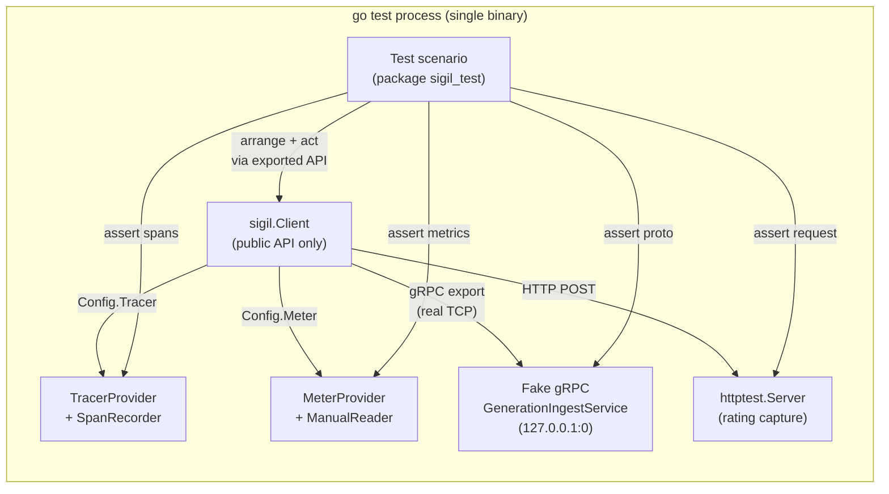

# SDK Conformance Harness

## Problem

Sigil has two test layers for SDK behavior, neither of which catches field-level regressions quickly:

1. **Unit tests** (`sdks/go/sigil/client_test.go`, `exporter_transport_test.go`, etc.) use internal test seams (`testGenerationExporter`, `testDisableWorker`) to bypass real transport. They test mechanics (batching, retry, flush) and verify individual span attributes, but they access unexported fields and skip the generation export path. A broken public API surface or a serialization bug would not be caught until Docker integration.

2. **Docker one-shot harness** (`.config/devex/sdk-traffic/assert-one-shot.py`) runs all SDK emitters against the full Compose stack and polls the Sigil query API. It only checks that records exist per language and framework tag -- zero field-level validation. It takes minutes, requires Docker, and can only tell you "Go emitted something" not "Go emitted the right thing."

The gap: no test answers "does the SDK's **public API**, through **real transport**, emit the exact fields the UI and backend require?" quickly and without Docker.

### Why this matters

The Grafana plugin UI and the backend query/catalog layers depend on specific fields from SDK emission:

- **Conversation list/detail**: `conversation_id`, `conversation_title` (from `sigil.conversation.title` metadata), `user_id` (from `sigil.user.id` metadata), `trace_ids` for trace linkage, `models`, `agents`, `error_count`, `rating_summary`.
- **Generation detail**: all identity fields, `input`/`output` message parts (text, thinking, tool call, tool result), `system_prompt`, `tools`, `usage`, `stop_reason`, `metadata`, `tags`, `artifacts`.
- **Agent catalog**: `agent_name`, `agent_version`, `system_prompt`, `tools` (the backend hashes these for `agent_effective_version`).
- **Trace FlowTree**: span `gen_ai.operation.name`, `sigil.generation.id`, `sigil.sdk.name`, tool/embedding span attributes, parent-child span linkage via `trace_id`/`span_id`.
- **Dashboard metrics**: `gen_ai.client.operation.duration`, `gen_ai.client.token.usage`, `gen_ai.client.time_to_first_token`, `gen_ai.client.tool_calls_per_operation` -- each with specific label sets.
- **Ratings**: HTTP request shape to `/api/v1/conversations/{id}/ratings`.

If any of these fields are missing, malformed, or resolved incorrectly (e.g. user ID fallback chain broken, conversation title not propagated to metadata), the UI silently degrades. A fast, field-level conformance suite catches this before merge.

## Goals

- Verify all SDK-emitted fields that the UI, query layer, and agent catalog depend on.
- Run in `go test` time (seconds, no Docker, no external services).
- Use only the public API surface -- no internal test seams.
- Cover all four emission channels: generation export (gRPC), OTLP spans, OTLP metrics, and rating HTTP.
- Serve as the reference implementation that other SDKs (JS, Python, Java, .NET) replicate.
- Catch regressions in identity resolution (conversation title, user ID, agent name/version), trace linkage, metric labels, and proto payload shape.
- **Fix bugs found during implementation.** Building conformance tests against the public API will surface real issues: missing fields, incorrect fallback chains, serialization mismatches, or broken public surface. These are fixed in the same branch as the tests, with regression tests proving the fix. The conformance suite is both a verification tool and a discovery tool.
- **Do not fabricate unsupported embedding coverage.** Embedding conformance only applies when the SDK, provider wrapper, or framework adapter exposes a real embedding lifecycle on its public API surface. Otherwise the suite should assert an explicit unsupported capability contract.

## Non-goals

- Replace unit tests. Existing internal tests remain the exhaustive branch-level safety net for mechanics like batching, retry, flush, queue full, and shutdown ordering.
- Test backend-derived fields (`agent_effective_version`, conversation rollups, query-side latest-title selection).
- Test provider wrappers or framework adapters (separate per-provider/framework suites).
- Build shared test library code across languages (impossible across Go/JS/Python/Java/.NET runtimes).

## Design

### Architecture



Everything runs in a single `go test` process. No subprocess, no Docker, no network beyond localhost loopback. The fake gRPC server listens on `127.0.0.1:0` (OS-assigned port), the rating server uses `httptest.Server`, and OTel captures use the SDK's own test infrastructure (`tracetest.SpanRecorder`, `sdkmetric.ManualReader`).

### Four assertion targets

Every scenario asserts against one or more of these capture points:

| Target | Mechanism | What it captures |
|---|---|---|
| **Generation proto** | Fake `GenerationIngestService` gRPC server on `127.0.0.1:0` | `ExportGenerationsRequest` with full `Generation` protobuf messages -- every field the backend receives |
| **OTLP spans** | `tracetest.SpanRecorder` injected via `Config.Tracer` | All spans with attributes, status, kind, timing, trace/span IDs |
| **OTLP metrics** | `sdkmetric.ManualReader` injected via `Config.Meter` | All histogram instrument recordings with attribute label sets |
| **Rating HTTP** | `httptest.Server` capturing request body, path, headers | Rating submission requests exactly as the backend would receive them |

The generation proto capture goes through real TCP gRPC transport (not an in-memory mock), which means serialization, framing, and header propagation are all exercised.

### External test package: public API only

The conformance tests use `package sigil_test` (Go external test package in the same directory). This guarantees:

- Only exported symbols are accessible -- `sigil.Client`, `sigil.Config`, `sigil.GenerationStart`, `sigil.Generation`, etc.
- No access to internal test seams like `testGenerationExporter` or `testDisableWorker`.
- No access to unexported state like `lastGeneration` or `callErr`.
- The proto package at `sigil/internal/gen/sigil/v1` remains accessible because Go's `internal` visibility boundary includes the parent directory.

This is the idiomatic Go pattern for black-box testing: the test exercises exactly the same API surface an SDK user would.

### Cross-SDK strategy

Rather than shared code (which cannot cross language boundaries), the cross-SDK contract is a **conformance spec document** at `docs/references/sdk-conformance-spec.md`. For every scenario it specifies:

- Setup steps in language-neutral terms (e.g. "create a generation with conversation title X using context propagation")
- Expected generation proto fields and values
- Expected span attributes and values
- Expected metric instrument + label combinations
- Expected absence conditions (e.g. "no TTFT metric for sync mode")

Each SDK implements its own test runner against this spec in its native test framework. The Go implementation is the reference. When a new feature is added to the SDK contract, the conformance spec gets a new scenario, and every SDK's runner adds a corresponding test.

## Go implementation blueprint

### Code quality expectations

The conformance test code is a reference implementation. It will be read by developers porting to other languages. It must be:

- **Idiomatic Go.** Standard library patterns, `testing.T` with `t.Helper()`, `t.Run()` subtests, table-driven tests where many similar cases exist. No assertion libraries -- use `t.Fatalf` with clear messages that show got vs want.
- **Explicit over clever.** Each scenario reads top to bottom: arrange, act, shutdown, assert. No abstraction layers that hide what's being tested.
- **Well-named.** Test functions follow `TestConformance_<Feature>` or `TestConformance_<Feature>/<SubCase>`. Helper types and functions have doc comments explaining their role in the harness.
- **Self-contained.** Each test creates its own `conformanceEnv`, runs its scenario, shuts down, and asserts. No shared mutable state between tests.
- **Fast.** Every test completes in under a second. No `time.Sleep` -- use `Shutdown()` to guarantee flush, then assert on captured data.

### File structure

Two files in `sdks/go/sigil/`, both `package sigil_test`:

**`conformance_helpers_test.go`** -- test infrastructure:

- `conformanceEnv` struct: wires a `sigil.Client` to all four capture targets. A single constructor (`newConformanceEnv`) creates the fake gRPC server, OTel providers, rating HTTP server, and client. Functional options control resource attributes and config overrides.
- `fakeIngestServer`: implements `GenerationIngestServiceServer`, captures proto-cloned `ExportGenerationsRequest` messages. Thread-safe. Provides `Generations()` and `SingleGeneration(t)` accessors.
- `fakeRatingServer`: wraps `httptest.Server`, captures request method/path/headers/body. Responds with a valid JSON rating response.
- Span helpers: `findSpan(t, spans, operationName)`, `spanAttrs(span)` (returns `map[string]any`), `requireSpanAttr(t, attrs, key, expected)`, `requireSpanAttrAbsent(t, attrs, key)`.
- Metric helpers: `findHistogram(t, resourceMetrics, name)`, `requireNoHistogram(t, resourceMetrics, name)`.
- Proto helpers: `requireProtoMetadata(t, gen, key, expected)`, `requireProtoMetadataAbsent(t, gen, key)`.

Each helper uses `t.Helper()` for clean stack traces.

**`conformance_test.go`** -- scenarios:

Each top-level test function covers one feature area. Sub-cases use `t.Run`. Each test follows the same pattern:

```go
func TestConformance_FeatureName(t *testing.T) {
    t.Run("sub-case description", func(t *testing.T) {
        // 1. Create environment
        env := newConformanceEnv(t)

        // 2. Exercise public API
        ctx := sigil.WithConversationTitle(context.Background(), "My Title")
        _, rec := env.Client.StartGeneration(ctx, sigil.GenerationStart{...})
        rec.SetResult(sigil.Generation{...}, nil)
        rec.End()

        // 3. Flush all data
        env.Shutdown(t)

        // 4. Assert on captured data
        gen := env.Ingest.SingleGeneration(t)
        // ... assert proto fields ...

        span := findSpan(t, env.Spans.Ended(), "generateText")
        attrs := spanAttrs(span)
        // ... assert span attributes ...

        rm := env.CollectMetrics(t)
        // ... assert metric recordings ...
    })
}
```

### What `conformanceEnv` wires

```go
type conformanceEnv struct {
    Client  *sigil.Client
    Ingest  *fakeIngestServer       // generation proto capture
    Spans   *tracetest.SpanRecorder // OTLP span capture
    Metrics *sdkmetric.ManualReader // OTLP metric capture
    Rating  *fakeRatingServer       // rating HTTP capture
}
```

The constructor:
1. Starts a `grpc.NewServer` with `fakeIngestServer` on `127.0.0.1:0`.
2. Creates a `tracetest.SpanRecorder` and `sdktrace.TracerProvider`.
3. Creates a `sdkmetric.ManualReader` and `sdkmetric.MeterProvider`.
4. Starts an `httptest.Server` for rating capture.
5. Builds `sigil.Config` pointing at these receivers with `BatchSize: 1` (immediate flush) and injects the tracer/meter.
6. Calls `sigil.NewClient(cfg)`.
7. Registers all cleanup via `t.Cleanup`.

Optional `resource.Resource` can be injected for scenarios that need custom resource attributes on OTLP telemetry.

## Scenario matrix

### 1. Full generation roundtrip

Exercises every field on a sync generation: identity (conversation ID, title, user ID, agent name, agent version), model (provider, name), all content types (text, thinking, tool call, tool result across input and output messages), request controls (max tokens, temperature, top P, tool choice, thinking enabled), system prompt, tool definitions (including deferred flag), tags, metadata, artifacts (request + response), usage (all six token fields), stop reason, response ID, response model, timing.

Asserts on all four targets:
- **Proto**: every field on the captured `Generation` protobuf matches the input.
- **Spans**: `gen_ai.operation.name = generateText`, `sigil.generation.id` matches generation ID, all identity/model/usage/request-control attributes per `semantic-conventions.md`, span kind is CLIENT, span status is OK.
- **Trace linkage**: generation proto `trace_id` and `span_id` match the OTLP span's trace ID and span ID.
- **Metrics**: `gen_ai.client.operation.duration` has a data point with correct labels; `gen_ai.client.token.usage` has data points for each non-zero token type; no `gen_ai.client.time_to_first_token` (sync mode).

### 2. Conversation title semantics

Table-driven sub-scenarios testing the title resolution chain defined in the SDK contract:

| Sub-case | GenerationStart.ConversationTitle | WithConversationTitle ctx | Metadata `sigil.conversation.title` | Expected title |
|---|---|---|---|---|
| explicit wins | "Explicit" | "Context" | "Meta" | "Explicit" |
| context fallback | "" | "Context" | -- | "Context" |
| metadata fallback | "" | -- | "Meta" | "Meta" |
| whitespace omitted | "  " | -- | -- | (absent) |

For each sub-case, assert:
- Generation proto `conversation_title` field.
- Generation proto `metadata["sigil.conversation.title"]` (present when title non-empty, absent when empty).
- Span attribute `sigil.conversation.title` (present/absent matching above).

### 3. User ID semantics

Table-driven sub-scenarios testing the user identity resolution chain:

| Sub-case | GenerationStart.UserID | WithUserID ctx | Metadata `sigil.user.id` | Metadata `user.id` | Expected user_id |
|---|---|---|---|---|---|
| explicit wins | "explicit" | "ctx" | "meta-canonical" | "meta-legacy" | "explicit" |
| context fallback | "" | "ctx" | -- | -- | "ctx" |
| canonical metadata | "" | -- | "canonical" | -- | "canonical" |
| legacy metadata | "" | -- | -- | "legacy" | "legacy" |
| canonical beats legacy | "" | -- | "canonical" | "legacy" | "canonical" |
| whitespace trimmed | "  padded  " | -- | -- | -- | "padded" |

For each sub-case, assert:
- Generation proto `user_id` field.
- Generation proto `metadata["sigil.user.id"]` equals resolved user ID (when non-empty).
- Span attribute `user.id` equals resolved user ID.

### 4. Agent identity semantics

Sub-scenarios:
- Explicit `agent_name` + `agent_version` on `GenerationStart` -- assert proto and span match.
- Context fallback via `WithAgentName`/`WithAgentVersion` when start fields empty.
- Result-time override: `Generation.AgentName` set in `SetResult` overrides seed value.
- Empty agent fields: no `gen_ai.agent.name` or `gen_ai.agent.version` span attributes emitted.

### 5. SDK identity protection

Caller provides `Metadata: map[string]any{"sigil.sdk.name": "evil"}` on `GenerationStart`. Assert:
- Generation proto `metadata["sigil.sdk.name"]` is `"sdk-go"` (overwritten).
- Span attribute `sigil.sdk.name` is `"sdk-go"`.

This validates the SDK contract: `sigil.sdk.name` is SDK-owned and always overwrites caller-supplied values.

### 6. Tags and metadata merge

Start provides `Tags: {"env": "start", "start-only": "a"}` and `Metadata: {"env": "start", "start-only": 1}`. Result provides `Tags: {"env": "result", "result-only": "b"}` and `Metadata: {"env": "result", "result-only": 2}`. Assert:
- Proto tags: `{"env": "result", "start-only": "a", "result-only": "b"}` (result wins on conflict, union on disjoint).
- Proto metadata: `{"env": "result", "start-only": 1, "result-only": 2}` (same merge rule).

### 7. Resource attributes on OTLP

Configure OTel resource with `service.name`, `service.namespace`, `deployment.environment`. Run a generation, a tool execution, and an embedding. Assert:
- All three OTLP spans carry the resource attributes (via `span.Resource().Attributes()`).
- Generation proto does not duplicate resource attributes but provides trace linkage (`trace_id`, `span_id`) so the UI can join generation with trace.

### 8. Streaming mode

Use `StartStreamingGeneration`, call `SetFirstTokenAt` with a timestamp, then `SetResult` + `End`. Assert:
- Generation proto `mode = GENERATION_MODE_STREAM`.
- Span attribute `gen_ai.operation.name = streamText`.
- `gen_ai.client.time_to_first_token` histogram has a data point.
- A companion sync generation in the same test does NOT produce a TTFT data point.

### 9. Tool execution

Start a generation (to establish conversation context), then within that context start a tool execution with `StartToolExecution`. Assert:
- Tool span: `gen_ai.operation.name = execute_tool`, `gen_ai.tool.name`, `gen_ai.tool.call.id`, span kind INTERNAL.
- Context propagation: tool span carries `gen_ai.conversation.id`, `sigil.conversation.title`, `gen_ai.agent.name`, `gen_ai.agent.version` from the parent generation context.
- `gen_ai.client.operation.duration` metric recorded for the tool execution.
- When `IncludeContent: true`, `gen_ai.tool.call.arguments` and `gen_ai.tool.call.result` attributes are present.

### 10. Embedding

Start an embedding with `StartEmbedding`, set result with input count, tokens, dimension. Assert:
- Span: `gen_ai.operation.name = embeddings`, `gen_ai.embeddings.input_count`, `gen_ai.embeddings.dimension.count`, span kind CLIENT.
- Metrics: `gen_ai.client.operation.duration` and `gen_ai.client.token.usage` (input token type).
- **No generation export**: `env.Ingest.RequestCount() == 0` after shutdown.

### 11. Validation and error semantics

Two sub-scenarios:
- **Invalid generation**: missing model provider/name. Assert `rec.Err()` wraps `sigil.ErrValidationFailed`, and `env.Ingest.RequestCount() == 0` (nothing exported).
- **Provider call error**: `rec.SetCallError(errors.New("status 429"))`. Assert span has `error.type = provider_call_error` and `error.category = rate_limit`, span status is ERROR, and `gen_ai.client.operation.duration` metric has the error labels.

### 12. Rating helper

Submit a conversation rating via `SubmitConversationRating`. Capture the HTTP request at the fake server. Assert:
- Request method is POST.
- Request path is `/api/v1/conversations/{url-encoded-id}/ratings`.
- Request body deserializes to valid `ConversationRatingInput` JSON.
- Custom headers from `Config.GenerationExport.Headers` are forwarded.
- Response is parsed into `SubmitConversationRatingResponse`.

### 13. Shutdown flushes pending

Enqueue a single generation (via `StartGeneration` + `SetResult` + `End`), immediately call `Shutdown`. Assert `env.Ingest.SingleGeneration(t)` returns the generation. This validates the public contract that `Shutdown` flushes the async export queue.

## What this does NOT test

| Excluded area | Reason | Covered by |
|---|---|---|
| Batch/flush/retry mechanics | Internal mechanics, not public contract | `exporter_test.go` |
| `agent_effective_version` | Backend projection, not SDK emission | `sigil/internal/agentmeta` tests |
| Conversation search rollups | Query-layer concern | query service tests |
| Grafana trusted-user headers | Plugin/eval backend concern | plugin proxy tests |
| Provider wrapper mapping | Per-provider concern | `sdks/go-providers/*/` tests |
| Framework adapter behavior | Per-framework concern | framework module tests |

## Three conformance layers

The conformance harness isn't just the core SDK. Every layer of the SDK stack needs its own conformance scenarios because each layer transforms data differently:

### Layer 1: Core SDK conformance

Validates the SDK runtime itself: generation export (proto shape, identity fields, metadata), OTLP spans (attributes per `semantic-conventions.md`), OTLP metrics (histogram instruments with correct labels), rating HTTP, and identity resolution chains.

This is the 13-scenario matrix described above. The Go implementation is the reference. Every SDK language implements the same scenarios.

**Applies to**: Go core (`sdks/go/sigil/`), JS core (`sdks/js/src/`), Python core (`sdks/python/`), Java core (`sdks/java/core/`), .NET core (`sdks/dotnet/src/Grafana.Sigil/`).

### Layer 2: Provider wrapper conformance

Validates that provider mappers correctly transform provider-specific request/response objects into the normalized `Generation` shape the core SDK exports. Each provider wrapper has its own mapping logic that can break independently.

Provider conformance scenarios (per provider):
- **Request mapping**: provider request -> `GenerationStart` seed fields (model, system prompt, tools, request controls, messages).
- **Response mapping**: provider response -> `Generation` result fields (output messages with correct part types, usage with all token fields including provider-specific ones, stop reason, response ID, response model).
- **Streaming mapping**: provider stream events -> `Generation` with `mode=STREAM`, accumulated output, correct TTFT.
- **Thinking/reasoning**: provider thinking content -> `ThinkingPart` in output.
- **Tool calls**: provider tool call objects -> `ToolCallPart` with correct ID, name, input JSON.
- **Error mapping**: provider error responses -> `SetCallError` with correct error type/category.
- **Artifact capture**: when opt-in enabled, raw request/response/tools artifacts are captured.
- **Embedding mapping**: provider embedding response -> `EmbeddingResult` with correct fields.

**Applies to**: Go providers (`sdks/go-providers/openai/`, `anthropic/`, `gemini/`), JS providers (`sdks/js/src/providers/`), Python providers (`sdks/python-providers/`), Java providers (`sdks/java/providers/`), .NET providers (`sdks/dotnet/src/Grafana.Sigil.OpenAI/`, `.Anthropic/`, `.Gemini/`).

### Layer 3: Framework adapter conformance

Validates that framework callbacks/hooks correctly produce spans with `sigil.framework.*` attributes and correctly trigger generation recording through the core SDK.

Framework conformance scenarios (per framework):
- **Span creation**: framework invocation produces span(s) with correct `sigil.framework.name`, `sigil.framework.language`, `sigil.framework.source`.
- **Generation triggering**: LLM calls within the framework trigger generation recording with correct model, usage, input/output.
- **Span hierarchy**: framework spans are parents of generation/tool spans (correct `parentSpanID` linkage).
- **Framework metadata**: `sigil.framework.run_id`, `sigil.framework.thread_id`, `sigil.framework.component_name`, and framework-specific attributes are propagated.
- **Tags**: framework-tagged records include `sigil.framework.name` and `sigil.framework.language` in generation tags (required by the one-shot harness and UI).

**Applies to**: Go frameworks (`sdks/go-frameworks/google-adk/`), JS frameworks (langchain, langgraph, openai-agents, llamaindex, google-adk, vercel-ai-sdk), Python frameworks (langchain, langgraph, openai-agents, llamaindex, google-adk), Java frameworks (`sdks/java/frameworks/google-adk/`).

## Full SDK conformance matrix

The complete matrix of what needs conformance coverage, by language and layer:

| Language | Core SDK | Providers | Frameworks |
|---|---|---|---|
| **Go** | `sdks/go/sigil/` | openai, anthropic, gemini | google-adk |
| **TypeScript/JS** | `sdks/js/` | openai, anthropic, gemini | langchain, langgraph, openai-agents, llamaindex, google-adk, vercel-ai-sdk |
| **Python** | `sdks/python/` | openai, anthropic, gemini | langchain, langgraph, openai-agents, llamaindex, google-adk |
| **Java** | `sdks/java/core/` | openai, anthropic, gemini | google-adk |
| **.NET** | `sdks/dotnet/` | openai, anthropic, gemini | _(none currently)_ |

That's **5 core** + **15 provider** + **11 framework** = **31 conformance suites** at full coverage.

## Delivery roadmap

### Phase A: Go core

Build the Go core SDK conformance suite (13 scenarios), the conformance spec document, and the test infrastructure. Fix SDK bugs found. This is the reference implementation.

### Phase B: Go providers

Add conformance tests for `sdks/go-providers/openai/`, `anthropic/`, `gemini/`. These test provider-to-Generation mapping through the public mapper API + core SDK export. Each provider gets its own conformance test file (e.g. `openai/conformance_test.go`). The provider conformance spec extends `sdk-conformance-spec.md` with a provider section.

### Phase C: Go framework (google-adk)

Add conformance test for `sdks/go-frameworks/google-adk/`. Tests span hierarchy, framework attributes, and generation triggering through the adapter.

### Phase D: Other language core SDKs

Each language team implements the current core scenario set from `sdk-conformance-spec.md` in their native test framework:
- **JS/TS**: `sdks/js/test/conformance.test.mjs` using `node:test` + OTel JS test utilities.
- **Python**: `sdks/python/tests/test_conformance.py` using pytest + OTel Python test utilities.
- **Java**: `sdks/java/core/src/test/java/.../ConformanceTest.java` using JUnit + OTel Java test utilities.
- **.NET**: `sdks/dotnet/tests/.../ConformanceTests.cs` using xUnit + OTel .NET test utilities.

### Phase E: Other language providers and frameworks

Each language adds provider and framework conformance tests following the same spec. Priority order follows usage: Python providers/frameworks first (highest adoption), then JS, then Java, then .NET.

## Design decisions

| Decision | Choice | Tradeoff |
|---|---|---|
| In-process vs subprocess | In-process external test package | Simpler, faster, idiomatic Go. Subprocess would only matter for non-Go SDKs, and those have their own test runners anyway. |
| Shared code vs shared spec | Shared spec document | Go code cannot be imported by JS/Python/Java/.NET. A spec doc is the only truly language-agnostic contract. |
| gRPC vs HTTP export | gRPC as primary | gRPC is the production default. HTTP export parity is already proven in `exporter_transport_test.go`. |
| New test helpers vs reuse existing | New helpers in external package | Existing helpers are internal (`package sigil`). The conformance suite needs its own helpers that only use exported types. Some patterns will mirror the internal helpers, which is acceptable. |
| Assertion style | `t.Fatalf` with got/want messages | No assertion library dependencies. Clear, greppable failure messages. Consistent with the rest of the Go SDK test suite. |
| Three layers not one | Core + Provider + Framework | Each layer transforms data differently and breaks independently. A single core-only suite would miss provider mapping bugs and framework integration bugs. |

## File layout

```
# Go core (Phase A -- this branch)
sdks/go/sigil/conformance_test.go            # package sigil_test -- core scenarios
sdks/go/sigil/conformance_helpers_test.go     # package sigil_test -- test infrastructure

# Go providers (Phase B)
sdks/go-providers/openai/conformance_test.go
sdks/go-providers/anthropic/conformance_test.go
sdks/go-providers/gemini/conformance_test.go

# Go frameworks (Phase C)
sdks/go-frameworks/google-adk/conformance_test.go

# Cross-SDK spec (grows with each phase)
docs/references/sdk-conformance-spec.md

# Design and plan
docs/design-docs/2026-03-12-sdk-conformance-harness.md
docs/exec-plans/active/2026-03-12-sdk-conformance-harness.md
```

## Delivery

- Execution plan: `docs/exec-plans/active/2026-03-12-sdk-conformance-harness.md`
- Phase A (this branch): Go core conformance + spec doc + mise task + ARCHITECTURE.md update.
- Phases B-E: follow-up branches, each extending the conformance spec and adding tests for the next layer/language.
