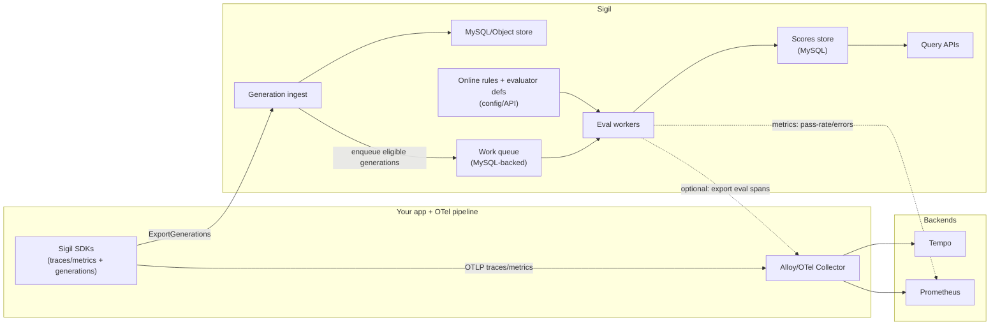

# Online Evaluation (Live Scoring)

## Summary

Add **online evaluation** to Sigil: configurable evaluators that run asynchronously on production traffic (generations) and attach **scores** back to the generation + conversation debugging workflow in the Grafana app plugin.

The design is intentionally:

- **generation-first**: evaluation attaches to `generation_id` as the primary unit (MVP).
- **async + cost-controlled**: filters + sampling + budgets, never request-path latency.
- **pluggable**: run evaluators inside Sigil *or* in user infrastructure (bring-your-own-evaluator) and report results back.
- **Grafana-native**: treat eval results as another timeline signal next to traces, ratings, and operator annotations.

This doc focuses on online evaluation only. Offline evaluation (datasets + experiments + CI gates) is covered in `docs/design-docs/drafts/2026-02-15-offline-evaluation.md`.

## Background / Research

See:

- Market survey: `docs/references/ai-observability-evaluation-market.md`
- Competitive benchmark: `docs/references/competitive-benchmark.md`

Common market pattern is consistent: **evaluator definition + rule (filters + sampling + backfill) + async workers + score attachment** (Braintrust/Langfuse/LangSmith style).

## Problem Statement

Sigil already answers:

- “What happened?” (trace + normalized generation payload)
- “Where did it break?” (errors, tool timeline, infra metadata)
- “What did the user think?” (conversation ratings)
- “What did the operator decide?” (annotations)

It does not answer the next operator question at production scale:

- “**Is quality drifting?**”
- “**Did a rollout regress helpfulness/format/safety?**”
- “**Which cohorts are getting worse (model/agent/version/namespace)?**”

Online evaluation exists to provide **continuous, quantitative signals** without becoming a separate platform. It should be easy to enable, easy to reason about, and hard to misuse.

## Goals

- Score generations asynchronously with configurable evaluators.
- Make scoring cheap to operate:
  - filters + sampling + rate limits
  - concurrency caps and backpressure
- Keep evaluation **debuggable**:
  - score -> generation -> trace linkage is first-class
  - evaluator execution is observable (logs/metrics; optional trace spans)
- Support two execution modes:
  - **built-in** evaluators running inside Sigil workers
  - **bring-your-own evaluator**: users compute scores externally and export them to Sigil
- Provide a simple, opinionated UX in the plugin:
  - show score badges in conversation/generation views
  - surface “what got worse” and “show me failures”
  - make it easy to create datasets from failing online eval cases (bridge to offline eval)

## Non-Goals (Initial)

- Guardrails (request-path blocking/routing/transform). Online eval is monitor-first.
- Full “prompt CMS” / prompt registry.
- Complex hosted execution environments for agent replay.
- Perfect cross-model comparability. We will be explicit about limits.
- Step/trajectory evaluation in v1 (see “Future extensions”).

## Definitions (Opinionated)

- **Evaluator**: a function that produces one or more **scores** for a target.
- **Online rule**: binds an evaluator to production traffic via filters + sampling + scheduling/backfill.
- **Score**: a typed result attached to a target with provenance (who/what produced it).
- **Target** (v1): generation-scoped (`generation_id`), with optional `conversation_id`, `trace_id`, `span_id` for drilldown.

We explicitly do not call ratings/annotations “evals”:

- **Ratings**: end-user feedback (thumbs up/down).
- **Annotations**: operator workflow notes/tags/status.
- **Evals**: automated or programmatic scoring outputs.

## Generation vs Turn vs Conversation (What Is “Final”?)

Most users care about **the quality of what the user sees**, which is usually a *turn-level* concept. But “turn” and “conversation end” are often ambiguous in production systems (agents, streaming, tools, handoffs).

We separate the concepts explicitly:

- **Generation**: one model invocation recorded by Sigil. Always has a clear “finished” moment (`completed_at`), so it is the safest online trigger.
- **Turn**: “one user request -> what we show the user”. A single turn may include multiple generations (planner, tool calls, final answer).
- **Conversation**: a sequence of turns. Often never “finishes” (support chats, copilots).
- **Episode / run**: an agent task bounded by your app control flow (start -> complete). This is frequently what teams mean by “final”, but it requires explicit wiring (`run_id`) or heuristics.

**Opinionated MVP stance:** keep online evaluation **generation-attached**, but make rules default to selecting **user-visible turn outputs** (not every internal step). Then compute **conversation-level rollups** in the UI without requiring a hard “conversation finished” signal.

This keeps setup simple:

- you can enable online eval without redesigning your conversation model
- you can still answer “what got worse” and “show me failures” because each scored generation is trace-linked
- you avoid the false promise that Sigil can *always* infer when a conversation is truly done

## Design Principles

1. **Scores are just another timeline signal**
   - Debugging is the core job; evaluation should not create a separate analysis world.
2. **No latency in the request path**
   - Everything is async; default sampling is conservative.
3. **Content is optional**
   - Evaluators must work with normalized payloads and policy-driven content capture.
   - No “send everything to the judge model” defaults.
4. **Config-first is the default**
   - OSS users should be able to enable evals without a complex control plane.
   - UI can render/inspect; editing can come later.
5. **Bring-your-own evaluator is first-class**
   - Many teams already have evaluation pipelines; Sigil should ingest scores cleanly.

## High-Level Architecture



Key point: evaluation uses **generation-first ingest** as the trigger and **stores scores in Sigil** so the plugin can show them alongside the generation payload and trace link.

## Core Objects

### 1) Score (the atomic output)

Scores are append-only events. They are never edited in place; “new truth” is a new score record with a new timestamp and a new `score_id`.

**Score shape (logical):**

```json
{
  "score_id": "sc_01K...",
  "created_at": "2026-02-15T23:10:00Z",
  "tenant_id": "t-1",

  "target": {
    "type": "generation",
    "generation_id": "gen_01K...",
    "conversation_id": "conv-123",
    "trace_id": "4bf92f3577b34da6a3ce929d0e0e4736",
    "span_id": "00f067aa0ba902b7"
  },

  "evaluator": {
    "id": "rubric.helpfulness.v1",
    "version": "2026-02-15",
    "kind": "llm_judge"
  },

  "key": "helpfulness",
  "value": { "number": 0.78 },
  "unit": "score_0_1",
  "passed": true,

  "explanation": "Concise but missed constraints.",
  "metadata": {
    "judge_model": "gpt-5-mini",
    "judge_latency_ms": 623,
    "prompt_hash": "sha256:..."
  },

  "source": {
    "kind": "online_rule",
    "id": "online.helpfulness.user_visible_turn",
    "run_id": "run_01K..."
  }
}
```

Notes:

- `key` is the stable metric name (e.g., `helpfulness`, `json_valid`, `policy.safe`).
- `value` is a oneof:
  - `number` (recommended default for most quality rubrics)
  - `bool` (pass/fail)
  - `string` (categorical label)
- `passed` is optional; for numeric scores it can be computed from thresholds but storing it improves query UX.
- `source` establishes provenance and is what powers “show me what rule did this.”

### 2) Evaluator definition (what to run)

We need a durable definition format for:

- evaluator kind and configuration
- input mapping (what parts of the generation to pass)
- output schema (what score keys and types it produces)
- versioning (so results are reproducible)

**Evaluator kinds (v1 target set):**

1. `llm_judge`
2. `json_schema`
3. `regex`
4. `heuristic` (simple built-in checks: length bounds, language detection, “contains apology”, etc.)

We should treat “RAG metrics” and “agent trajectory” evaluators as future work because they require richer step context and/or external retrieval artifacts.

**Input mapping**

Opinionated default: evaluator input is derived from the **current generation only**:

- `prompt`: concatenated normalized input (system + user messages) with safe truncation
- `response`: concatenated assistant-visible output text (tool calls excluded by default)
- `tool_calls`: structured tool call list (optional)
- `tool_results`: optional, only when captured
- `metadata`: `{provider, model, agent, usage, error fields, tags}`

Later (explicit opt-in): include limited conversation history window (e.g., previous 2 turns).

### 3) Online rule (what to score in production)

An online rule binds:

- `select`: which generations within a conversation/episode should be considered eligible (defaults to user-visible turns)
- `match`: a filter over generation attributes and/or infra context
- `sampling`: to control volume and cost
- `schedule/backfill`: new-only vs backfill window, plus rate limits
- `evaluators`: one or more evaluator refs

We should use the same “filter language” concepts as the conversation search work (Tempo-backed) but keep MVP scoped to **generation payload fields** that are guaranteed available at ingest time.

#### Selecting “user-visible” generations (recommended default)

The biggest practical problem with online eval is not scoring itself, it is scoring the *right thing*:

- agents often generate multiple internal steps per user request (planner thoughts, tool calls, intermediate drafts)
- only one (or a small subset) of generations are actually shown to the user

We want online evaluation to be useful out of the box even if the application does **not** explicitly tag “final”.

**Opinionated default selector:** score “user-visible turn outputs” (a generation that looks like a displayable assistant answer).

Heuristic definition (v1, computed from the normalized generation payload):

- must be an assistant generation (has at least one `MESSAGE_ROLE_ASSISTANT` output message)
- must contain user-visible text (at least one `text` part after excluding `thinking`)
- must not be a tool-call step (no `tool_call` parts in output)
- optional: ignore errored calls (`call_error` present)

This works well for common tool-using agents because tool invocations are represented as structured `tool_call` parts and typically also carry a `stop_reason` like `tool_calls` / `tool_use`.

**Explicit overrides (optional, when the app knows more):**

- Tag the generation with `sigil.visibility=user|internal` (recommended over `final`, because “final” is often unknowable).
- Tag the generation with `sigil.role=final|draft|planner` if your framework already has this concept.
- Tag the generation with `sigil.run_id=<uuid>` (episode boundary). “Final” can then mean “last eligible generation in the run”.

We should treat these tags as *hints* that can override the heuristic when present, not a requirement for the system to function.

**Example: tagging visibility (TypeScript, pseudo-code)**

```ts
await client.startGeneration(
  {
    conversationId: "conv-123",
    agentName: "assistant-main",
    model: { provider: "openai", name: "gpt-5-mini" },
    tags: {
      // Prefer this over trying to guess "final conversation message".
      "sigil.visibility": "user",
      // Optional: if you already have it.
      "sigil.run_id": "run_01K...",
    },
  },
  async (rec) => {
    const response = await callProvider();
    rec.setResult(mapToGenerationResult(response));
    return response;
  }
);
```

#### Stop reason as a hint (best-effort, provider-dependent)

Sigil stores `stop_reason` as a free-form string (provider-mapped). It is useful as an additional label, but should not be the only selector signal because vocab differs by provider and some code paths may omit it.

Current SDK mapping behavior (JS SDK as reference):

- OpenAI Chat Completions: uses `choice.finish_reason` verbatim (e.g., `stop`, `length`, `tool_calls`).
- OpenAI Responses API: normalizes to `stop` on completion, or returns the incomplete/cancel/failed reason.
- Anthropic Messages API: uses `stop_reason` verbatim (e.g., `end_turn`, `max_tokens`, `tool_use`).
- Gemini: uses `finishReason` uppercased (e.g., `STOP`, `MAX_TOKENS`, `SAFETY`).

If we expose stop reason matching in rules, we should also add a tiny normalization layer (computed field) so configs stay portable:

- `stop_category = tool_call|stop|length|safety|cancelled|error|other`
- keep `stop_reason_raw` as-is for debugging and provider-specific cases

**Rule match fields (v1)**

- `tenant_id` (always applied)
- generation fields:
  - `agent_name`, `agent_version`
  - `model.provider`, `model.name`
  - `mode` / `operation_name`
  - `tags` (from generation payload)
  - derived output selectors (computed from the generation payload):
    - `output.has_text` (excluding `thinking`)
    - `output.has_tool_calls`
    - `stop_reason` (raw)
    - `stop_category` (normalized; see “Stop reason as a hint”)
  - `error.type`, `error.category` (from generation payload)
- optional infra fields (only if we copy them into generation payload metadata during ingest; otherwise defer)

We should avoid depending on Tempo search for rule matching in v1 to keep the online pipeline independent and reliable.

## Storage Design (MySQL)

### Why MySQL for eval data

- Sigil already uses MySQL for hot metadata and feedback tables.
- Online eval requires strong idempotency + query ergonomics + pagination.
- Evaluation results should not disappear when generation payloads are compacted/truncated.

### Tables (proposed)

Minimal set for online evaluation:

1. `generation_scores` (append-only score events)
2. `generation_score_summaries` (optional, denormalized latest/best/worst for fast UI)
3. `eval_online_rules` (optional if we do config-first only; otherwise persistent control plane)
4. `eval_evaluators` (optional control plane)
5. `eval_work_items` (queue table)
6. `eval_work_logs` (optional, for debugging worker failures)

**Option A (MVP, simplest):** only `generation_scores` + `eval_work_items`, rules/evaluators live in a config file.

**Option B (richer UX):** persist rules/evaluators in MySQL and allow UI/API CRUD.

### `generation_scores` schema (draft)

```sql
CREATE TABLE generation_scores (
  id BIGINT UNSIGNED AUTO_INCREMENT PRIMARY KEY,
  tenant_id VARCHAR(128) NOT NULL,

  score_id VARCHAR(128) NOT NULL,
  generation_id VARCHAR(255) NOT NULL,
  conversation_id VARCHAR(255) NULL,
  trace_id VARCHAR(64) NULL,
  span_id VARCHAR(16) NULL,

  evaluator_id VARCHAR(255) NOT NULL,
  evaluator_version VARCHAR(64) NOT NULL,
  rule_id VARCHAR(255) NULL,
  run_id VARCHAR(255) NULL,

  score_key VARCHAR(255) NOT NULL,
  score_type VARCHAR(16) NOT NULL, -- number|bool|string
  score_number DOUBLE NULL,
  score_bool BOOLEAN NULL,
  score_string VARCHAR(255) NULL,
  unit VARCHAR(64) NULL,
  passed BOOLEAN NULL,

  explanation TEXT NULL,
  metadata_json JSON NOT NULL,

  created_at DATETIME(6) NOT NULL,
  ingested_at DATETIME(6) NOT NULL DEFAULT CURRENT_TIMESTAMP(6),

  UNIQUE KEY ux_generation_scores_tenant_score (tenant_id, score_id),
  KEY idx_generation_scores_tenant_generation_time (tenant_id, generation_id, created_at),
  KEY idx_generation_scores_tenant_rule_time (tenant_id, rule_id, created_at),
  KEY idx_generation_scores_tenant_evaluator_time (tenant_id, evaluator_id, evaluator_version, created_at),
  KEY idx_generation_scores_tenant_key_time (tenant_id, score_key, created_at),
  KEY idx_generation_scores_tenant_pass_time (tenant_id, passed, created_at)
);
```

Rationale:

- `score_id` provides idempotency across retries (same pattern as ratings/annotations).
- Storing typed values in columns keeps query simple; `metadata_json` holds the rest.
- `rule_id` and `run_id` enable grouping and backfills.

### Queue table `eval_work_items` (draft)

```sql
CREATE TABLE eval_work_items (
  id BIGINT UNSIGNED AUTO_INCREMENT PRIMARY KEY,
  tenant_id VARCHAR(128) NOT NULL,

  work_id VARCHAR(128) NOT NULL,
  work_kind VARCHAR(32) NOT NULL, -- generation_online
  generation_id VARCHAR(255) NOT NULL,
  evaluator_id VARCHAR(255) NOT NULL,
  evaluator_version VARCHAR(64) NOT NULL,
  rule_id VARCHAR(255) NOT NULL,

  scheduled_at DATETIME(6) NOT NULL,
  attempts INT NOT NULL DEFAULT 0,
  status VARCHAR(16) NOT NULL, -- queued|running|success|failed|dead
  last_error TEXT NULL,

  created_at DATETIME(6) NOT NULL,
  updated_at DATETIME(6) NOT NULL,

  UNIQUE KEY ux_eval_work_items_tenant_work (tenant_id, work_id),
  KEY idx_eval_work_items_tenant_status_scheduled (tenant_id, status, scheduled_at)
);
```

Opinionated choice: **MySQL-backed queue** for OSS simplicity. If we later need Kafka/NATS, we can abstract the queue behind an interface and keep MySQL as the default implementation.

## APIs

### 1) Export scores (bring-your-own evaluator)

We should support score ingestion as a first-class contract, not as “stuff it into generation metadata”.

Proposed:

- HTTP: `POST /api/v1/scores:export`
- gRPC parity: `EvaluationIngestService.ExportScores`

Request:

```json
{
  "scores": [
    {
      "score_id": "sc_01K...",
      "generation_id": "gen_01K...",
      "conversation_id": "conv-123",
      "trace_id": "....",
      "span_id": "....",
      "evaluator_id": "my-company.policy.v1",
      "evaluator_version": "1.2.3",
      "score_key": "policy.safe",
      "value": { "bool": true },
      "passed": true,
      "explanation": "No policy violation detected",
      "metadata": { "runtime_ms": 12 },
      "created_at": "2026-02-15T23:10:00Z",
      "source": { "kind": "sdk", "id": "my-service" }
    }
  ]
}
```

Response mirrors generation ingest style: per-item acceptance with deterministic errors.

### 2) Query scores (plugin UX)

Minimum set:

- `GET /api/v1/generations/{generation_id}/scores?limit=50&cursor=...`
- `GET /api/v1/conversations/{conversation_id}/scores/summary` (optional)

We should also include score summaries in generation detail response once the conversation query path lands:

- `GET /api/v1/generations/{id}` includes `scores_summary` and/or `latest_scores`.

### 3) Online rule control plane (optional in v1)

Two viable directions:

- **Config-first (recommended MVP):** rules live in `sigil.yaml` or `sigil-eval.yaml`, reloaded on restart or SIGHUP.
- **API + UI CRUD (richer):** `POST /api/v1/eval/online-rules`, etc.

This doc describes both as alternatives.

## Execution Model

### Trigger point

Online evaluation should trigger when a generation is successfully ingested.

Options:

1. **Ingest-time enqueue (recommended):**
   - after `SaveBatch` succeeds, enqueue work items for matching rules
   - cheapest latency-to-score and simplest “exactly once-ish” behavior
2. **Polling worker:**
   - periodically scan for new generations and apply rules
   - avoids coupling to ingest path but increases lag and complexity for “already processed” tracking

Opinionated MVP: ingest-time enqueue with strict budgets so ingest stays safe.

### Matching + sampling

Rule evaluation must be cheap:

- Do string comparisons and tag checks only.
- Sampling should be deterministic per generation to avoid biased repeated evaluations:
  - compute `hash(tenant_id + generation_id + rule_id) mod 1.0 < sample_rate`

### Worker lifecycle

Workers:

- claim work from MySQL table (status transition with row lock)
- load generation payload (hot store; cold store fallback if necessary)
- build evaluator input (using policy)
- execute evaluator
- write one or more score rows (idempotent by `score_id`)
- update work status

Retry policy:

- transient errors: retry with exponential backoff up to `max_attempts`
- permanent errors (validation, missing generation): mark failed without retry

Backpressure:

- if queue length or DB latency exceeds thresholds, workers should slow down and expose metrics.

### Evaluator observability

Every evaluator execution should emit:

- Prometheus metrics:
  - `sigil_eval_executions_total{evaluator,rule,status}`
  - `sigil_eval_duration_seconds{evaluator,rule}`
  - `sigil_eval_scores_total{evaluator,rule,key,passed}`
- Logs with `work_id`, `generation_id`, and `evaluator_id`

Optional: export an “evaluation span” as a child of the generation span (Braintrust-style) so you can debug judge prompts and latency in Tempo.

## Optional: Evaluation Spans in Tempo (Trace-Linked Debugging)

If enabled, Sigil workers export an OTel span with:

- same `trace_id` as the generation
- parent span id = generation `span_id`
- attributes:
  - `gen_ai.operation.name = "evaluate"` (Sigil extension)
  - `sigil.eval.id`, `sigil.eval.evaluator_id`, `sigil.eval.rule_id`
  - `sigil.eval.score_key`, `sigil.eval.passed`, `sigil.eval.score_number`
  - `gen_ai.provider.name` / `gen_ai.request.model` for the judge model (if LLM judge)

This is optional because:

- some users may not want eval artifacts mixed into production traces
- it requires an OTLP exporter configuration for Sigil workers

## Configuration (Opinionated Examples)

### Option A: `sigil-eval.yaml` (config-first, recommended MVP)

```yaml
online:
  enabled: true

  # Global budgets (hard stops).
  budgets:
    max_executions_per_minute: 600
    max_concurrent_workers: 8
    max_queue_backlog: 50000

  # Evaluators are versioned. Changing a rubric should bump version.
  evaluators:
    - id: rubric.helpfulness.v1
      version: "2026-02-15"
      kind: llm_judge
      output:
        keys:
          - key: helpfulness
            type: number
            unit: score_0_1
            pass_if: ">= 0.7"
      input:
        include:
          - prompt
          - response
        max_chars:
          prompt: 6000
          response: 6000
      judge:
        provider: openai
        model: gpt-5-mini
        temperature: 0
        max_tokens: 300
        timeout_ms: 15000
      rubric:
        prompt: |
          You are grading an assistant response.
          Return JSON: {"helpfulness": number in [0,1], "explanation": string}.
          Rubric:
          - 1.0: fully correct, complete, follows constraints
          - 0.0: incorrect or ignores constraints

    - id: format.json_response.v1
      version: "2026-02-15"
      kind: json_schema
      output:
        keys:
          - key: json.valid
            type: bool
            unit: boolean
            pass_if: "= true"
      input:
        include:
          - response
      schema:
        type: object
        required: ["answer"]
        properties:
          answer:
            type: string

  # Online rules decide *what* to score.
  rules:
    - id: online.helpfulness.user_visible_turn
      enabled: true
      # Prefer selecting "user-visible" assistant outputs by default.
      # This avoids needing the app to know or tag what is "final".
      select:
        selector: user_visible_turn
      match:
        agent_name: ["assistant-*"]
        operation_name: ["generateText", "streamText"]
      sample:
        rate: 0.05
      evaluators:
        - rubric.helpfulness.v1

    - id: online.json_contract.api_responses
      enabled: true
      match:
        agent_name: ["api-*"]
      sample:
        rate: 1.0
      evaluators:
        - format.json_response.v1
```

`select.selector` is intended to be a small set of built-in, opinionated choices (so users don't have to invent “final” semantics):

- `user_visible_turn` (recommended): assistant output with text and no tool calls
- `all_assistant_generations`: score all assistant generations (includes tool-call steps)
- `tool_call_steps`: score only tool-call generations (useful for tool selection quality)
- `errored_generations`: score only generations with `call_error` present (debug cohorts)

If your app can provide stronger signals, it can override the heuristic via tags (for example `sigil.visibility=internal|user` or `sigil.run_id=<id>`).

### Option B: API-managed rules (richer UX)

Same objects, but stored in MySQL and editable via UI. This enables:

- filter builder with preview
- backfill button (“score last 24h”)
- per-rule run history and error logs

Tradeoff: larger control plane surface and more RBAC needs.

## Plugin UX (Grafana App) Integration

### Where scores show up (opinionated)

1. **Conversation list**
   - show “quality badges” derived from the most recent **eligible user-visible turn** (and optionally a small rollup window like “last 3 user-visible turns”):
     - `helpfulness: 0.78`
     - `json.valid: FAIL`
   - allow quick filter “has failing scores” (MySQL-side filter in query path, similar to `has_bad_rating`)

2. **Conversation detail**
   - per-generation score badges in the generation timeline
   - default view emphasizes user-visible turns; internal steps (tool-call generations) are collapsed unless “Show internal steps” is enabled
   - expanded panel shows:
     - score history for this generation (multiple evaluators)
     - judge explanation (if any)
     - link to trace (and optional evaluation span)

3. **Evaluation page (new)**
   - “Online rules” tab:
     - list rules, sampling, evaluator list, last run, error rate
     - quick actions: enable/disable, backfill window, dry-run preview (if API-managed)
   - “Evaluators” tab:
     - list evaluator defs, versions, output keys, last updated
     - show rubric prompt hash and “view prompt” gated behind a permission toggle (avoid accidental leakage)

### UX defaults (keep it simple)

- Default to **one** score family: “Helpfulness” (numeric 0..1) and “Format valid” (bool).
- Do not overwhelm users with 10 metrics on day 1.
- Make “cost knobs” explicit:
  - sampling rate
  - max executions / minute
  - judge model choice and token limits

## SDK Integration (Bring Your Own Score)

Online evaluation is not only “Sigil runs judges”. Many teams will:

- run deterministic validators in their app (schema, regex, policy checks)
- run external evaluators via webhooks/queues

We should make reporting scores trivial from SDKs by adding a helper similar to ratings:

- Go: `SubmitGenerationScore(ctx, generationID, input)`
- JS/TS: `submitGenerationScore(generationId, input)`
- Python: `submit_generation_score(generation_id, input)`
- Java: `submitGenerationScore(generationId, request)`
- .NET: `SubmitGenerationScoreAsync(generationId, request)`

### Example (TypeScript)

```ts
import { SigilClient } from "@grafana/sigil-sdk-js";

const client = new SigilClient({
  generationExport: {
    protocol: "http",
    endpoint: "http://localhost:8080/api/v1/generations:export",
    auth: { mode: "tenant", tenantId: "dev-tenant" },
  },
  api: { endpoint: "http://localhost:8080" },
});

// ... run your app and get a generation id from the recorder ...

await client.submitGenerationScore("gen_01K...", {
  scoreId: "sc_01K...",
  evaluatorId: "myapp.regex.v1",
  evaluatorVersion: "1.0.0",
  key: "json.valid",
  value: { bool: true },
  passed: true,
  explanation: "Response JSON schema validated",
  metadata: { runtimeMs: 4 },
});
```

### Example (Go)

```go
resp, err := client.SubmitGenerationScore(ctx, "gen_01K...", sigil.GenerationScoreInput{
    ScoreID:          "sc_01K...",
    EvaluatorID:      "myapp.regex.v1",
    EvaluatorVersion: "1.0.0",
    Key:              "json.valid",
    BoolValue:        sigil.Ptr(true),
    Passed:           sigil.Ptr(true),
    Explanation:      "Response JSON schema validated",
    Metadata:         map[string]any{"runtime_ms": 4},
})
_ = resp
_ = err
```

## Alternatives (Explicit Tradeoffs)

### A1: Config-first vs UI-managed evaluator/rule CRUD

- Config-first:
  - Pros: simplest OSS story, GitOps friendly, fewer APIs, fewer auth/RBAC questions.
  - Cons: iteration is slower; no preview/backfill UX without extra work.
- UI-managed:
  - Pros: best UX; matches market leaders; enables previews/backfills and non-engineer workflows.
  - Cons: larger control plane; needs audit/RBAC; harder to keep “simple”.

Recommendation: ship config-first MVP, then add UI-managed as a Phase 2 if demand is strong.

### A2: Ingest-time enqueue vs polling worker

- Ingest-time enqueue:
  - Pros: low latency; no “already processed” bookkeeping.
  - Cons: slight coupling to ingest; must be carefully bounded so ingest stays safe.
- Polling:
  - Pros: zero coupling to ingest.
  - Cons: higher complexity and lag; harder to avoid double-processing; needs cursors per rule.

Recommendation: ingest-time enqueue with hard budgets and fast failure.

### A3: MySQL queue vs external queue (Redis/NATS/Kafka)

- MySQL:
  - Pros: no new dependencies; simplest for OSS.
  - Cons: extreme throughput might pressure DB.
- External queue:
  - Pros: scalable; isolates DB from work churn.
  - Cons: more ops; harder self-host story.

Recommendation: MySQL queue first, abstract behind an interface.

### A4: Store scores in Sigil DB vs as OTel data only

- DB:
  - Pros: easy to join to generation payload and build UI; stable semantics.
  - Cons: more schema to maintain.
- OTel-only (Tempo spans / Prom metrics):
  - Pros: reuse existing backends; no new DB schema.
  - Cons: hard to query per-generation in UI; filtering/join semantics get messy.

Recommendation: DB as source of truth; optional OTel export for debugging.

## Security, Privacy, and Data Governance

- Online eval must respect content capture policies:
  - default evaluator input uses truncated normalized content
  - allow per-evaluator “requires content” gating; if required fields missing, mark score as `skipped` (not failed)
- Judge model credentials:
  - stored in environment/secret manager, not in evaluator objects
- Retention:
  - score retention can differ from generation payload retention
  - provide TTL config per score family (e.g., keep aggregates longer than raw explanations)
- PII:
  - never include raw provider artifacts by default
  - allow opt-in to include tool arguments/results only if content capture is enabled

## Performance and Cost Controls

Opinionated defaults:

- sampling rate defaults to `0.01` unless rule explicitly sets it
- global `max_executions_per_minute` is required if LLM judge enabled
- strict timeouts and concurrency caps
- optional caching for judge calls (hash(prompt+response+rubric+judge_model) -> result) to stabilize backfills and reduce cost

## Future Extensions (Not in v1)

- Step-level evaluators using Tempo span queries (tool call correctness, retrieval relevance).
- Trajectory/episode scoring anchored on root span or explicit `run_id`.
- “Final for now” sessionization via an idle window (useful for conversation-level summaries when no explicit run boundary exists).
- UI slices and cohort analysis (language/topic/tenant) powered by score aggregation.
- Alerting templates (Grafana alert rules) prebuilt for “pass-rate drop” and “mean score regression.”

## Open Questions

1. Should we standardize a small set of score keys (`helpfulness`, `groundedness`, `json.valid`) as “built-in dimensions”?
2. Do we want “evaluation spans” on by default in OSS mode, or always opt-in?
3. How should score filtering integrate with conversation search?
   - MySQL-side filters (like `has_bad_rating`) are doable but can explode query complexity.
   - Another approach is to keep eval filtering in a dedicated “Evaluation” page first.
4. Do we want to formalize “user-visible vs internal” as:
   - pure heuristics (`output.has_tool_calls`, `output.has_text`) + optional tags, or
   - explicit first-class fields (for example `turn_id`, `visibility`, `run_id`) in the generation ingest contract?
