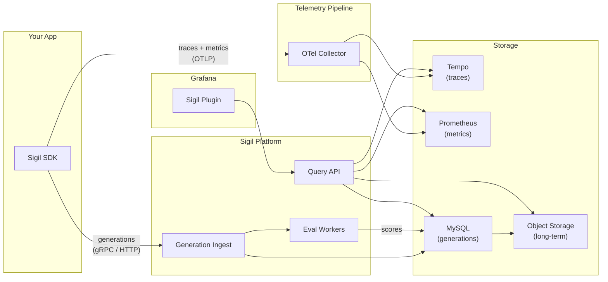

# Grafana Sigil

**Actually useful AI observability.**

Instrument, observe, and evaluate every LLM call in production — with drop-in SDKs for Go, Python, TypeScript, Java, and .NET.

---

## How it works



Your application code wraps LLM calls with a Sigil SDK. Traces and metrics flow through the standard OpenTelemetry pipeline. Structured generation records (prompts, completions, tool calls, tokens, cost) go directly to Sigil for indexing, evaluation, and long-term storage. The Grafana plugin gives you a single pane of glass across all of it.

---

## Features

### Auto-instrumentation

Drop-in SDKs that capture every LLM call with zero manual work. Wrap your provider client and every generation is recorded automatically — prompts, completions, tool calls, token counts, latency, and cost.

**Supported providers:** OpenAI, Anthropic, Gemini
**Supported frameworks:** LangChain, LangGraph, OpenAI Agents, LlamaIndex, Google ADK, Vercel AI SDK
**Languages:** Go · Python · TypeScript · Java · .NET

<!-- Screenshot: landing page auto-instrumentation section showing Cursor / Claude Code / Copilot buttons -->
<!-- Suggested: code snippet gif showing a 3-line SDK setup wrapping an OpenAI client -->


---

### Analytics

Full-stack AI analytics across all your providers, models, and agents. Track request volume, token usage, estimated cost, error rates, and latency — broken down by any dimension. Compare time periods to spot trends and regressions at a glance.

**Dashboards:** Overview · Performance · Errors · Usage · Evaluation · Cache
**Breakdowns:** by provider, model, agent, language, status
**TopStats:** sparklines with period-over-period comparison

<!-- Screenshot: analytics dashboard overview tab — time series charts, TopStats row, breakdown panels -->
<!-- Suggested gif: switching between dashboard tabs (Overview → Performance → Usage) -->


---

### Prompt analysis

Browse every conversation flowing through your AI stack. Inspect the full prompt chain — system prompts, user messages, assistant responses, tool calls, and tool results — in a chat-style view. See token counts, cost, model, and latency per generation.

**Views:** Conversation browser with histogram · Flow tree with agent/model grouping · Chat thread view · Generation detail with trace link
**Filters:** time range, provider, model, agent, status, token count, feedback

<!-- Screenshot: conversation explore page — flow tree sidebar + chat thread detail panel -->
<!-- Suggested gif: clicking through a multi-turn conversation, expanding tool calls -->


---

### Drilldown into the details

Click any conversation to see the full execution flow. The flow tree shows every generation grouped by agent, model, or provider. Select a generation to see the complete input/output, tool definitions, reasoning tokens, and timing. Jump directly to the distributed trace in Tempo for infrastructure-level debugging.

**Features:** resizable split layout · mini timeline · agent version diff · system prompt history · feedback ratings and annotations

<!-- Screenshot: conversation detail with flow tree expanded, generation selected, showing input/output -->
<!-- Suggested gif: selecting different generations in the flow tree, then opening the trace drawer -->


---

### Online evaluations

Automatically score every generation in production with configurable evaluator rules. Use LLM judges, regex matchers, JSON schema validators, or custom heuristics. Set up rules that target specific conversation selectors with sampling rates, then watch pass rates and quality signals flow into dashboards.

**Evaluator types:** LLM Judge · Regex · JSON Schema · Heuristic
**Rule engine:** selector-based targeting · conversation-level sampling · dry-run preview
**Results:** pass rate trends · score breakdowns · lowest-pass-rate conversations · eval duration P95
**Templates:** fork predefined evaluators or create your own

<!-- Screenshot: evaluation results page — TopStats (pass rate, scores, duration) + charts grid -->
<!-- Suggested gif: creating an evaluator from a template, running a test against a real generation -->


---

### Agent catalog

Track every AI agent deployed across your organization. See activity timelines, model usage footprints, risk signals, and version history. Compare system prompt diffs between agent versions and monitor per-agent quality metrics.

<!-- Screenshot: agents overview — activity timeline + agent footprint bars + TopStats -->
<!-- Suggested gif: drilling into an agent, viewing version history, diffing system prompts -->


---

## Screenshot guide

Replace the placeholder images above with actual screenshots. Recommended captures:

| Feature | Page URL | What to capture |
|---|---|---|
| Auto-instrumentation | `/a/grafana-sigil-app` | Landing page hero + auto-instrumentation section |
| Analytics | `/a/grafana-sigil-app/analytics?tab=overview` | Dashboard with time series, TopStats, breakdowns |
| Prompt analysis | `/a/grafana-sigil-app/conversations/{id}/explore` | Flow tree + chat thread with a multi-turn conversation |
| Drilldown | `/a/grafana-sigil-app/conversations/{id}/explore` | Generation detail panel with tool calls expanded |
| Online evaluations | `/a/grafana-sigil-app/evaluation/results` | Eval results charts + pass rate trends |
| Agent catalog | `/a/grafana-sigil-app/agents` | Overview tab with activity timeline and footprint |

**For GIFs**, use a screen recorder (e.g. CleanShot, Kap, or LICEcap) at 800–1200px wide:

1. **Analytics gif:** Open analytics → switch tabs Overview → Performance → Usage (~5s)
2. **Prompt analysis gif:** Open a conversation → click through 3–4 generations → expand a tool call (~8s)
3. **Evaluations gif:** Fork a template → fill in config → hit test → see result (~10s)
4. **Agent catalog gif:** Open agents list → click an agent → scroll to version diff (~6s)

---

## Quick start

```bash
# 1. Install the SDK
go get github.com/grafana/sigil-go

# 2. Wrap your provider client
client := sigil.WrapOpenAI(openai.NewClient(apiKey))

# 3. Use it normally — every call is instrumented
resp, err := client.Chat(ctx, params)
```

```python
# Python
from sigil import wrap_openai
client = wrap_openai(OpenAI())
```

```typescript
// TypeScript
import { wrapOpenAI } from '@grafana/sigil-sdk-js';
const client = wrapOpenAI(new OpenAI());
```

That's it. Traces, metrics, and generation records flow automatically.
