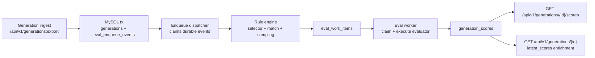
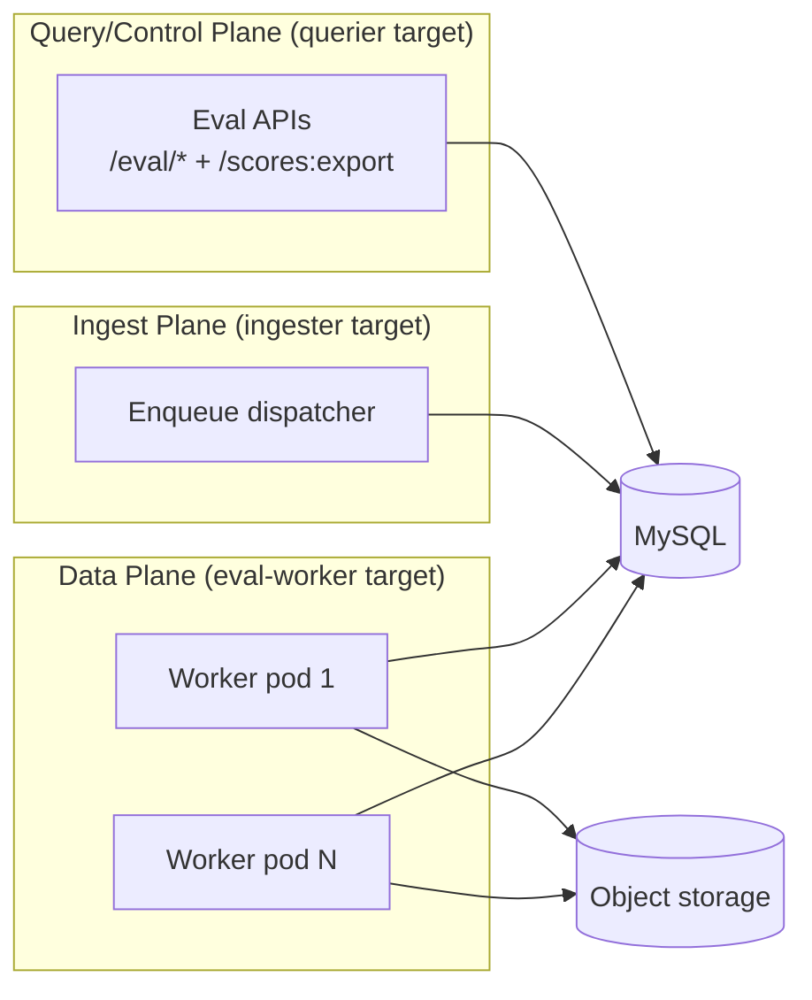

# Online Evaluation User Guide

This guide explains how online evaluation works in Sigil, how to deploy it, and how to configure evaluators/rules end to end.

## What Online Evaluation Does

Online evaluation asynchronously scores ingested generations and writes typed scores back to Sigil.

You can use it for:
- Built-in evaluators (`llm_judge`, `json_schema`, `regex`, `heuristic`).
- Predefined evaluator templates (forkable via API).
- External evaluators that push scores via `POST /api/v1/scores:export`.

## Architecture



Key properties:
- Enqueue intent is durable (`eval_enqueue_events` is written in the same transaction as generation rows).
- Dispatcher and workers are horizontally scalable (DB claim loops with row locking).
- Worker retries are persisted; permanent evaluator/config errors are marked failed.

### Deployment Topology



## Setup

### 1. Run Required Targets

Use one of these modes:
- Single process: `SIGIL_TARGET=all`.
- Split deployment: run `SIGIL_TARGET=ingester`, `SIGIL_TARGET=querier`, and `SIGIL_TARGET=eval-worker` separately.

### 2. Configure Worker Runtime

| Env var | Default | Purpose |
| --- | --- | --- |
| `SIGIL_EVAL_WORKER_ENABLED` | `false` | Enable eval worker loop |
| `SIGIL_EVAL_MAX_CONCURRENT` | `8` | Max in-flight evaluations |
| `SIGIL_EVAL_MAX_RATE` | `600` | Global eval executions/min |
| `SIGIL_EVAL_MAX_ATTEMPTS` | `3` | Retry cap for transient failures |
| `SIGIL_EVAL_CLAIM_BATCH_SIZE` | `20` | Work items claimed per cycle |
| `SIGIL_EVAL_POLL_INTERVAL` | `250ms` | Claim loop cadence |
| `SIGIL_EVAL_DEFAULT_JUDGE_MODEL` | `openai/gpt-4o-mini` | Default for `llm_judge`; must be `provider/model` |

### 3. Configure Judge Providers

Providers are discovered only when both are true:
- Explicitly enabled via `SIGIL_EVAL_*_ENABLED` flag.
- Credentials/config are valid.

| Provider ID | Enable flag | Required auth/config |
| --- | --- | --- |
| `openai` | `SIGIL_EVAL_OPENAI_ENABLED` | `SIGIL_EVAL_OPENAI_API_KEY` |
| `azure` | `SIGIL_EVAL_AZURE_OPENAI_ENABLED` | `SIGIL_EVAL_AZURE_OPENAI_ENDPOINT`, `SIGIL_EVAL_AZURE_OPENAI_API_KEY` |
| `anthropic` | `SIGIL_EVAL_ANTHROPIC_ENABLED` | one of `SIGIL_EVAL_ANTHROPIC_API_KEY`, `SIGIL_EVAL_ANTHROPIC_AUTH_TOKEN`, `ANTHROPIC_API_KEY`, `ANTHROPIC_AUTH_TOKEN` |
| `bedrock` | `SIGIL_EVAL_BEDROCK_ENABLED` | AWS default credentials/role, or `SIGIL_EVAL_BEDROCK_BEARER_TOKEN` |
| `google` | `SIGIL_EVAL_GOOGLE_ENABLED` | one of `SIGIL_EVAL_GOOGLE_API_KEY`, `GOOGLE_API_KEY`, `GEMINI_API_KEY` |
| `vertexai` | `SIGIL_EVAL_VERTEXAI_ENABLED` | `SIGIL_EVAL_VERTEXAI_PROJECT` + ADC or explicit credentials |
| `anthropic-vertex` | `SIGIL_EVAL_ANTHROPIC_VERTEX_ENABLED` | `SIGIL_EVAL_ANTHROPIC_VERTEX_PROJECT` + ADC or explicit credentials |
| `openai-compat` / named compat providers | `SIGIL_EVAL_OPENAI_COMPAT_ENABLED` or indexed flags | compat `BASE_URL` (API key optional) |

Full provider matrix and optional vars: `docs/references/eval-control-plane.md`.

Split deployment note:
- Judge provider discovery APIs (`/api/v1/eval/judge/providers`, `/api/v1/eval/judge/models`) run in the querier process.
- Evaluations execute in eval-worker processes.
- Keep provider env/config aligned across querier and worker if you want UI discovery to match worker execution capability.

### 4. Optional YAML Bootstrap

Seed file support is optional:
- `SIGIL_EVAL_SEED_FILE` (default `sigil-eval-seed.yaml`)
- `SIGIL_EVAL_SEED_STRICT` (default `false`)

Behavior:
- Seed load runs only for bootstrap (when tenant has no existing evaluators and no rules).
- Best-effort mode (`strict=false`) skips invalid entries and logs issues.
- Strict mode fails startup on the first seed error.
- Startup seed bootstrap applies to the configured `SIGIL_FAKE_TENANT_ID` tenant.

Example: `sigil-eval-seed.example.yaml`.

## Evaluator Types

Each evaluator currently supports exactly one output key.

| Kind | Config keys | Typical output |
| --- | --- | --- |
| `llm_judge` | `provider`, `model`, `system_prompt`, `user_prompt`, `max_tokens`, `temperature`, `timeout_ms` | `number`, `bool`, or `string` |
| `json_schema` | `schema` | `bool` |
| `regex` | `pattern` or `patterns`, optional `reject=true` | `bool` |
| `heuristic` | `not_empty`, `contains`, `not_contains`, `min_length`, `max_length` | usually `bool` |

### LLM Template Variables

`llm_judge` prompt templates support:
- `{{input}}`
- `{{output}}`
- `{{generation_id}}`
- `{{conversation_id}}`

`{{input}}` and `{{output}}` are normalized text extracted from the generation payload.
Text parts are included verbatim. Assistant `tool_call` parts are serialized as lines like
`[tool_call] <name> <input_json>` so tool-call generations can be judged without losing
the selected tool and arguments.

## Rule Configuration

### Selectors

| Selector | Meaning |
| --- | --- |
| `user_visible_turn` | Assistant text output with no tool-call parts (respects `tags["sigil.visibility"]` override) |
| `all_assistant_generations` | Any generation with assistant output |
| `tool_call_steps` | Any generation containing tool-call parts |
| `errored_generations` | Generations with non-empty `call_error` |

### Match Keys

Supported keys:
- `agent_name`, `agent_version`, `operation_name`, `model.provider`, `model.name` (glob-capable)
- `mode` (exact; e.g. `SYNC`, `STREAM`)
- `tags.<key>` (exact)
- `error.type`, `error.category` (exact plus presence/absence forms)

Validation rules:
- Unknown keys are rejected.
- Values must be a string or array of non-empty strings.
- Invalid glob patterns are rejected.

### Sampling

`sample_rate` is deterministic conversation-level sampling:
- Hash input: `(tenant_id, conversation_id, rule_id)`
- Same conversation + rule gives stable sample decisions.
- API/YAML default when omitted: `0.01` (1%).

## API Workflow

All eval endpoints are tenant-scoped protected routes; send `X-Scope-OrgID`.

### 1. List predefined templates

```bash
curl -s -H 'X-Scope-OrgID: tenant-a' \
  http://localhost:8080/api/v1/eval/predefined/evaluators
```

### 2. Fork a template into a tenant evaluator

```bash
curl -s -X POST -H 'Content-Type: application/json' -H 'X-Scope-OrgID: tenant-a' \
  http://localhost:8080/api/v1/eval/predefined/evaluators/sigil.helpfulness:fork \
  -d '{
    "evaluator_id": "prod.helpfulness.v1",
    "config": {
      "provider": "openai",
      "model": "gpt-4o-mini",
      "timeout_ms": 15000
    }
  }'
```

### 3. Create a rule

```bash
curl -s -X POST -H 'Content-Type: application/json' -H 'X-Scope-OrgID: tenant-a' \
  http://localhost:8080/api/v1/eval/rules \
  -d '{
    "rule_id": "online.helpfulness.user_visible",
    "selector": "user_visible_turn",
    "match": {"agent_name": ["assistant-*"]},
    "sample_rate": 0.1,
    "evaluator_ids": ["prod.helpfulness.v1"]
  }'
```

### 4. Read scores for a generation

```bash
curl -s -H 'X-Scope-OrgID: tenant-a' \
  'http://localhost:8080/api/v1/generations/gen_123/scores?limit=50'
```

Response shape:

```json
{
  "items": [
    {
      "score_id": "sc_...",
      "generation_id": "gen_123",
      "evaluator_id": "prod.helpfulness.v1",
      "evaluator_version": "2026-02-18",
      "score_key": "helpfulness",
      "score_type": "number",
      "value": {"number": 0.82},
      "passed": true,
      "created_at": "2026-02-18T12:00:00Z",
      "source": {"kind": "online_rule", "id": "online.helpfulness.user_visible"}
    }
  ],
  "next_cursor": ""
}
```

### 5. Inspect latest score summary on generation detail

```bash
curl -s -H 'X-Scope-OrgID: tenant-a' \
  http://localhost:8080/api/v1/generations/gen_123
```

Look for `latest_scores` in the generation payload.

### 6. Push external scores (bring your own evaluator)

```bash
curl -s -X POST -H 'Content-Type: application/json' -H 'X-Scope-OrgID: tenant-a' \
  http://localhost:8080/api/v1/scores:export \
  -d '{
    "scores": [
      {
        "score_id": "sc_external_001",
        "generation_id": "gen_123",
        "evaluator_id": "external.policy",
        "evaluator_version": "v1",
        "score_key": "policy_pass",
        "value": {"bool": true},
        "source": {"kind": "external_api", "id": "compliance-service"}
      }
    ]
  }'
```

## API Reference Map

| Area | Endpoints | Reference |
| --- | --- | --- |
| Control plane | `/api/v1/eval/evaluators*`, `/api/v1/eval/rules*`, `/api/v1/eval/predefined/evaluators*`, `/api/v1/eval/judge/*` | `docs/references/eval-control-plane.md` |
| External score ingest | `POST /api/v1/scores:export` | `docs/references/score-ingest-contract.md` |
| Score read path | `GET /api/v1/generations/{id}/scores`, `GET /api/v1/generations/{id}` (`latest_scores`) | this guide |

## Reliability and Scale Notes

- Claim loops are DB-coordinated; multiple dispatcher/worker pods can run safely.
- Work-item score IDs are deterministic from work identity + score key, so retries/duplicates are idempotent at score insertion.
- Cancellation/shutdown paths requeue claimed enqueue events and work items without consuming retry attempts.
- Missing evaluator references are treated as permanent enqueue failures (fix config first, then backfill if needed).

## Troubleshooting

| Symptom | Likely cause | Check |
| --- | --- | --- |
| No providers in `/eval/judge/providers` | Enable flag off or credentials invalid | Provider env + enable flags |
| Rule created but very few scores | Default sampling is 1% | `sample_rate` on rule |
| Rule never matches | Bad `match` key/value | API validation error or rule `match` payload |
| `llm_judge` fails with provider/model error | Invalid `SIGIL_EVAL_DEFAULT_JUDGE_MODEL` or partial override | Must be `provider/model`; override both `provider` and `model` together |
| `scores:export` returns `generation_id was not found` | Generation lookup failed in strict mode | Confirm generation exists for tenant in hot/cold stores |
